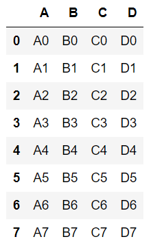
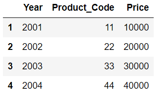

### 데이타 병합  -  Concat, Merge
서로 다른 데이타프레임을 하나로 합치는 작업
**1)Concatenate**
단순히 하나의 DataFrame에 다른 DataFrame을 연속적으로 붙이는 방법
이 경우에는 두 DataFrame이 서로 동일한 인덱스,컬럼을 가지고 있는 경우가 대부분
위+아래로 연결되는 방식이 기본이지만 좌,우로도 연결 가능하다.
outer join이 기본방식이다.
key를 이용한 concat도 가능하다.
    
**2)Merge**
두개의 DataFrame에 공통적으로 포함되어 있는 하나의 컬럼을 기준으로 삼아
합치는 방식
inner join이 기본방식이다.
on 속성뒤에 공통의 컬럼명
how 속성되에 조인기법을 입력함  

### Concat

``` python
import numpy as np
import pandas as pd
from pandas import Series, DataFrame
import matplotlib.pyplot as plt

df1 = DataFrame({
    'A':['A0','A1','A2','A3'],
    'B':['B0','B1','B2','B3'],
    'C':['C0','C1','C2','C3'],
    'D':['D0','D1','D2','D3'],
    
})
df1
```


``` python
df2 = pd.DataFrame({
    'A':['A4', 'A5', 'A6', 'A7'],
    'B':['B4', 'B5', 'B6', 'B7'],
    'C':['C4', 'C5', 'C6', 'C7'],
    'D':['D4', 'D5', 'D6', 'D7'],
})
df2
```


**df1, df2의 데이터를 보면, 상하로 병합하면 딱 좋을 모양의 데이터이다.**

- 상하로 병합을 기본으로 제공하는 concat()

``` python
result = pd.concat([df1,df2], ignore_index=True)
result
```



ignore_index=True가 되면 인덱스가 순서대로 된다.

- 좌우병합

``` python
result = pd.concat([df1,df2],axis=1) # 행이 아닌 열로 병합됨
result
```


**keys 속성이 왜 필요한지 반드시 정리한다.
key 속성으로 데이터를 가져온 출처를 표시할 수 있고...데이터를 직관적으로 세분화할 수 있다.**

``` python
result = pd.concat([df1,df2],keys=["F","M"])
result
```


``` python
df3 = DataFrame({
    'A':['A0','A1','A2','A3'],
    'B':['B0','B1','B2','B3'],
    'C':['C0','C1','C2','C3']      
})

df4 = pd.DataFrame({
    'A':['A4', 'A5', 'A6', 'A7'],
    'B':['B4', 'B5', 'B6', 'B7'],
    'C':['C4', 'C5', 'C6', 'C7'],
    'D':['D4', 'D5', 'D6', 'D7'],
})

df3
df4
```


df3, df4는 열 인덱스가 일치하지 않는다.
concat은 axis가 0이 기본으로 작동하기 때문에 상하로 합쳐질 것이고
지금처럼 열 인덱스가 일치하지 않을 때 문제가 발생할 수 있다.

df3에는 df4에 있는 D열이 없기 때문에 NaN으로 채워지는데
이런 방법은 join = "outer"가 디폴트로 잡혀있기 때문이다.

``` python
result2 = pd.concat([df3,df4],ignore_index=True)
result2
```


join = "inner"
-> 두 데이터에 모두 존재하는 컬럼의 행인덱스만 가져온다.

``` python
result3 = pd.concat([df3,df4],join="inner")
result3
```


### Merge

``` python
df1 = DataFrame({ 'Year':[2001,2002,2003,2004],
                  'Product_Code':[11,22,33,44],
                  'Price':[10000,20000,30000,40000]},
                   index=list('1234'))
df1

df2 = DataFrame({ 'Year':[2001,2002,2003,2004],
                  'Product_Code':[11,22,33,44],
                  'Price':[10000,20000,30000,40000]},
                   index=list('5678'))
df2

df3 = DataFrame({ 'Year':[2001,2003,2004,2005],
                  'Product_Code':[11,22,33,44],
                  'Color_num':[33,44,55,99]},
                   index=list('1234'))
df3
```

- df1, df2를 병합...merge 사용
    - 인덱스와 상관없이 병합되고 값들은 중복표기가 되지 않는다.
    - 문법적인 표현이 concat과 다르다. [ ] 사용하지 않는다. left, right

``` python
result = pd.merge(df1,df2,how="inner")
result
```


**merge를 할 때는 특정한 컬럼을 기준으로 병합한다.
그때 사용되는 옵션이 on이다.
Year 컬럼을 기준으로 데이터를 병합
Year 컬럼을 제외한 나머지 데이터들은 중복으로 표기된다.**

``` python
df1_1 = DataFrame({ 'Year':[2001,2002,2003,2004],
                  'Product_Code':[11,22,33,44],
                  'Price':[1,2,3,4]},
                   index=list('1234'))

result1 = pd.merge(df1,df1_1, on="Year")
result1
```


- 2개 이상의 컬럼을 기준으로 병합 가능

``` python
result2 = pd.merge(df1, df2, on = ["Year","Product_Code"])
result2
```


#### set_index()
병합한 결과에서 특정한 컬럼값을 새롭게 인덱스로 지정함으로써 분석문서의 가독력과 직관성을 높일 수 있다. 아울러 DataFrame 형식이 좀 더 깔끔해질 수 있다.

``` python
result2.set_index('Year', inplace=True)
result2
```


``` python
df1
df3
```




``` python
result3 = pd.merge(df1, df3)
result3
```


merge의 기본 속성이 how ="inner"이기 때문에 이러한 결과로 나온다.

- Year 기준으로 df1, df3를 병합
어떻게 merge 할 것인가? how속성인데...디폴트가 inner(중복되는 Year에 대해서만 merge)

``` python
result4 = pd.merge(df1, df3, on = "Year")
result4
```


- 어떻게 merge할 것인가? how = 'outer'
outer는 기준이 되는 컬럼 Year의 값에 상관없이 데이터 다 보여줌

``` python
result5 = pd.merge(df1, df3, on = "Year", how = "outer")
result5
```


- how="left"일 때는 왼쪽에 적힌 데이터가 기준이 되고, how="right"일 때는 오른쪽에 적힌 데이터가 기준이 된다.

``` python
result6 = pd.merge(df1,df3,on="Year",how="left")
result6
```


``` python
result7 = pd.merge(df1,df3,on="Year",how="right")
result7
```

