### DataFrame
#### DataFrame - 생성
DataFrame은 2차원 배열형식, 표같은 스트레드시트 자료구조
여러 개의 컬럼을 가지며 서로 다른 종류의 값이 담긴다.
    
DataFrame은 다양한 방식으로 생성되지만 가장 흔하게 생성하는 방법
1) 리스트를 값으로 가지는 딕셔너리 방법으로 생성
2) Numpy 배열을 이용해서 생성
3) read_csv(), read_excel()함수 등을 이용해서 생성

``` python
import numpy as np
import pandas as pd
from pandas import Series, DataFrame
import matplotlib.pyplot as plt
```

#### 1. 딕셔너리를 이용해서 생성

``` python

df_dic = {
        "state":['Ohio','Ohio','Ohio','Nevada','Nevada','Nevada'],
        "year":[2000, 2001, 2002, 2001, 2002, 2003],
        'pop':[1.5, 1.7, 3.6, 2.4, 2.9, 3.2]
}

#시리즈의 결합체 -> 데이터프레임(서로 다른 타입들의 컬럼값을 가짐)
dicDf = DataFrame(df_dic)
dicDf

print(type(dicDf.state))
print(type(dicDf.year))
print(type(dicDf.pop))
print(type(dicDf["pop"]))
```

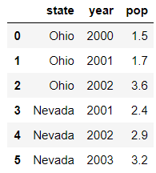

<class 'pandas.core.series.Series'>
<class 'pandas.core.series.Series'>
<class 'method'>
<class 'pandas.core.series.Series'>

``` python
data1 = {'name': ['James','Peter','Jane','Tomas'],
       'address':["NY","NY","LA","Texas"],
       "age":[33,44,55,66]
      }

df1 = DataFrame(data1)
df1
```

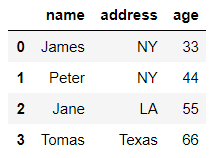

#### 2. random 함수 사용하기

``` python
df2 = DataFrame(np.random.randint(10,100,16).reshape(4,4),
               columns = list('abcd'),
               index = list("abcd")) # 키워드 매개변수 -> 매개변수명을 알고 사용
                                     #                    순서는 상관 없음
    
# columns를 사용해서 컬럼명을 수정
df2.columns = ["one","two","three","four"]
df2
```

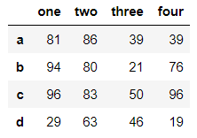

보게 되면 열의 이름명을 수정할 수도 있다.

#### 3. read_csv()를 이용해서 생성

``` python
df3 = pd.read_csv("../data/tips.csv")
df3
```

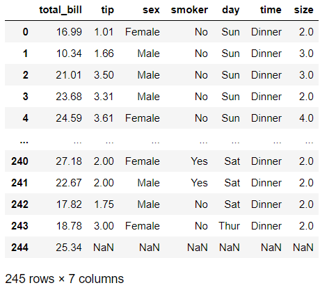

이것은 csv파일을 판다스 라이브러리를 통해서 가져온 것이다.

#### DataFrame - 구조확인

``` python
# 1. DataFrame 구조 확인하는 속성 4-15
df1
```

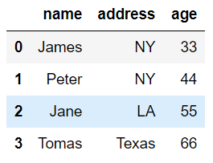

``` python
print(df1.index)
print(df1.columns)
print(df1.values)
print(df1.T) # 행과 열을 바꿈
print("*"*30)
df1.info() # 컬럼에 대한 정보를 상세히 볼 때 사용
```

RangeIndex(start=0, stop=4, step=1)
Index(['name', 'address', 'age'], dtype='object')
[['James' 'NY' 33]
 ['Peter' 'NY' 44]
 ['Jane' 'LA' 55]
 ['Tomas' 'Texas' 66]]
             0      1     2      3
name     James  Peter  Jane  Tomas
address     NY     NY    LA  Texas
age         33     44    55     66
******************************
<class 'pandas.core.frame.DataFrame'>
RangeIndex: 4 entries, 0 to 3
Data columns (total 3 columns):
Column   Non-Null Count  Dtype 
---  ------   --------------  ----- 
 0   name     4 non-null      object
 1   address  4 non-null      object
 2   age      4 non-null      int64 
dtypes: int64(1), object(2)
memory usage: 224.0+ bytes

#### DataFrame - 조회함수

``` python
df3
```


``` python
df3.head()
df3.tail()
```

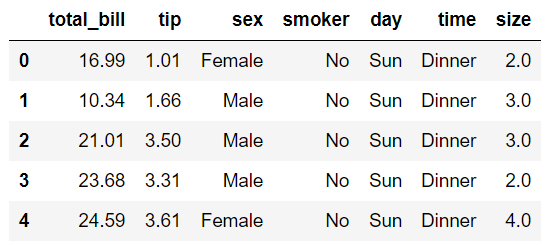

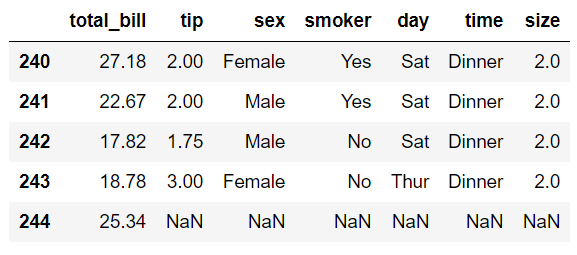

.head()는 앞의 기본으로 5개의 행을 보여주고, .tail은 뒤의 5개의 5을 보여준다. () 안에 숫자를 넣으면 그 숫자만큼 행을 보여준다.

``` python
df3.shape
```

(245, 7)
-> 전체 행렬의 수를 보여준다.

### DataFrame - 컬럼명 변경 및 추가, 삭제하기

#### 1. 변경하기
####      1)컬럼명 전체 수정...columns (원본이 바로 변경)    
#### 2)컬럼명 부분수정...rename (원본변경이 안됨 inplace = True)

``` python
df2
```


``` python
df2.columns = ["A-class","B-class","C-class","D-class"]
df2
```

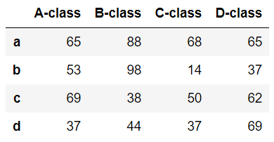

``` python
df1
```


``` python
df1_1 = df1.rename(columns={"address":"addr"}) # shift + tab
df1_1
```


inplace = False => 원본 변경 안된다.
따라서 inplace = True => 원본이 변경됨

**원본 변경하기**

``` python
df1.rename(columns={"address":'addr'},inplace=True)
df1
```


**컬럼명 추가하기**
- 이때 모든 값은 기본으로 부여

``` python
df1['phone'] = np.nan
df1
```

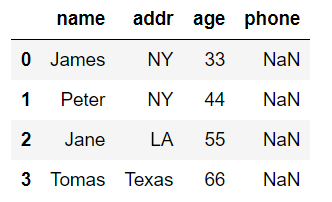

### DataFrame - 조회하기

``` python
df2.columns = ["one","two","three","four"]
df2
```


- 슬라이싱에는 2가지 방법이 있다.

1. 숫자슬라이싱

``` python
df2[0:2]
```

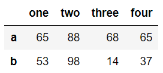

2. 라벨 슬라이싱

``` python
df2["a":"b"]
```


결과들을 보게 되면 숫자 슬라이싱은 마지막보다 하나 작은 행의 값이 나오고, 라벨 슬라이싱은 마지막 값까지 포함된 행의 값까지 나온다.

- one, two 컬럼에 대한 모든 데이터를 조회
(컬럼을 조회할 때는 슬라이싱이 아닌 2차원으로 검색해야 한다.)

``` python
df2[["one","two"]]
```

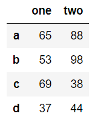

``` python
df2[df2["two"]>45][["two"]]
```

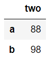

### DataFrame 조회하기 
iloc, loc<br>
iat, at -> 스칼라 값 조회(1 row, 1 column)

``` python
df2[df2['two']>45].iloc[:,1:2]
```


``` python
df1
```


- 1. James, Peter 라인 전부 가져오기...iloc, loc

``` python
print(df1.iloc[0:2,0:4])
print("*"*30)
print(df1.iloc[:2,:4])
print("*"*30)
print(df1.iloc[:2])
print("*"*30)
print(df1.loc[0:1,"name":"age"])
```

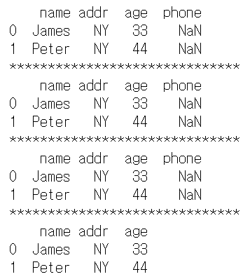

loc는 숫자로 가져오고, loc는 라벨로 가져온다.

- 2. 스칼라값으로 가져오기...iat, at

``` python
print(df1.iat[1,1])
print(df1.iat[0,2])

print("*"*30)
print(df1.at[1,"addr"])
print(df1.at[0,"age"])
```

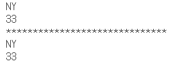

- 값 변경하기

``` python
df1.iat[2,2] = 50
df1
```

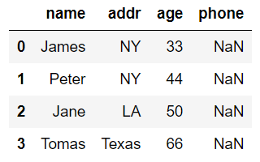

지정된 스칼라값만 변경된 것을 볼 수 있다.(원래는 55였는데 50으로 바꿈)

- loc를 이용해서 마지막 줄에 결측값 넣기

``` python
df1.loc[4] = np.nan
df1
```

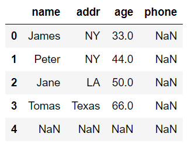

#### 삭제하기
drop함수 -> 컬럼명을 삭제

``` python
df1.drop("phone",axis = 1,inplace=True)
df1
```

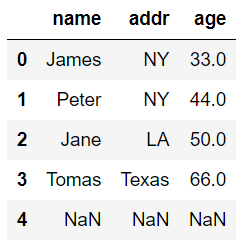

``` python
df1.drop(4,inplace=True)
df1
```

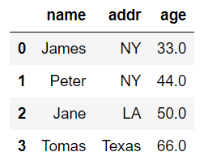

### DataFrame - 정렬하기
sort_index(), sort_values()

``` python
df2
```


``` python
df2.sort_index()
```

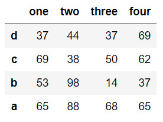

``` python
df2.sort_index(axis=1, ascending=False)
```

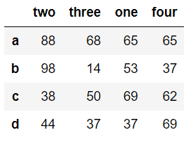

``` python
df2.sort_values(by = ["four"])
```

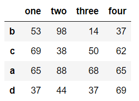

by -> 주로 컬럼 기준으로 정렬

