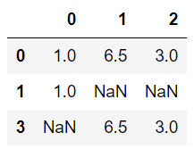
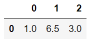

## DataFrame
### 누락데이타 처리하기

누락데이타 값 삭제하기 - dropna()
    
데이터를 보면 값이 없는 경우가 있다. 
이런 경우 missing value 가 있다고 한다.
데이타 분석을 본격적으로 하기 전에 Missing value 처리 전략을 세우는 것은
데이타 전처리 과정에서 매우 중요하다
    
대표적인 처리전략
1) 데이터가 거의 없는 feature 는 feature 자체를 DROP
2) 데이터의 최소 개수를 정해서 DROP
3) 최빈값, 평균값, 0 등의 값으로 비어있는 데이터를 채우기
    
판다스는 누락된 데이타를 모두 NaN으로 처리한다.
판다스 객체의 모든 통계는 누락된 데이타를 배제하고 처리한다
    
**누락데이타와 관련된 기능**
**dropna()** : na이 하나라도 있는 로우는 모두 DROP
**dropna(how='all')** :모든 값이 na인것만 DROP
**dropna(thresh=3)** : not-nan value가 3개이상이 임계치
3개 이상인 데이타만 남기겠다.해당 임계치 안되면 DROP
**dropna(how='any')** : 누락데이터가 한개라도 있으면 DROP 해라 
**fillna()** :누락된 데이타 값을 다른 값으로 채움
**isnull() or isna()** : 누락되거나 NA인 값을 알려줌
**notnull()** :insull()과 반대

``` python
from numpy import nan as NA
import numpy as np
from pandas import DataFrame

df = DataFrame([[1,6.5,3],[1,NA,NA],[NA,NA,NA],[NA,6.5,3]])
df
```


- dropna() -> 원본은 유지된다.

``` python
removeNa = df.dropna()
removeNa
```


- dropna(how="all")

``` python
df.dropna(how="all")
```



- dropna(thresh=3)

``` python
df.dropna(thresh=3)
```



### 누락데이터 채우기

- 0으로 채우기

``` python
df.fillna(0) #원본은 유지한다.
```


- 평균으로 채우기

``` python
df.fillna(df.mean())
```


- 특정한 값으로 채우기

``` python
df.fillna(value=5)
```


``` python
df.fillna(method="ffill")
```


마지막을 보면 열 방향으로 같은 값으로 채워졌다는 것을 볼 수 있다.