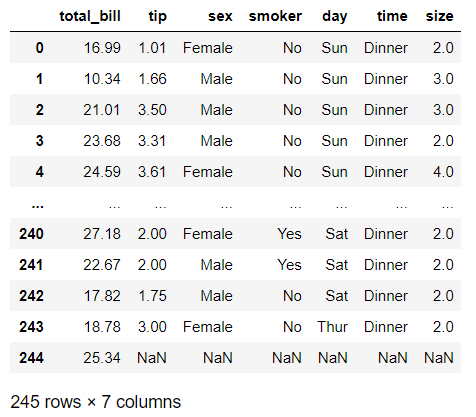

### 데이타 그룹 연산  -  groupby
통계자료에서 많이 사용한다.
그룹핑 시켜서 합을 도출하거나 평균 구하거나 등등..

``` python
import numpy as np
import pandas as pd
from pandas import Series, DataFrame
import matplotlib.pyplot as plt

df = DataFrame({
    'Gender':['Female','Male','Female','Male','Female','Male','Female','Female'],
    'Smoking':['Smoker','Smoker','Smoker','Non-Smoker','Non-Smoker','Non-Smoker','Non-Smoker','Smoker'],
    'Gold':np.random.randint(1,10,8),
    'Silver':np.random.randint(1,10,8)

})

df
```


**- groupby() 함수로 데이터를 그룹핑하면 DataFrameGroupBy 객체가 리턴된다.**
**-따라서 groupby() 함수로 데이터를 그룹화 했으면 반드시 그 뒤에 통계함수를 적용해야 한다.**

``` python
df.groupby('Gender')
```

<pandas.core.groupby.generic.DataFrameGroupBy object at 0x000002264C3117F0>

``` python
# 통계함수 적용
df.groupby("Gender").sum()
df.groupby("Smoking").sum()
```


``` python
df.groupby("Gender").max()
```


- 그룹핑은 여러번 가능하다.

``` python
df.groupby(["Gender","Smoking"]).sum()
```


- 특정 컬럼에만 그룹핑을 적용할 수도 있다.

``` python
df.groupby(["Gender"])["Silver"].sum() # 시리즈 반환
df.groupby(["Gender"])["Silver"].agg("sum") # 위와 동일한 결과
```

Gender
Female    32
Male      16
Name: Silver, dtype: int32

``` python
df.groupby(["Gender"])[["Silver"]].sum() # 데이터프레임 반환
df.groupby(["Gender"])[["Silver"]].agg("sum")
df.groupby(["Gender"])[["Silver"]].agg(["sum"])
```


- agg는 aggregation이라는 뜻으로 여러 개의 함수를 동시에 사용할 수 있다.

``` python
df.groupby(["Gender"])[["Silver"]].agg(["sum","mean","count"])
```


### 실전 데이터로 응용하기

``` python
tipdf = pd.read_csv("../data/tips.csv")
tipdf
```



- 날짜별로 그룹핑하고 count함수 적용

``` python
tipdf.groupby("day").agg("count")
```


날짜로 분류하게 되면 의미없는 분류가 된다. 자신이 어떤식으로 쓸 것인지는 잘 생각해야 한다.

``` python
#1. 요일별 팁의 평균구하기(다같은 표현)
tipdf.groupby("day")[["tip"]].mean()
tipdf.groupby("day")[["tip"]].agg("mean")
tip_group = tipdf.groupby("day")
tip_group[["tip"]].mean()

#2. 정렬...내림차순으로!
tip_group[["tip"]].mean().sort_values(asceding=False)
tip_group[["tip"]].mean().sort_values(by="tip",ascending=False)

# 3. 시각화
tip_group["tip"].mean().plot(kind="bar",grid=True)
plt.show()
```


- 위에서 본 것과 같이 이중으로 그룹핑이 가능하다. 
여기서는 성별과 흡연여부 기준으로 그룹핑해보자

``` python
tip_group2 = tipdf.groupby(["sex","smoker"])
tip_group2.mean()
```


``` python
tip_group2.mean().plot(kind="bar")
plt.show()
```


### 다시 한번 짚어보기!!
1. unique()
중복된 것은 걸러버리고 중복되지 않은값만 데이타가 중복되어 있을때 
unique해서 고유한 값만 찾아내고 다른 값들은 버려버릴때 많이 쓴다. 
SQL에서 DISTINCT와 동일한 기능 LIST를 SET으로 변경한후 다시 LIST로 만드는 
 것과 동일
       
2. describe()
describe() 함수는 데이타에 대한 간력한 설명
간략한 통계를 내준다.
숫자로서 가능한 데이타만 나온다.
하위 25%, 상위 25%
4분위할 때 쓰는 부분이다.
데이타 성격을 알고 싶을때 많이 사용한다.
        
3. sum() 은 숫자 데이타에만 적용됨
    
4. count()는 값의 갯수..
    
5. value_counts()
해당 컬럼에서 그 값이 몇번 나왔는지를 확인할때 사용한다.
빈도수 확인할때 사용됨
       
6.apply()
판다스에서 내가 만들어서 적용시킬수 있는 함수기능
판다스에서 제공해주지 않는 함수를 내가 만들어서
적용할때 많이 사용한다.
df['C'].apply(add)..인자값으로 함수이름

7. 컬럼확인 | 인덱스 확인 | 컬럼명 수정
디비에서 데이타를 가져오거나
웹에서 데이타를 가져올때
내가 원하는 이름을 컬럼명을 바꾸고 싶을때가 있다.
컬럼명 수정은 빈번하게 진행된다.

- unique

``` python
df["Gender"].unique()
```

array(['Female', 'Male'], dtype=object)

- describe

``` python
df.describe()
```


- 통계함수(sum, count)

``` python
df.groupby("Gender").sum()
df.groupby("Smoking").count()
```


- value_counts()

``` python
df["Smoking"].value_counts()
```

Smoker        4
Non-Smoker    4
Name: Smoking, dtype: int64

- 함수적용

``` python
def add(x):
    return x + 100 -1

df[["Gold"]].apply(add)
df[["Gold"]].agg(add)
df[["Gold"]].agg("sum")
```

Gold    52
dtype: int64