### Pivot Table
엑셀에서 pivot table 기능이 있는것처럼, 
Pandas에서도 이와 유사한 pivot_table함수를 제공한다.
    
분석을 하다 보면 원본 데이터의 구조가 분석 기법에 맞지 않아서 
행과 열의 위치를 바꾼다거나, 특정 요인에 따라 집계를 해서 구조를 
바꿔주어야 하는 경우가 종종 발생하는데 이때 피봇함수를 이용해서
분석에 알맞는 구조로 데이타를 변경해서 사용한다.

**피봇함수은 DataFrame의 데이타를 Reshape 하는 방법중 하나이다.**
    
여러 컬럼을 index, values, columns 값으로 사용가능하다.
그룹연산과 함께 사용

#### Reshaping Data By Pivoting( 데이타의 재구조화)

``` python
import numpy as np
import pandas as pd
from pandas import Series, DataFrame
import matplotlib.pyplot as plt

data = {
    "도시": ["서울", "서울", "서울", "부산", "부산", "부산", "인천", "인천"],
    "연도": ["2015", "2010", "2005", "2015", "2010", "2005", "2015", "2010"],
    "인구": [9904312, 9631482, 9062546, 3448737, 3393191, 3512547, 2890451, 263203],
    "지역": ["수도권", "수도권", "수도권", "경상권", "경상권", "경상권", "수도권", "수도권"]
}

df1 = DataFrame(data)
df1
```

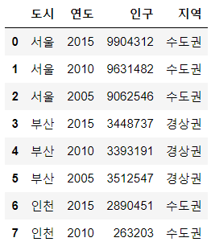

- pivot_table의 매개변수 중 중요한 키워드 매개변수는 index, columns, values이다.

``` python
df1.pivot_table(index=["도시"],columns=["연도"],values=["인구"])
df1.pivot_table("인구",index=["도시"],columns=["연도"])
df1.pivot_table("인구","도시","연도")
```

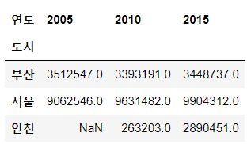

=> 키워드를 적지 않으면 위치 매개변수가 되는데 이 때 순서는 values, index, columns 순이다.

- pivot_table의 속성 중 aggfunc은 기본 설정이 mean이다.
- margins = True로 설정하면 행과 열의 all값을 계산해준다.

``` python
df1.pivot_table("인구","도시","연도",margins=True)
```

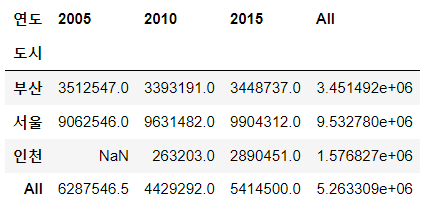

- groupby처럼 여러 컬럼을 그룹핑 할 수 있다.

``` python
df1.pivot_table("인구", index=["연도","도시"])
```

``` python
df1.groupby(["연도","도시"])[["인구"]].mean()
```

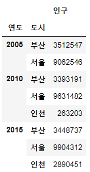

=> pivot_table의 결과와 groupby의 결과가 동일하게 도출되는 것을 알 수 있다.

### 실전데이터

``` python
tipdf = pd.read_csv("../data/tips.csv")
tipdf
```

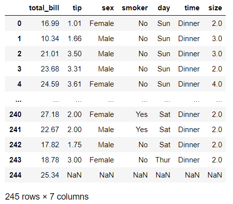

**이 데이터 분석의 목표는 식사총대금 대비 팁의 비율이 어떤 경우에 가장 높은지 찾는 것이며 그렇게 하기 위해서는 우선 식사대금과 팁의 비율을 나타내는 tip_pct컬럼을 추가하는 것이 좋다.**

``` python
tipdf['tip_pct'] = round(tipdf['tip'] / tipdf['total_bill'],2)

tipdf.dropna(inplace=True)
tipdf.tail()
```

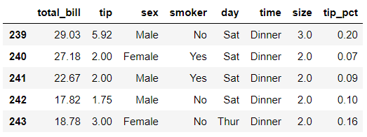

- tipdf에서 day 기준으로 그룹핑 

``` python
tipdf.pivot_table(index="day").round(2)
```

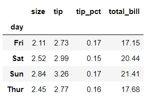

- tipdf에서 성별 흡연여부별, 그룹핑

``` python
tipdf.pivot_table(index=["sex","smoker"]).round(2)
```

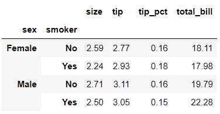

- pivot_table(속성)
    - values : 채우고자 하는 값
    - index : 그룹핑 기준
    - columns : 컬럼값

``` python
tipdf.pivot_table(values=["total_bill","tip"],
                 index =["sex","day"],
                 columns = "smoker")
```

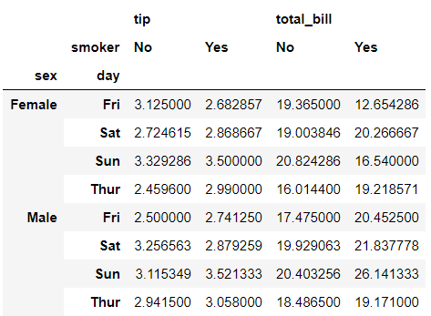

- 성별에 따른 평균 팁비율

``` python
tipdf.pivot_table(index="sex",values="tip_pct")
```

``` python
tipdf.groupby("sex")[["tip_pct"]].mean()
```

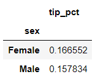

- 여성, 남성 | 흡연자, 비흡연자
각 그룹에서 가장 많은 팁과 가장 작은 팁의 차이를 알고 싶다...
따라서 사용자 정의 함수를 만들고 적용해보자.

``` python
def min_max_tip(x):
    return x.max() - x.min()

tipdf.groupby(["sex","smoker"])[["tip"]].app(min_max_tip)
```

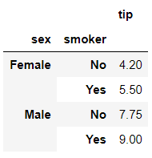