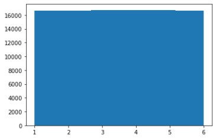

### Matplot
파이썬으로 데이터 분석 결과를 시각화 하는데에는 Matplot 라이브러리를 가장 많이 사용한다.
Matplot은 파이썬에서 2D 형태의 그래프, 이미지 등을 그릴 때 사용하는 것으로 실제로 과학 컴퓨팅 분야나 인공지능 연구 분야에서도 많이 사용된다.
여기서는 Matplot 여러가지의 기능 중에서 기본적인 기능에 대해서만 다뤄볼 예정이다.
    
Matplot 모듈 중에는 다양한 서브 모듈들이 있는데 그중에서 가장 많이 사용되는 서브모듈이 pyplot이다.

### 1. Basic Graph

``` python
import matplotlib.pyplot as plt

# 1. plot() : 직선 혹은 꺽은선을 그릴 때 사용 - 꺽은선
plt.plot([1,2,3,4],[1,4,9,16])
plt.show()

# 그렇다면 직선은?
plt.plot([10,20,30,40])
plt.show()

# 2. 그래프에 옵션 추가하기
'''
1) 선의 모양, 색상
2) x,y축의 최소, 최대값 지정
3) 그래프의 타이틀
'''

plt.plot([1,2,3,4],[1,4,9,16],"r")
plt.axis([0,6,0,20]) # 축의 최대, 최소 지정
plt.title("graph test") # 그래프 제목 넣기
plt.show()
```


### 2. 겹쳐진 그래프 그리기

``` python
import numpy as np
t = np.arange(0,5,0.2) # 0에서 5미만...0.2 간격으로 arange
t
'''
이 값을 x,y값으로 활용
'''
plt.plot(t,t,"b--") 
# 접선...
plt.show()
```


``` python
plt.plot(t,t,"b--",t,t**2,"gs")
plt.show()
```


``` python
plt.plot(t,t,"b--",t,t**2,"gs",t,t**3,"r^")
```


``` python
# 겹쳐진 그래프일 때는 각 그래프에 대한 정보를 표시해야 알 수 있다.

plt.plot(t,t,"b--",label="A Group")
plt.plot(t,t**2,"gs",label="B Group")
plt.plot(t,t**3,"r^",label="C Group")

# 이 부분을 지정해야 label이 나타난다.
plt.legend()

plt.title("Wrapped Graph") 

plt.xlabel("Year") # x축 제목
plt.ylabel("Growth Rate") # y축 제목
plt.grid() #격자선 만들기
plt.show()
```


### 파형모양의 그래프

``` python
t = np.arange(0,12,0.01)

'''
기본으로 존재하는 figure가 아닌 새로운 figure를 생성하기 위해서는 
plt.figure()를 사용한다.
'''

plt.figure(figsize=(10,6))
plt.plot(t,np.sin(t),"r",lw=13,label="sin") # lw => 선 굵기
plt.plot(t,np.cos(t),"g",label="cos")

plt.grid()
plt.legend()

plt.xlabel("Time")
plt.ylabel("Amplitude")

plt.title("Graph Test2")
plt.show()
```


### 기본적인 matplotlib 내용..
- cmap ->  구글에서 파이썬 cmap
- https://matplotlib.org/3.1.1/tutorials/introductory/pyplot.html -> matplot 튜토리얼 주소

### Subplot

``` python
names = ['group_a', 'group_b', 'group_c']
values = [1, 10, 100]

plt.figure(figsize=(9,3))

# 131 => 시작값|마지막값|몇번째...
plt.subplot(131)
plt.bar(names, values)
plt.subplot(132)
plt.scatter(names,values)
plt.subplot(133)
plt.plot(names,values)
plt.subtitle("Categorical Plotting")
plt.show()
```


## 히스토그램
hist() 함수를 사용
데이터의 빈도에 따라서 막대 그래프의 높이가 결정된다.

``` python
import matplotlib.pyplot as plt
import numpy as np

plt.hist([1,1,2,3,4,5,6,6,7,8,10])
plt.show()
```


``` python
dice = []
for i in range(5):
    dice.append(np.random.randint(1,7))
print(dice)
```

[3, 6, 5, 1, 6]

``` python
'''
bins
해당 막대 영역을 얼마나 채우는지를 결정하는 변수
이 값이 크면 영역이 더 촘촘하게 나눠지고
작으면 분포가 뭉뚱그려진다.
'''
plt.hist(dice,bins=6)
plt.show()
```



``` python
# 이번에는 주사위를 100000번 돌렸다고 가정해보자.
dice = []
for i in range(100000):
    dice.append(np.random.randint(1,7))
#print(dice)

plt.hist(dice)
plt.show()
# 주사위 던지는 횟수를 늘릴수록 특정한 주사위 숫자가 나오는 횟수가 전체의 1/6에 가까워진다.
# 큰 수의 법칙...
```


``` python
mu, sigma = 100,15
x = mu + sigma * np.random.randn(10000)
x.shape
plt.hist(x)
plt.show()
```

(10000,)


``` python
plt.hist(x,bins=50,
           facecolor="g", # 그래프 색상
           density=1, # 단위변경
           alpha=0.25) # 투명도 0~1
plt.xlabel("smart")
plt.ylabel("Probability")

plt.grid()
plt.title("Histogram of IQ")

plt.text(40,0.025, r"$mu = 100, \sigma = 15$") # 글자 적어주기(r은 해석하지 말고 문자 그대로 받아들여라.raw)
# sigma앞에 \은 부호로 표시할 수 있게 해줌
plt.axis([42,160,0,0.028]) # x,y축의 보기싫은 부분은 짤라낸다.
plt.show()
```

