## Seaborn

- https://seaborn.pydata.org 갤러리 사이트

``` python
import seaborn as sns
import pandas as pd
import numpy as np

ts = pd.Series(np.random.randn(1000),
              index=pd.date_range("1/1/2000",periods=1000)) # 기본단위가 day
# 2000/1/1부터 1000일간의 데이터
ts
```

2000-01-01   -0.767951
2000-01-02    0.155482
2000-01-03   -1.730574
2000-01-04    0.654634
2000-01-05   -0.323869
                ...   
2002-09-22    1.634681
2002-09-23   -2.144344
2002-09-24    0.005616
2002-09-25   -0.536058
2002-09-26    0.365279
Freq: D, Length: 1000, dtype: float64

``` python
ts = ts.cumsum() # 누적값
ts.plot() # x축으로는  2000/1/1부터 1000일 기간
```

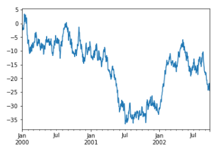

## BoxPlot

``` python
# 0~100까지 총 101개의 숫자를 만든다.
xs = np.array(np.linspace(start=0,stop=100,num=101))
xs

df = pd.DataFrame(xs,columns=["feature"])
df
```

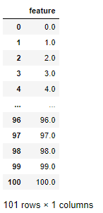

``` python
plt.figure(figsize=(7,6)) #크기를 지정
boxplot = df.boxplot(column = ["feature"])
#y축을 촘촘하게 해야 함
plt.yticks(np.arange(0,101,step=5))
boxplot
```

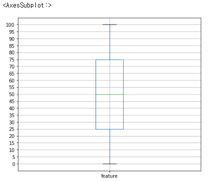

``` python
tips = sns.load_dataset("tips")
tips
```

전에 봤던 데이터여서 데이터프레임 구조는 생략한다.

- total_bill값을 boxplot으로 표현

``` python
plt.figure(figsize=(6,3))
sns.boxplot(x=tips["total_bill"])
plt.show()
```

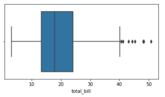

- 날짜별로 total_bill을 분석

``` python
sns.boxplot(x="day", y="total_bill", data=tips)
```

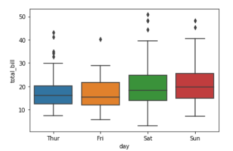

박스의 편차가 심한날은 금요일인데 음식값의 편차가 심한 것을 의미

``` python
'''
요일별, 흡연여부별 전체음식값의 boxplot을 알아보자
즉 어느 요일에 / 흡연자 혹은 비흡연자가 음식지불액을 어떻게 지불했는지를 확인
비교 - - hue
'''
sns.boxplot(x="day", y="total_bill", hue = "smoker" ,data=tips)
plt.xticks(rotation=45) #x축 글자 기울어짐
plt.show()
```

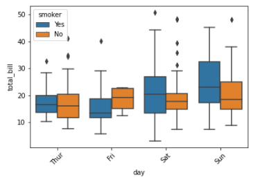

## lmPlot

``` python
sns.lmplot(x="total_bill",y="tip", data=tips)
```

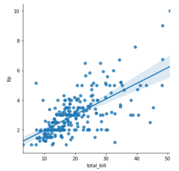

``` python
# 흡연자, 비흡연자 중에서 누가 더 팁을 많이 내는가...
# 전체 음식 지불액을 함께 보면서...hue

sns.lmplot(x="total_bill",y="tip",hue = "smoker",data=tips)
```

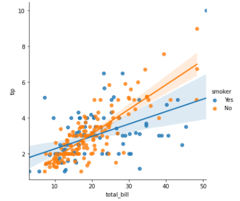

- 20달러 음식값을 넘어서는 부분부터는 비흡연자가 팁을 더 많이 준다.

## Heatmap

``` python
flights = sns.load_dataset("flights")
# 데이터의 구조 reshape
flights = flights.pivot(index ="month",columns="year",values="passengers")
flights
```

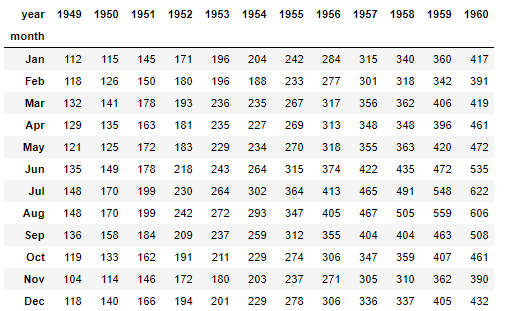

``` python
plt.figure(figsize=(10,8))
sns.heatmap(flights) #디폴트는 값이 표시 안된다.
plt.show()
```

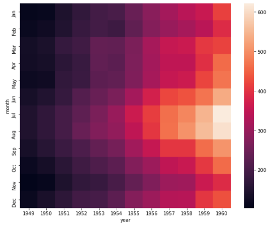

``` python
'''
y축은 month
x축은 year
value는 승객수
'''
plt.figure(figsize=(10,8))
sns.heatmap(flights,annot=True,fmt="d") # annotation과 format을 주면 아래와 같은 그림
plt.show()
```

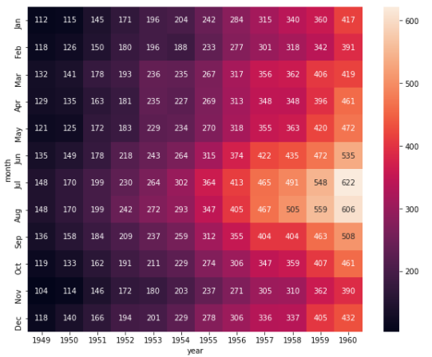