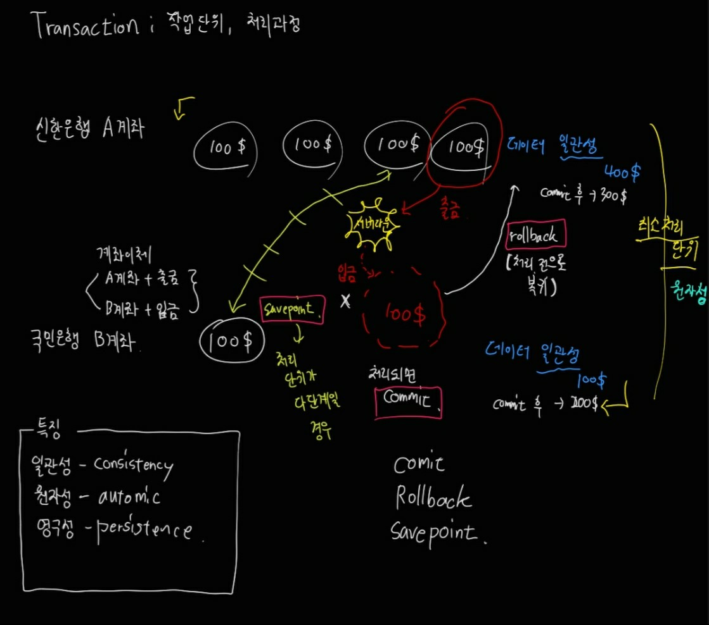
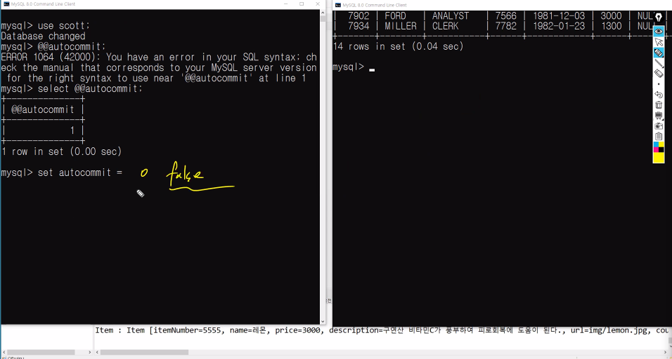
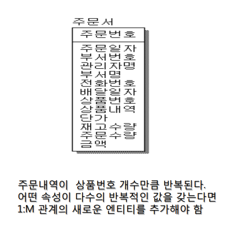
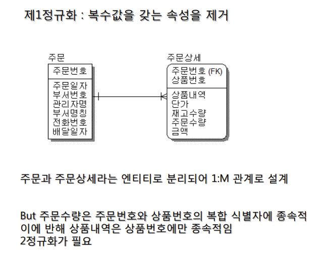
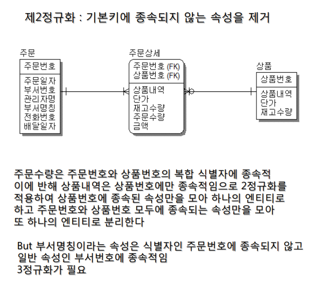
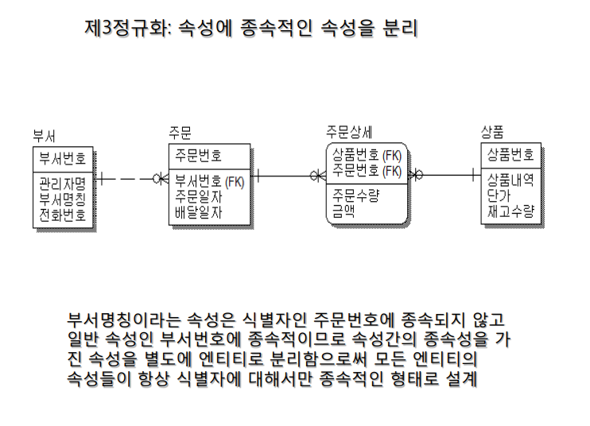

## Transaction

**트랜잭션이란?**

- 논리적인 일의 단위

**트랜잭션의 활용**

- 동시성 제어 -> 여러 사용자나 여러 응용 프로그램들이 동시에 수행되어도 간섭하지 못하도록 보장

- 회복 -> 데이터베이스를 갱신하는 도중에 시스템 고장 시에도 데이터베이스의 일관성을 유지

**트랜잭션의 특성**

- 원자성 -> 한 트랜잭션 내의 모든 연산들이 완전히 수행되거나 전혀 수행되지 않음을 의미
- 일관성 -> 데이터베이스가 일관된 상태를 가졌다면 트랜잭션이 수행된 후에 데이터베이스는 일관된 상태임
- 격리성 -> 한 트랜잭션이 갱신하는데 완료되기 전에는 다른 트랜잭션들이 접근하지 못하게 함
- 영속성 -> 일단 한 트랜잭션이 완료되면 이 트랜잭션이 갱신한 것은 시스템 고장이 발생해도 손실되지 않음

**트랜잭션 제어문(TCL)**

**Commit**
트랜잭션의 마지막 명령어가 수행되었음을 나타냄
**Rollback**
트랜잭션의 변경을 취소하고 트랜잭션 종료
**Savepoint**
현재 트랜잭션에서 Rollback시킬 위치 지정

아래의 그림은 은행의 입출금 시스템을 예시로 한 트랜잭션의 전체적인 구조이다.

MYSQL의 경우, 다른 벤더사와는 다르게 커밋이 자동으로 되기 때문에 정확한 동작 방식을 확인하기 위해서는 오토커밋을 풀어줘야 한다.

그림과 같이 select @@autocommit; 명령어를 써주면 된다.
 
## 삭제 관련 함수

이번에는 MYSQL에서 삭제 관련 함수를 한번 정리해보자.

삭제와 관련된 함수는 **Delete**, **Truncate**, **Drop** 이렇게 3가지가 있다.

우선 Drop함수는 데이터를 포함 전체적인 구조를 다 삭제해버리는 함수이다.

Delete와 Truncate함수는 구조는 남긴채 데이터를 삭제한다는 공통점이 있다. 하지만 Delete는 rollback 명령어를 쓰면 데이터가 복구가 되지만 Truncate는 rollback을 해도 데이터가 다 날아간다는 차이점이 있다.

## 정규화

한마디로 DB서버의 메모리를 낭비하지 않기 위해서
어떤 테이블을 식별자를 가지는 여러개의 테이블로
나누는 과정을 정규화라 한다.
정규화된 데이타베이스는 중복이 최소화되도록 설계된 데이타베이스이다.

정규화는 DB모델링 논리설계의 마지막 단계이다. 원래는 제5정규화까지 있는데 그 단계까지 가면 복잡성이 증가하게 되므로 정규화는 3단계까지 하는 것을 권장한다고 한다.

**장단점**
장점 
1. 메모리를 절약할 수 있다
2. 구조화된 시스템으로 인해서 관리가 편하다

단점 
1. 조회비율이 매우 높은 시스템의 경우에는 테이블간의
2. join 연산이 반복적으로 이뤄지기 때문에 질의 응답 속도가
살짝 늦어질 수 있

제 1정규화는 복수의 속성값을 갖는 속성을 분리하는 과정이다.

제 2정규화는 주 식별자에 종속되지 않는 속성을 분리하는 과정이다.

제3정규화는 속성에 종속적인 속성을 제거하는 과정이다.

글만으로는 이해가 안되니까 하나의 예시를 봐보자.

해당 그림들을 보면 정규화의 과정을 전체적으로 볼 수 있다.