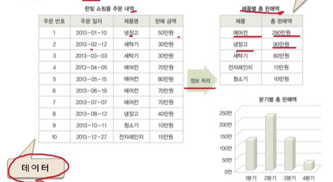

## 데이터베이스 기본개념

### 데이터베이스의 필요성
- 데이터와 정보
    - 데이터(data)
        - 현실 세계에서 단순히 관찰하거나 측정해 수집한 사실이나 값
    - 정보(information)
        - 의사 결정에 유용하게 활용할 수 있도록 데이터를 처리한 결과물()

<DIKW 체계>

피라미드 위로 올라갈수록 가치가 증가

데이터 - 가공하기 전에 순수한 수치의 상태
정보 - 데이터를 바탕으로 유의미하게 가공된 2차 데이터 형태
지식 - 정보를 의미있게 활용하고 처리
지혜 - 지식을 활용할 수 있는 아이디어

- 정보 처리(information processing)
    - 데이터에서 정보를 추출하는 과정 또는 방법

- 정보 시스템과 데이터베이스
    - 정보 시스템
        - 조직 운영에 필요한 데이터를 수집하여 저장해두었다가 필요할 때 유용한 정보를 만들어 주는 수단
    - 데이터베이스
        - 정보 시스템 안에서 데이터를 저장하고 있다가 필요할 때 제공하는 역할

### 데이터베이스의 정의와 특성

- 데이터베이스의 정의와 특성

여러 사람이 공유하여 사용할 목적으로, 통합하여 관리되는 데이터의 집합. 자료 항목의 중복을 없애고 자료를 구조화하여 저장함으로써 자료 검색과 갱신의 효율을 높인다.

- 데이터베이스(DataBase)
    - 특정 조직의 여러 사용자가 **공유**하여 사용할 수 있도록 **통합**하여 **저장**한 **운영** 데이터 집합

**공유 데이터** : 특정 조직으 여러 사용자가 함께 소유하고 이용할 수 있는 공용 데이터 
**통합 데이터** : 최소의 중복과 통제 가능한 중복만 허용하는 데이터 
**저장 데이터** : 컴퓨터가 접근할 수 있는 매체에 저장된 데이터
**운영 데이터** : 조직의 주요 기능을 수행하기 위해 지속적으로 유지해야 하는 데이터

- 데이터베이스의 특성

**실시간 접근** : 사용자의 데이터 요구에 실시간으로 응답
**내용 기반 참조** : 데이터가 저장된 주소나 위치가 아닌 내용으로 참조
**계속 변화** : 데이터의 계속적인 삽입, 삭제, 수정을 통해 현재의 정확한 데이터를 유지 
**동시 공유** : 서로 다른 데이터의 동시 사용만이 아니라 같은 데이터의 동시 사용도 지원