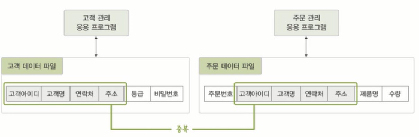
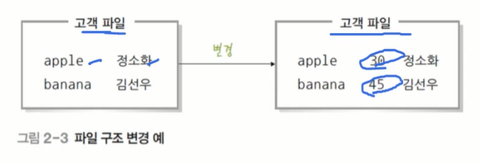
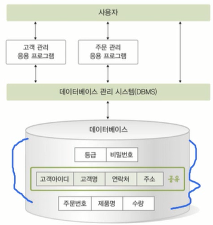
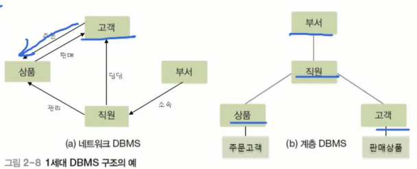

## 데이터베이스 관리시스템

### 1. 데이터베이스 관리 시스템의 등장 배경
- 파일 시스템(file system)
    - 데이터를 파일로 관리하기 위해 파일을 생성,삭제,수정,검색하는 기능을 제공하는 소프트웨어
    - 응용 프로그램마다 필요한 데이터를 별도의 파일로 관리

- 파일 시스템의 문제점
    - 같은 내용의 데이터가 여러 파일에 중복 저장된다.
    - 응용 프로그램이 데이터 파일에 종속적이다.
    (데이터 파일의 구조가 변경되면 응용 프로그램을 다시 설계해야 한다...)
    - 데이터 파일에 대한 동시 공유, 보안, 회복 기능이 부족하다.
    - 응용 프로그램 개발이 쉽지 않다.

- 파일 시스템의 주요 문제점
    - 같은 내용의 데이터가 여러 파일에 중복 저장된다 -> **데이터 중복성**
        - 저장 공간의 낭비는 물론 데이터 일관성과 무결성을 유지하기 어렵다.
    - 응용 프로그램이 데이터 파일에 종속적이다 -> **데이터 종속성**
        - 사용하는 파일의 구조를 변경하면 응용 프로그램도 함께 변경해야 한다.

### 2. 데이터베이스 관리 시스템의 정의 및 특성

- 데이터베이스 관리 시스템(DBMS: DataBase Management System)
    - 파일 시스템의 문제를 해결하기 위해 제시된 소프트웨어
    - 조직에 필요한 데이터를 데이터베이스에 통합하여 저장하고 관리

데이터베이스 관리 시스템은 응용 프로그램을 대신해서 저장된 데이터를 검색,삽입,수정,삭제하고 응용 프로그램들은 데이터베이스를 공유해서 사용할 수 있게 한다.

 

- 데이터 베이스 관리 시스템의 주요 기능
    - 정의 기능 : 데이터베이스 구조를 정의하거나 수정할 수 있다.
    - 조작 기능 : 데이터를 삽입, 삭제, 수정, 검색하는 연산을 할 수 있다.
    - 제어 기능 : 데이터를 항상 정확하고 안전하게 유지할 수 있다.

 

- 장점과 단점
    - 장점
        - 데이터 중복 통제
        - 데이터 독립성이 확보
        - 데이터를 동시 공유
        - 데이터 보안 향상
        - 데이터 무결성 유지
        - 표준화 가능
        - 장애발생 시 회복이 가능
        - 응용 프로그램 개발 비용이 줄어듦
    
    - 단점
        - 비용이 많이 듦
        - 백업과 회복 방법이 복잡함
        - 중앙 집중 관리로 취약점이 존재

### 3. 데이터베이스 관리 시스템의 발전 과정

- 1세대 : 네트워크 DBMS, 계층 DBMS
    - 네트워크 DBMS : 데이터베이스를 그래프 형태로 구성
    eg) IDS(Intergrated Data Store)
    - 계층 DBMS : 데이터베이스를 트리 형태로 구성
    eg) IMS(Information Management System)

- 2세대 : 관계 DBMS
    - 관계 DBMS : 데이터베이스를 테이블 형태로 구성
    eg) 오라클, MS SQL, 엑세스, MySQL

- 3세대 : 객체지향 DBMS, 객체관계 DBMS
    - 객체지향 DBMS : 객체를 이용해 데이터베이스를 구성
    eg) 오투, 온투스, 젬스톤
    - 객체관계 DBMS : 객체 + 관계 DBMS