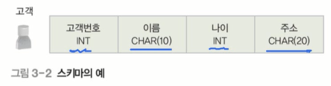
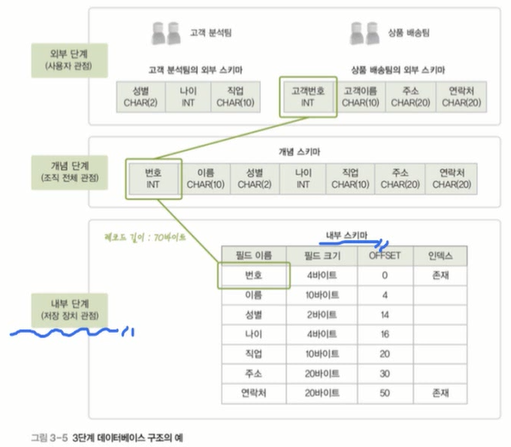
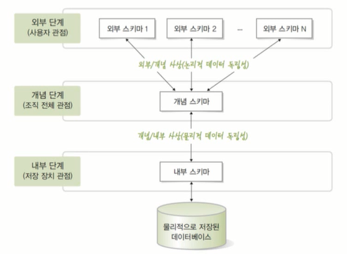
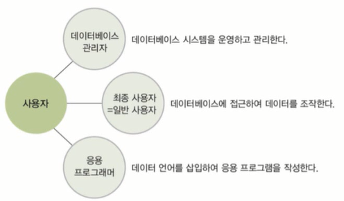
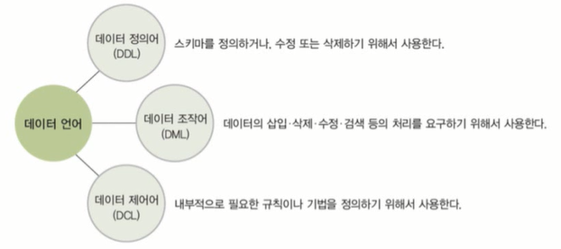
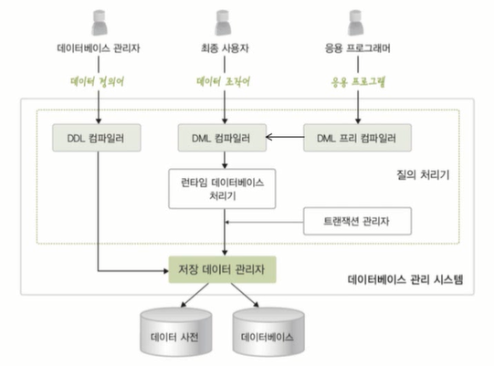

## 데이터베이스 시스템(DBS : DataBase System)
### 1. 데이터베이스 시스템의 정의

- 데이터베이스에 데이터를 저장하고, 이를 관리하여 조직에 필요한 정보를 생성해주는 시스템

- 데이터베이스, 데이터베이스 관리시스템, 데이터언어까지 포함하는 개념

### 2. 데이터베이스의 구조
- 스키마와 인스턴스
    - 스키마(schema)
        - 데이터베이스에 저장되는 데이터 구조와 제약조건을 정의한 것
        - 전체적인 뼈대를 정의해주는 것

    - 인스턴스(instance)
        - 스키마에 따라 데이터베이스에 실제로 저장된 값
        - 변동이 가능함
        

그림에서 고객번호, 이름, 나이, 주소와 리턴값들을 정의한 것을 **스키마**라고 한다.
저러한 구조에 예를 들어 고객번호에 '200', 이름에 '홍길동', 나이에 '28', 주소에 '서초동' 이렇게 실질적으로 값이 저장되면 그 값을 **인스턴스**라고 한다.

- 3단계 데이터베이스 구조
    - 미국 표준화 기관인 ANSI/SPARC에서 제안
    - 데이터베이스를 쉽게 이해하고 이용할 수 있도록 하나의 데이터베이스를 관점에 따라 세 단계로 나눔
        - 외부 단계(external level) : 개별 사용자 관점
        - 개념 단계(conceptual level) : 조직 전체의 관점
        - 내부 단계(internal level) : 물리적인 저장 장치의 관점
    - 각 단계별로 다른 추상화(abstraction) 제공
        - 내부 단계에서 외부 단계로 갈수록 추상화 레벨이 높아짐

#### 외부 단계
- 데이터베이스를 개별 사용자 관점에서 이해하고 표현하는 단계
- 데이터베이스 하나에 외부 스키마가 여러 개 존재할 수 있다.
    - 외부 스키마(external schema)
        - 외부 단계에서 사용자에게 필요한 데이터베이스를 정의한 것
        - 각 사용자가 생각하는 데이터베이스의 모습...즉, 논리적 구조로 사용자마다 다르다.
        - 서브 스키마(sub schema)라고도 한다.

#### 개념 단계
- 데이터베이스를 조직 전체의 관점에서 이해하고 표현하는 단계
- 데이터베이스 하나의 개념 스키마가 하나만 존재한다.
    - 개념 스키마(conceptual schema)
        - 개념 단계에서 데이터베이스 전체의 논리적 구조를 정의한 것
        - 조직 전체의 관점에서 생각하는 데이터베이스의 모습
        - 전체 데이터베이스에 어떤 데이터가 저장되는지, 데이터들 간에는 어떤 관계가 존재하고 어떤 제약조건이 존재하는지에 대한 정의만이 아니라 데이터에 대한 보안 정책이나 접근 권한에 대한 정의도 포함된다

#### 내부단계
- 데이터베이스를 저장 장치의 관점에서 이해하고 표현하는 단계
- 데이터베이스 하나에 내부 스키마 하나만 존재함
    - 내부 스키마(internal schema)
        - 전체 데이터베이스가 저장 장치에 실제로 저장되는 방법을 정의한 것
        - 레코드 구조, 필드 크기, 레코드 접근 경로 등 물리적 저장 구조를 정의한다.

<스키마 사상>

- 3단계 데이터베이스 구조의 사상 또는 매핑
    - 스키마 사이의 대응 관계
        - 외부/개념 사상 : 외부 스키마와 개념 스키마의 대응 관계
         (응용 인터페이스)
        - 개념/내부 사상 : 개념 스키마와 내부 스키마의 대응 관계(저장 인터페이스)
    - 미리 정의된 사상 정보를 이용하여 사용자가 원하는 데이터에 접근한다.

** 데이터 독립성의 실현
-> 데이터베이스를 3단계 구조로 나누고 단계별로 스키마를 유지하며 스키마 사이의 대응 관계를 정의하는 궁극적인 목적

- 데이터 독립성(data independency)
    - 하위 스키마를 변경하더라도 상위 스키마가 영향을 받지 않는 특성
    - 논리적 데이터 독립성
        - 개념 스키마가 변경되어도 외부 스키마는 영향을 받지 않는다.
        - 개념 스키마가 변경되면 관련된 외부/개념 사상만 정확하게 수정해주면 된다.
    - 물리적 데이터 독립성
        - 내부 스키마가 변경되어도 개념 스키마는 영향을 받지 않는다.
        - 내부 스키마가 변경되면 관련된 개념/내부 사상만 정확하게 수정해주면 된다.

- 데이터 사전
    - 시스템 카탈로그라고도 한다
    - 데이터베이스에 저장되는 데이터에 관한 정보인 메타 데이터를 유지하는 시스템 데이터베이스
        - 메타 데이터(meta data) : 데이터에 대한 데이터
    - 스키마, 사상 정보, 다양한 제약조건 등을 저장
    - 데이터베이스 관리 시스템이 스스로 생성하고 유지함
    - 일반 사용자도 접근이 가능하지만 저장된 내용을 검색만 할 수 있다.

- 데이터 디렉토리(data directory)
    - 데이터 사전에 있는 데이터에 실제로 접근하는 데 필요한 위치 정보를 저장하는 시스템 데이터베이스
    - 일반 사용자의 접근은 허용되지 않는다.

- 사용자 데이터베이스(user database)
    - 사용자가 실제로 이용하는 데이터가 저장되어 있는 일반 데이터베이스

### 3. 데이터베이스 사용자
- 데이터베이스 사용자
    - 데이터베이스를 이용하기 위해 접근하는 모든 사람
    - 이용 목적에 따라 데이터베이스 관리자, 최종 사용자, 응용 프로그래머로 구분

- 데이터베이스 관리자(DBA : DataBase Administrator)
    - 데이터베이스 시스템을 운영, 관리하는 사람
    - 주로 데이터 정의어와 데이터 제어어 사용
    - 데이터베이스 구성 요소 선정 및 스키마 정의
    - 물리적 저장 구조와 접근 방법 결정
    - 무결성 유지를 위한 제약조건 정의
    - 보안 및 접근 권한 정책 결정
    - 백업 및 회복 기법 정의
    - 시스템 데이터베이스 관리
    - 시스템 성능 감시 및 성능 분석
    - 데이터베이스 재구성

- 최종 사용자(end user)
    - 데이터베이스에 접근하여 데이터를 조작하는 사람
    - 주로 데이터 조작어를 사용
    - 캐주얼 사용자와 초보 사용자로 구분
- 응용 프로그래머(application programmer)
    - 데이터 언어를 삽입하여 응용 프로그램을 작성하는 사람
    - 주로 데이터 조작어를 사용

### 4. 데이터 언어
- 데이터 언어
    - 사용자와 데이터베이스 관리 시스템 간의 통신 수단
    - 사용 목적에 따라 데이터 정의어, 데이터 조작어, 데이터 제어어로 구분

- 데이터 정의어(DDL)
    - 스키마를 정의하거나, 수정 또는 삭제하기 위해 사용
- 데이터 조작어(DML)
    - 데이터의 삽입,삭제,수정,검색 등의 처리를 요구하기 위해 사용
    - 절차적 데이터 조작어와 비절차적 데이터 조작어로 구분
        - 절차적 데이터 조작어(procedural DML)
            - 사용자가 어떤 데이터를 원하고 그 데이터를 얻기 위해 어떻게 처리해야 하는지도 설명
        - 비절차적 데이터 조작어(nonprocedural DML)
            - 사용자가 어떤 데이터를 원하는지만 설명
            - 선언적 언어라고도 한다.

- 데이터 제어어(DCL)
    - 내부적으로 필요한 규칙이나 기법을 정의하기 위해 사용
    - 사용 목적
        - 무결성 : 정호가하고 유효한 데이터만 유지
        - 보안 : 허가받지 않은 사용자의 데이터 접근 차단, 허가된 사용자에 권한 부여
        - 회복 : 장애가 발생해도 데이터 일관성 유지
        - 동시성 제어 : 동시 공유 지원

### 데이터베이스 관리 시스템의 구성
- 데이터베이스 관리 시스템
    - 데이터베이스 관리와 사용자의 데이터 처리 요구 수행
    - 주요 구성 요소
        - 질의 처리기(query processor)
            - 사용자의데이터 처리 요구를 해석하여 처리
            - DDL 컴파일러, DML 프리 컴파일러, DML 컴파일러, 런타임 데이터베이스 처리기, 트랙잭션 관리자 등을 포함
        - 저장 데이터 관리자(stored data manager)
            - 디스크에 저장된 사용자 데이터베이스와 데이터 사전을 관리하고, 여기에 실제로 접근하는 역할을 담당

<데이터베이스 관리 시스템의 구성>

