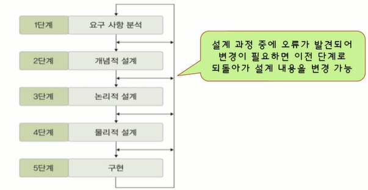
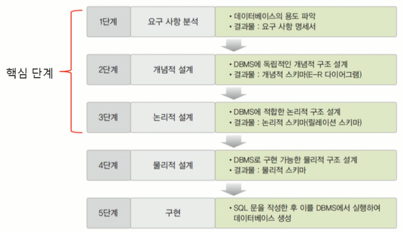
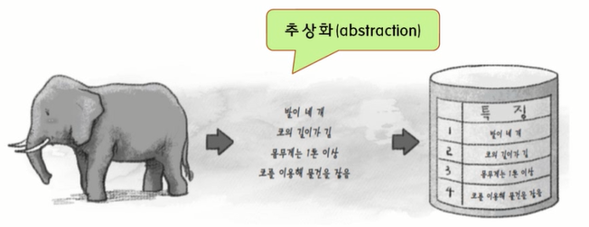
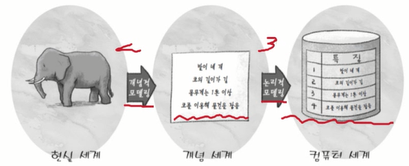

## Data Modeling

### 데이터베이스 설계 단계
- 데이터베이스 설계
    - 사용자의 다양한 요구 사항을 고려하여 데이터베이스를 생성하는 과정
    - E-R모델과 릴레이션 변환 규칙을 이용한 설계의 과정

- E-R 모델과 릴레이션 변환 규칙을 이용한 설계의 과정

### 1. 데이터 모델링과 데이터 모델의 개념

- 데이터 모델링
    - 현실 세계에 존재하는 데이터를 컴퓨터 세계의 데이터베이스로 옮기는 변환 과정
    - 데이터베이스 설계의 핵심과정

- 2단계 데이터 모델링
    - 개념적 데이터 모델링
        - 현실 세계의 중요 데이터를 추출하여 개념 세계로 옮기는 작업
    - 논리적 데이터 모델링
        - 개념 세계의 데이터를 데이터베이스에 저장하는 구조로 표현하는 작업

- 데이터 모델
    - 데이터모델링의 결과물을 표현하는 도구
    - 개념적 데이터 모델
        - 사람의 머리로 이해할 수 있도록 현실 세계를 개념적 모델링하여 데이터베이스의 개념적 구조로 표현하는 도구
        eg)개체-관계 모델
    - 논리적 데이터 모델
        - 개념적 구조를 논리적으로 모델링하여 데이터베이스의 논리적 구조로 표현하는 도구
        eg)관계 데이터 모델

- 개체-관계 모델(E-R model : Entity-Relationship model)
    - 피터 첸이 제안한 개념적 데이터 모델
    - 개체와 개체 간의 관계를 이용해 현실 세계를 개념적 구조로 표현
    - 핵심 요소는 개체, 속성, 관계

- 개체-관계 다이어그램(E-R diagram)
    - E-R 다이어그램
    - 개체-관계 모델을 이용해 현실 세계를 개념적으로 모델링한 결과물을 그림으로 표현

