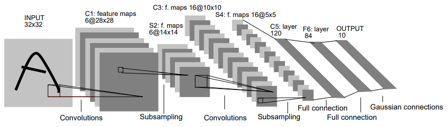
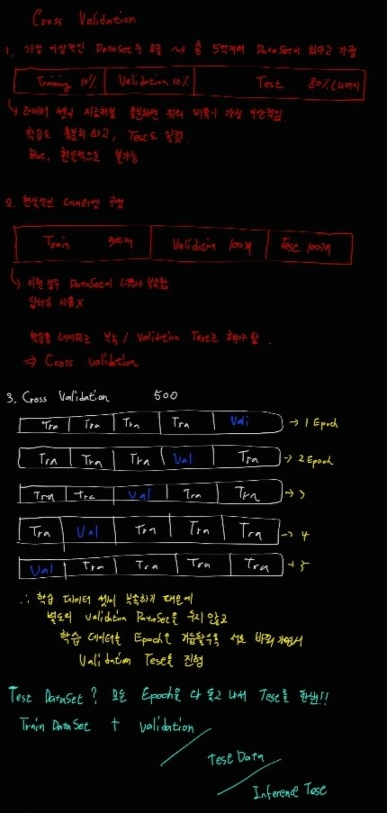
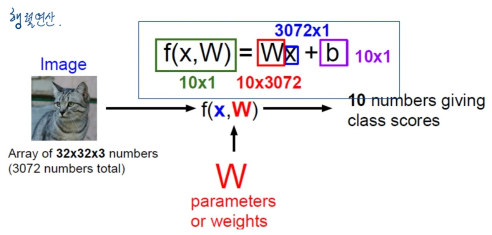
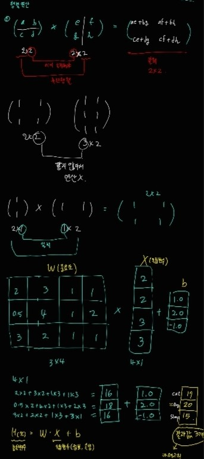

## Deep Learning

**Intro**

**Current revolution of AI**

**알파고(ALPHAGO)** : 인공지능 바둑 프로그램, 구글 딥마인드가 개발, 강화학습 사용

**스마트 스피커** : Amazon echo, 아마존에서 개발, 아마존은 세계 최대 올라인 커머스 기업, 알렉사라는 두뇌 탑재, 보안문제가 가장 큰 이슈

**자율주행** : 사람이 운전하는 차량의 사고를 미리 예측하기가 너무 어려움, 보안문제도 마찬가지로 대두, 완벽한 자율주행(5단계) 완성, 상용화는 미완성

**의료 인공지능** : IBM Watson이 대표적, 암 진단 분야에서 AI기술을 사용해 입증을 받음, 정확도를 98%까지 예측, 구글과 MS는 의료AI에 많은 투자를 하고있다.

**Robotic Surgery** : 원래는 산업용이었던 것을 의료용으로 많이 상용화
Computer Vision 컴퓨터가 인간과 똑같은 방식으로 인식하며 판단하는 기술

**Retina(망막) Scanning** : 혈관의 독특한 패턴 학습, 구글 답마인드가 런던 무어필드 안과 병원 연구팀과 함께 망막을 스캔하여 눈의 이상을 진단하는 스캐닝 기술 개발,
얼굴 인식 : 실생활에서 가장 많이 상용화되어있다, 사람이 하는 것보다 더 정확

**Segmentation** : segmentation 기법을 활용해 암 진단률 높임
MRI이미지 활용 시 이점 : Quality/Speed Improvement, Contrast Conversion, Modality Conversion

**딥러닝 활용 작업**
- Classification (분류 문제) : 진정한 학습은 label이 존재해야한다(지도학습), Nueral Network 사용
- Segmentation : 모든 픽셀을 카테고리로 분류, 자율주행에서 반드시 사용함, 그 외에도 암 진단, 세포 진단 등에 사용
- Image Generation : Image Generation을 활용한 대표적 사이트 (https://deepart.io/)
- Natural Langauage Processing (NLP) : 현재 불어와 영어 사이의 번역이 가장 인간과 비슷하게 구현되어있음.

## Computer Vision

1. Computer Vision : 기계의 시각화

- 컴퓨터 과학 최신 연구분야, 기계가 인간이 본 것처럼 학습
- 활용 분야: Physics, Biology, Psychology, Computer Science, Mathmatics, Engineering

<br>

**Hubel & Wiesel, 1959**

고양이 뇌를 이용하여 연구한 실험 연구 사례, 매우 유명
고양이는 물건의 어느 측면을 보고 뇌가 가장 강하게 반응하는가? 뇌파로 판단해본 결과 모서리부분을 보고 강한 반응을 보였다.
결론적으로 모서리는 사물의 명암을 기준으로 변화가 매우 큰 지점이므로 이를 잘 학습시킨다면 어떤 사물인지 판단 가능할 것임


**Edge Detection**<br> 알고리즘 생성 : 미분 활용
한계: 어느 측면을 바라보느냐 즉, 방향과 각도에 따라 결과가 천차 만별이다.
한계를 극복하기 위해 CNN(Convolutional Neural Network) 등장

**Convolutional Neural Network**

1998년 LeCun et al. 이 발명
인공지능(AI) 심층학습 시대를 연 사람들 : 제프리 힌튼(Geoffrey Hinton), 조슈아 벤지오(Yoshua Bengio), 얀 르쿤(Yann LeCun)
ImageNet대회에서 2012년에 CNN알고리즘이 사용되며 다시 빛을 보게 되었다.



## Classification

- 학습 방법
FCN (Fully Convolutional Network)
DNN (Deep Neural Network)
ANN (Artificial Neural Network) -> 히든 레이어 1개
Deep + Convolution = CNN 

<br>

- Semantic Gap
사람이 바라보는 사진을 컴퓨터는 0~255사이의 숫자로 이루어진 값들로 인식한다.
흑백일 경우 하나의 판으로 컬러일 경우 3개의 판으로 구성
(R,G,B)

<br>

- Challenges
Illumination (명암에 따라)
Deformmation (형태 변형)
Occlusion
Background Clutter (배경과 구분)
Intraclass Variation

<br>

- image classifier

``` python
def classify_image(image):
    # some magic here?
    return class_label
```

이 코드는 분류모델을 정의하고 있다. 함수 인자값은 입력값이고 주석 처리된 부분은 학습이 처리되는 부분이다. 마지막으로 예측한 값을 출력해준다.

- Data-Driven Approach

1. 이미지와 라벨의 데이터셋을 확보
2. 분류모델을 훈련하기 위한 머신러닝 사용
3. 새로운 이미지에 평가
Training model, Test model로 구분지어 학습 및 예측 수행

### Nearest Neighbor

``` python
def train(images,labels):
    # Machine Learning
    return model
```

이 코드는 훈련 모델로 모든 데이터와 라벨들을 저장한다.

``` python
def predict(model, test_images):
    # use model to predict labels
    return test_labels
```

이 코드는 테스트 모델로 인자값의 test_images는 미지의 데이터를 의미한다.
가장 유사한 훈련 모델로 정답을 예측한다.

<br>

- Data-Driven Approach 방법 중 초창기 방법
Classification을 가장 심플하게 할 수 있는 방법
모든 데이터들의 유사도를 각각 비교한다.

- 단점
비효율적임
위치가 아주 살짝만 이동되어도 픽셀의 모든 값들이 밀렸기 때문에 차이가 크다고 인식한다
푸른 계열의 색상이 입혀있을 경우 픽셀값에 어두움이 더해져 같은 이미지임에도 불구하고 다른 이미지로 인식한다.

### Cross-Validation

- Hyperparameters : Choices about the algorithm that we set rather than learn
    - 학습에 의해 알아지는 값이 아닌 인간이 알고리즘에 대해 선택한 값(= Heuristic Values 라고도 한다.)
예시: k-fold cross validation



그림에 대해서 간단하게 설명하자면 
데이터가 충분할 경우, train(10%) + validation(10%) + test(80%)로 나누는 것이 가장 이상적
현실적으로는 불가능하다. 보통 train데이터가 훨씬 많고 test데이터가 적다. Data Set이 매우 부족
이 때, validation을 많이 확보할 수 없다.
결론적으로 학습용 데이터는 턱없이 부족하고 validation 테스트는 필요할 때 Cross Validation을 사용한다.
학습 데이터셋이 부족하기 때문에 별도의 Validation DataSet을 두지 않고 학습 데이터를 에폭을 거듭할수록 서로 바꿔가면서
validation test 를 모든 에폭을 학습시킨 후 딱 한번 마지막에 진행한다.

#### Deep Learning Pipeline

1. Training Data Loading

2. Feature Engineering & Pre-processing 

3. Training Data Augmentation(데이터 변형 - 명암, 회전, 잘라내기 등)

4. Deep Neural Network Training & Validation with Training Data

5. Deep Neural Network testing with Testing Data - Interface with validation

## Linear Classification

- 이미지 데이터를 입력하면 모델 f(x,W) = Wx + b로 예측하여서 결과값 출력한다.



이때 수학시간에 배운 행렬연산이 들어간다.



행렬 연산에 대한 내용은 그림을 참고하면 될 것 같다.

