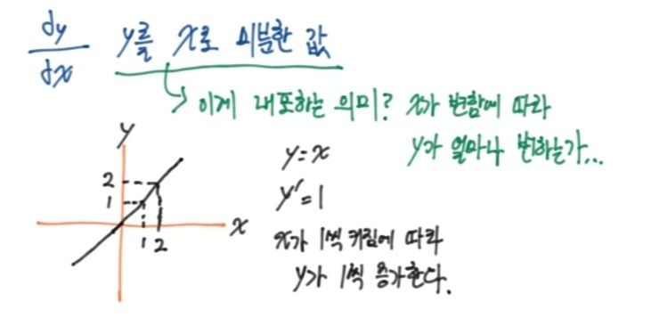
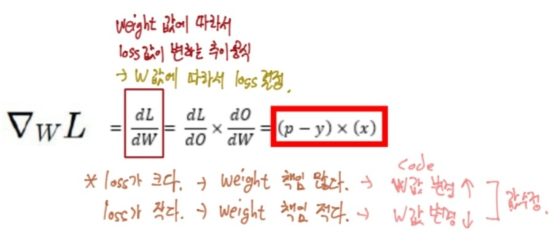
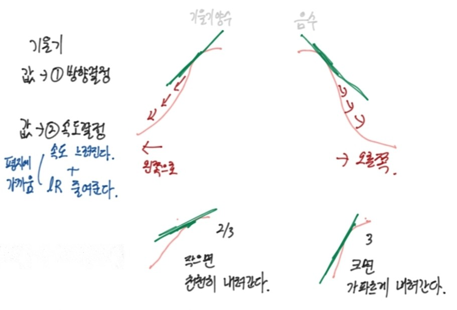
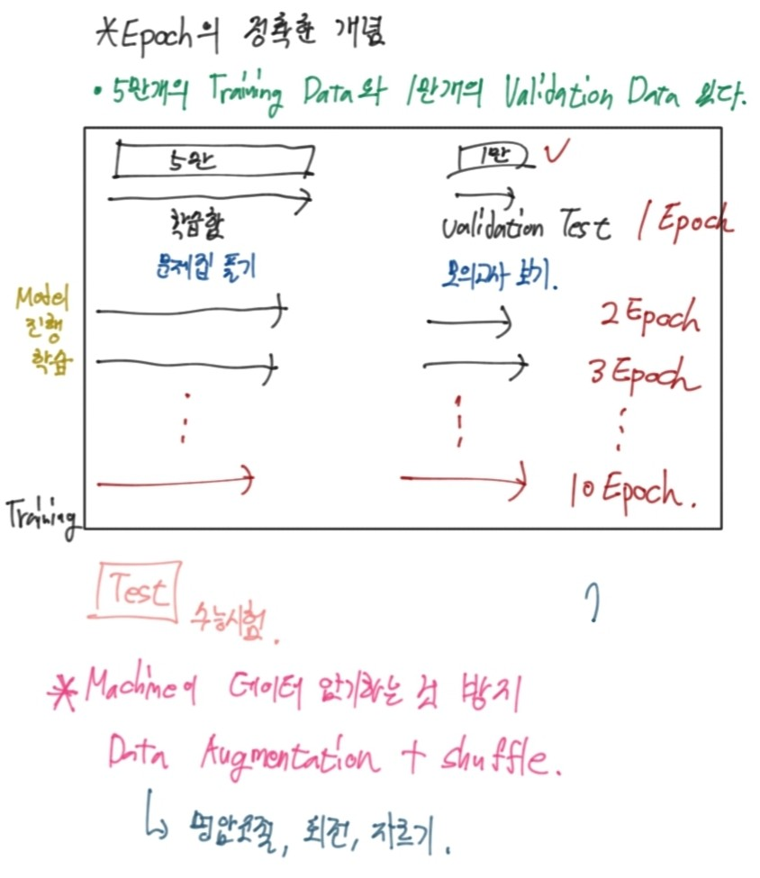
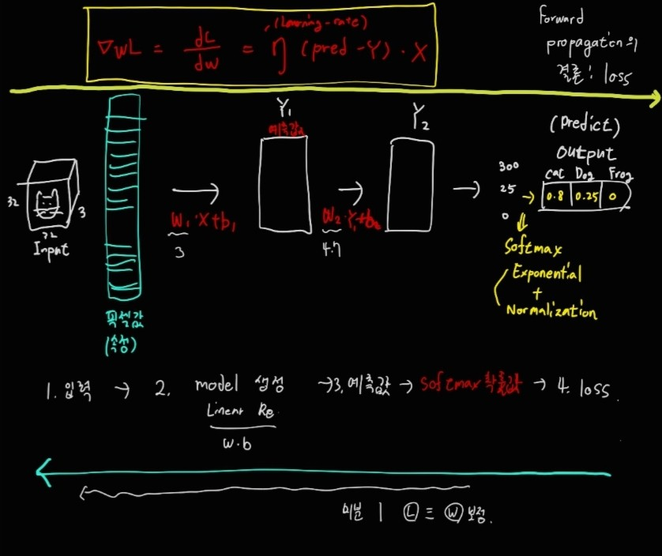
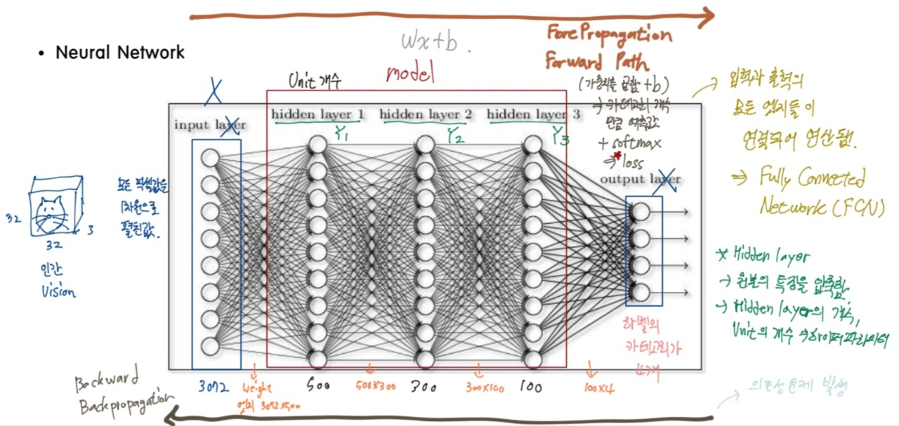
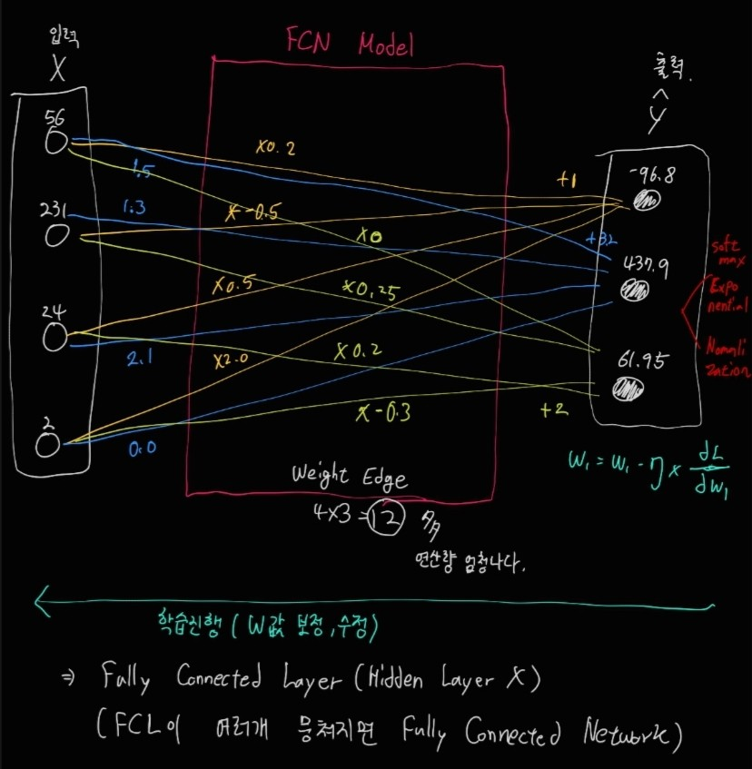

## Backpropagation

### Optimization
- 어떻게 하산할지를 정하는 것
- local minimum에 빠지지 않고 optimization하는 것이 쉽지 않다.
- 여러가지 방법이 존재하는데 대표적으로 SGD(Stochastic Gradient Descent)가 있다.
- dL/dW -> w 값에 따라서 loss값이 결정된다.

1. **Random Search**
- 무작위로 w값을 여러번 넣은 뒤, 그 중에서 최고의 값을 선정한다.
2. **Random Local Search**
- 무작위 방향으로 w값을 바꿔서 Loss가 감소하는지 확인 후, 감소하면 w값을 업데이터한다.
3. **Gradient Descent**
- 가장 가파르게 Loss를 감소하는 w방향을 수학적으로 계산한 뒤, 해당 방향으로 이동한다.
- 위 두가지 방법과 다르게 Trial Erro가 없지만 느리다.
- BackPropagation으로 편미분을 적용하여 optimization한다.

- 기울기 관련....

4. **Stochastic Gradient Descent**
- 기존의 GD의 느리다는 단점을 보완하기 위해서 빠르게 찾을 수 있도록 발전했다.

5. **Adagrad**
- 굉장히 빠르다. 빠르게 하산한다.
- 하지만 정확한 지점 근처에 가면 노이즈가 많이 발생한다.

- Learning rate
    - 하이퍼파라미터인 learning rate도 기울기와 비례하여 함께 변화를 줘야 하는 대상이다.

### BackPropagation

- 가장 가파르게 Loss가 감소하는 weight값을 찾아내는 계산법이고, 편미분을 적용한다.

- 우리가 데이터를 입력하여 loss를 찾아가는 일련의 과정을 Forward Propagation이라고 한다.
- 반면에 계속해서 보정하는 과정은 Back에서부터 시작이 되고 Backpropagation에서 미분을 활용한다. 이 과정에서 가장 알맞은 w와 b를 찾아나간다.

그림을 보게 되면 Neural Network의 전체적인 구조를 알 수 있다. 이미지 데이터가 모델에 들어가기 전에 모든 픽셀값을 1차원으로 펼쳐서 입력한다. 그 후 모델에서는 hidden layer가 총 3개로 첫번째에서는 3072 * 500, 두번째는 500 * 300, 세 번쨰는 300 * 100 이렇게 w의 엣지의 개수가 정해진다. 이 때, 점점 hidden layer를 거칠수록 unit의 수가 줄어들면서 원본 이미지의 속성을 압축하게 된다. 이렇게 입력에서부터 예측값이 나오기까지의 과정을 **Fore Propagation, Forward Path**라고 한다. Fore Propagation의 결과값은 카테고리의 개수만큼의 예측값 + softmax함수가 되고 이것은 **Loss**를 의미한다. 
또한 이렇게 입력과 출력의 모든 엣지들이 연결되어 연산되는 것은 **Fully Connected Network**라고 한다.

이렇게 예측값이 나오고 loss를 조정하기 위해서 미분 또는 편미분을 사용하는 과정을 **Backward, Backpropagation**이라고 하며 Forporpagation의 반대 방향으로 간다. Backward는 Forward가 나오고 구해지는 것이기 때문에 의존성 문제가 발생한다고 한다.

- **Hidden layer**
    - 원본의 특징을 압축한다.
    - Hidden layer의 개수, unit의 개수
      => HyperParameter

