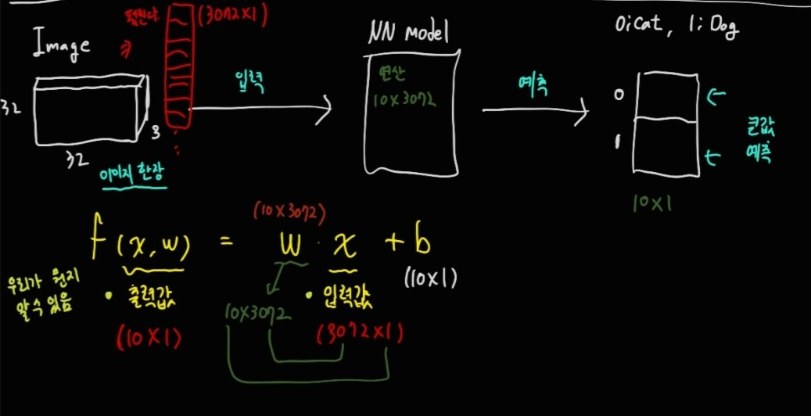
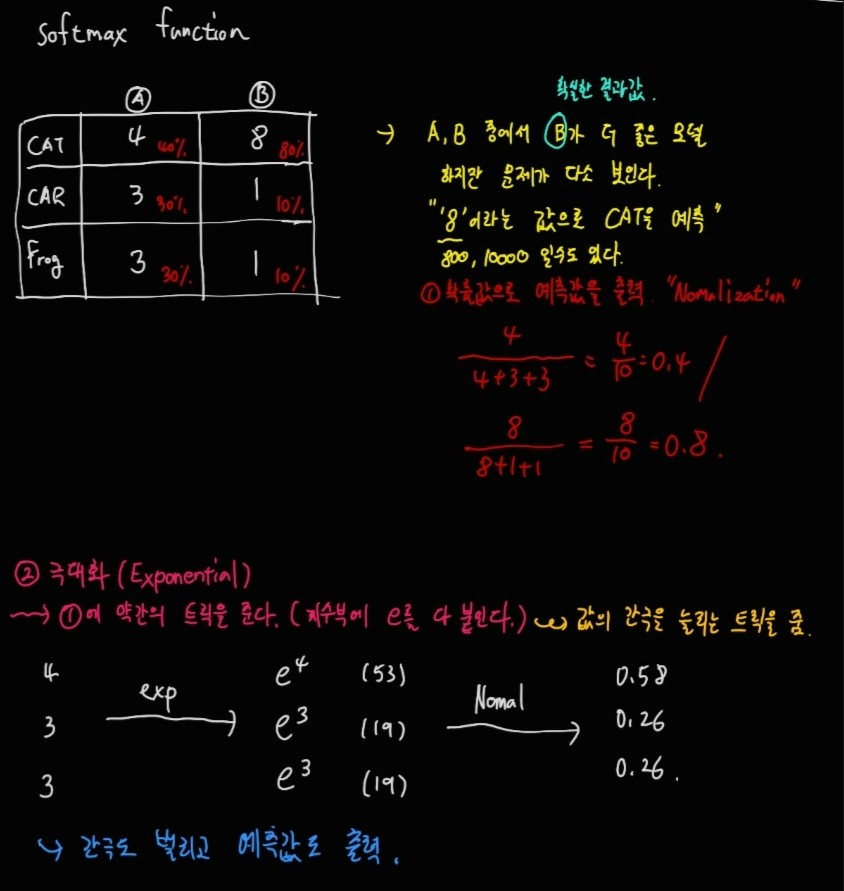
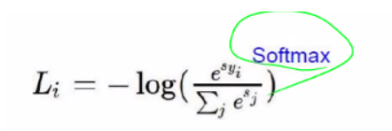
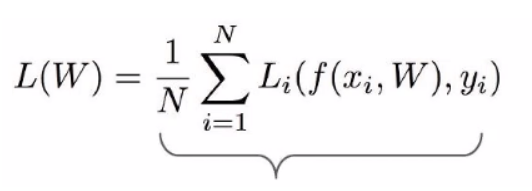
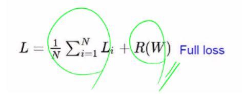

## Linear Classification

32 * 32 * 3(width * height * channel)인 이미지 파일이 입력이 되면 Linear Classification 모델에 들어가고 10개의 클래스에 그림과 같이 점수가 부여된다. 일반적으로 사람의 눈에서는 데이터가 입력될 때 32 * 32 * 3으로 입력될 것 같지만 컴퓨터는 실제로 데이터를 펼쳐서 3072 * 1 형태로 넣는다.

실제로 이렇게 입력되어 학습이 진행이 되면 크게 2가지의 문제점이 생긴다. 
1. 모델의 Variance가 높아져서 Overfitting 위험성이 있다.
2. 연산량이 너무 많아진다.

 

따라서 결과값을 산정할 때 확률값으로 예측값을 출력하는 **Nomalization**을 하고 간격을 더 늘리기 위해 **극대화(Exponential)**까지 해줘서 유사하게 나오는 값을 넓게 퍼트리게 만들어준다.

이렇게 나온 결과값을 loss에서 보정해가면서 학습을 하게 된다.

## Classification Loss Function
- Loss Function 
해당 모델이 얼마나 예측을 잘 했는지를 **정량적**으로 나타내는 함수이다. 값이 0에 가까울수록 예측을 잘한 모델이다.

    - Hinge Function
        - 문제점 : 잘한 결과와 못한 결과를 정량화, 극대화를 할 수가 없다. 무엇보다 현재 많이 안 쓰이기 때문에 정확한 설명은 넘어간다.

    - **Softmax Function**
        - Hinge Function에서 **Exponential, Normalization** 을 보완한 것이 Softmax Function이다.

        - 정량화하기 위해서는 Softmax Function으로 결과값을 뽑아놓고 loss를 구해야 한다.

        - **Normalization** : 예측값을 백분율로 나타낸다.
        특정예측값/모든카테고리의예측값의합

        - **Exponential** : 극대화, normalization에 약간의 트릭을 준다. 지수부에 e를 붙여줌.
        특정 값이 4 일 경우,
        e4 로 변환한 후 normalization을 취한다.
        Softmax Function으로 결과값을 확률적으로 찾을 후 Loss Function을 구해야한다.
        - **−log(x)** 의 x값에 softmax function을 실행한 결과값을 넣으면 loss function을 구할 수 있다.

        

    - **Regularization**
        - Loss Function에 들어가는 수식 중 하나이다.
        - 모델을 쉽게 만들고 cost를 낮추는 방향으로 잡아버리면 값들의 Variance는 연산을 할수록 간극이 벌여져서 Overfitting 가능성이 있다. 따라서 그러한 간극을 조정하는 Regularization을 해야 한다.

        

        f(Xi, W): 딥러닝 모델에서 나온 모든 예측값들
        yi: 이미지에 대한 라벨
        이들을 모두 더해 평균을 낸 것이 L(W)이다.
        
        

        Full Loss는 softmax, 모든 값 각각의 loss, 모델의 loss인 L(W)에 regularization을 추가한 값이다.
        예측값이 같더라도 weight값이 다르다면 R(w)값은 다르게 다온다. R(w)가 작을수록 overfitting이 적다.
        R(w)는 극심한 variance를 완만하게 바꿔준다.
        (w가 어떻게 분포하느냐에 따라서 R이 달라진다.)