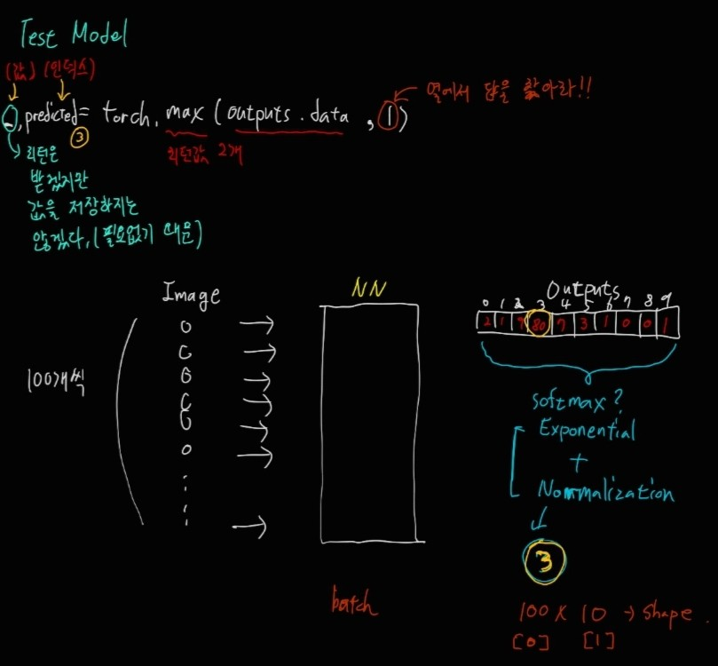

## Neural Network
- 사람의 뉴런을 본따서 만든 딥러닝 기법 


그림을 보게 되면 input인 x가 들어오면 입력값에 대한 직접적인 해석이 가장 먼저 이뤄진다. 이때, 해당 뉴런 고유의 해석 방식이 존재하는데 자신만의 신념에 따른 중요도를 직접 부여하게 된다. 즉, w값을 input에 곱해준다.
그 후에는 세포 바디 부분에서 입력값에 대한 동일한 해석을 하게 된다. 이 부분은 코드에서는 static한 상수를 주는 부분이라고 생각하면 된다. 즉, b값을 더해주는 부분이다.
Axon부분에서는 특정치 이상 되는 것만을 출력해주는 부분인데 이 부분에서 향후 나올 activation function이 사용된다.

- Activation Function


이 그림이 앞서 언급했던 활성화 함수이다. 해당 그림은 x축에 입력 데이터를 넣고, y축에 결과값 데이터를 넣어서 특정 이상의 값만을 받아들이게 한다. 이 그림에서는 입력값이 12.5가 되어야 이동이 된다고 볼 수 있다.

- Activation Function의 종류


대표적으로 활성화 함수에는 Sigmoid 함수가 있는데 성능이 더 좋은 ReLU 함수가 더 많이 쓰인다. 오른쪽 함수들은 난이도가 어려운 모델에서 사용된다고 한다.
**ReLU**는 값이 0보다 작으면 0으로 수렴하게 되고 0 이상이면 무한대의 값을 가지게 된다.

- 활성화 함수를 쓰는 이유?

1. NeuralNet은 인간의 신경망을 본떠서 나온 학습법이여서 인강의 반응과 유사하게 만들어졌다. 즉, 신경전달 자극값이 미세하면 무시하고, 신경전달 자극값이 크면 출력을 위해서 전달되는 형태이다.

2. 수학적 측면에서 활성화 함수가 필요하다.
    - 학습을 아무리 깊이 해도 wx + b 형태에서는 선형이기 때문에 하나의 block과 결과적으로 같아진다. 따라서 독립적으로 값을 유지, 풍부한 값을 출력하기 위해서 활성화 함수로 비선형을 표현할 수 있다.

**<실습>**

``` python
import torch
import torchvision
import torch.nn as nn
import numpy as np
import torchvision.transforms as transforms
import matplotlib.pyplot as plt

# 우리가 사용할 컴퓨터를 check하는 부분, cpu/gpu 지원 받을지...
device = torch.device("cuda" if torch.cuda.is_available() else "cpu")
device
```

``` python
# 하이퍼 파라미터들
input_size = 784  # 28 * 28 * 1 = 784 (픽셀을 1차원으로 늘린다.)
hidden_size = 500 # 은닉 계층의 unit 수(히든 레이어는 하나!)
num_classes = 10 # 카테고리의 개수(deep learning의 output의 카테고리 개수)
num_epochs = 5
batch_size = 100
learning_rate = 0.001
```


- 데이터셋 로딩
1. 데이터 다운로드
2. 모델, 머신 안으로 로딩

``` python
# 1step(데이터 다운로드)
# train_dataset
train_dataset = torchvision.datasets.MNIST(root="../../data",
                                           train = True,
                                           transform = transforms.ToTensor(),
                                           download = True # 스케일링해서 다운로드하겠다.
                                           )
# test_dataset
test_dataset = torchvision.datasets.MNIST(root="../../data",
                                          train=False,
                                          transform = transforms.ToTensor()
                                          ) # 다운로드는 한번만 하면 된다.

# 2step...DataLoader...BatchSize를 이용함(네트워크로 Load - 모델,머신 안으로 로딩)
train_loader = torch.utils.data.DataLoader(dataset=train_dataset,
                                           batch_size = batch_size,
                                           shuffle = True
                                           ) 

test_loader = torch.utils.data.DataLoader(dataset=test_dataset,
                                           batch_size = batch_size,
                                           shuffle = False # 테스트할 때는 굳이 shuffle 필요 없음
                                           ) 
```


- model 생성하기

``` python
class NeuralNet(nn.Module): # nn.module 상속 받아서 NeuralNet 클래스를 생성
    # 모델 설계
    def __init__(self,input_size, hidden_size, num_classes): # 생성자 역할
        super(NeuralNet,self).__init__()
        self.fc1 = nn.Linear(input_size,hidden_size) # fully connection
        self.relu = nn.ReLU()
        self.fc2 = nn.Linear(hidden_size,num_classes)

    # 모델의 Forward Path를 정의
    def forward(self, x):
        out = self.fc1(x)
        out = self.relu(out)
        out = self.fc2(out)

        return out # 여기까지가 클래스 정의 부분
```


- 모델 학습(forward, backward)

``` python
# 위에서 정의한 클래스를 인스턴스화 시킴
model = NeuralNet(input_size, hidden_size, num_classes).to(device) # 이 model을 GPU 서버에서 돌리겠다.

# loss and optimizer를 선정의
loss_function = nn.CrossEntropyLoss() # Loss 기능 안에 Softmax 함수 기능이 포함되어져 있다.
optimizer = torch.optim.Adam(model.parameters(),lr = learning_rate)

total_step = len(train_loader) # 600번 로딩...600번 학습이 진행된다.

for epoch in range(num_epochs): # 5번...
    for i,(images,labels) in enumerate(train_loader): # for문이 100개씩 덩어리가 600번 돌아감
        # 네트워크에 넣어줄 때는 1차원으로 펼쳐서 넣는다.
        images = images.reshape(-1,28*28).to(device) # 네트워크에 넣어줄 때도 gpu로 돌린다.
        labels = labels.to(device)

        # Forward Path
        pred = model(images)
        loss = loss_function(pred,labels) 

        # Backward path
        optimizer.zero_grad()
        loss.backward()

        # 학습
        optimizer.step() # weight들을 업데이트

        # 학습이 진행되어 가는 과정 출력
        if (i+1) % 100 == 0:
            print("Epoch[{}/{}], step [{}/{}], Loss:{:.4f}".format(epoch+1,num_epochs,i+1,total_step,loss.item()))
```


- 모델 Test

``` python
with torch.no_grad(): # 실제로 학습할 필요가 없을 때 이 구문을 반드시 작성해야 한다.
    correct = 0
    total = 0

    for images, labels in test_loader: # 100개씩 100번 돌아간다.
        images = images.reshape(-1,28*28).to(device)
        labels = labels.to(device)

        outputs = model(images)
        _,predicted = torch.max(outputs.data,1)

        total += labels.size(0)
        correct += (predicted == labels).sum().item()
    print("Accuracy of the Network on the Test images : {} %".format(100*correct/total))
```




<br>
<br>
<br>

## 전체적인 NN의 틀

