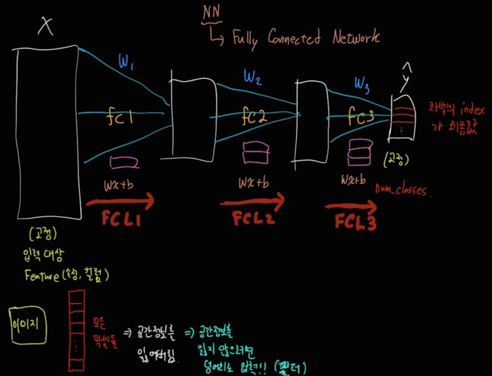

## CNN
- 영상처리에서 널리 사용하는 기계학습 방법론 중 하나
- 이미지의 전체가 아닌 여러개의 **작은 부분들을 보고(by Convolution Filter)   핵심적인 정보(Feature-map)** 을 추출하여 해당 정보를 이용하여 원하는 결과를 예측하는 기계학습 방법론이다.

1. 덩어리를 연산에 넣는다.
2. 이미지 부분의 특징을 훑는다.(Filter)

### CNN History
1) LeNet(1998)
- 얀 르쿤의 CNN 발명(손글시 테스트)

2) AlexNet(2012)
- CNN + ReLU() + Dropout()

3) VGG(2014)

4) ResNet(2015)

- object Detection, segmentation, pos의 백본으로 쓰임
- transfer learning -> 기존의 것을 갔다가 씀

** **기존의 FCN의 문제점**

이미지 데이터의 모든 픽셀들을 한줄로 늘려버리면 공간 정보를 잃어버리게 된다.

### Convolution layer
#### 필터
- 공간 정보를 유지하기 위해서는 덩어리 채로 입력이 되어야 하는데 이때, 필터(Filter)라는 개념이 나온다.
- 보통 3x3 또는 5x5의 형태로 많이 쓰이는데 원본 이미지 데이터의 특징을 훑는다.
- 필터는 원본 이미지의 채널과 필터의 채널이 같아야 이미지를 훑을 수 있다.

#### Feature Map
- 필터를 적용한 후 나오는 결과물을 Activation Map,Feature Map이라고 한다. 

1. 32 -> 28
    - 필터를 5*5를 사용함
2. 5*5 필터의 채널은? 3개
3. 5*5 채널은 몇 개인가? 6개
    - Feature Map의 채널 수가 6이다.

#### Stride
- stride의 수로 output의 사이즈를 조절할 수 있다. 
- 하지만 필터 사이즈와 stride 사이즈로 했을 때 정수로 맞아떨어져야만 활용할 수 있다.

- FeatureMap의 출력 사이즈가 어떻게 결정되는지의 공식은 
**(N - F) / stride + 1**이다.

- 공식 이외에 그냥 암기를 해보자면 
Stride가 1이라는 전제에
pad = 1, filter size = 3*3
pad = 1, filter size = 5*5
면 output size는 바뀌지 않는다.

이때, stride가 2가 되면
output size는 딱 절반 크기가 된다.

#### Padding
- 그렇다면 계속 나오는 padding은 무엇인가?
- 원본 사이즈와 중간 출력 사이즈를 갖게 만들어서 값에 영향을 주지 않게 만드는 것이다.(0과 같은 의미 없는 값으로 테두리를 채운다.)
- 패딩값은 필터의 사이즈에 의해서 결정된다.

- 아래의 그림과 같이 채운다고 생각하면 된다.

#### Pooling Layer
- Max Pooling : 큰 특징들만 추출
    - 2*2
    - 필터 안에 값이 없다.
    - 속성값 중에서 하나가 뽑힌다.
    - 이 기법으로 원본 사이즈가 정확히 반으로 줄어든다.
    - stride = 2 또는 Maxpooling을 쓰면 출력 사이즈는 입력의 1/2이다.
- Average Pooling : 윤곽선 추출
- Pooling 연산은 w가 없어서 학습이 되지 않는다.

#### Validation Test, Test와 Batch-size의 관계

Validation Test를 하는 이유는 loss를 점점 낮게 만들어서 최종 test 때, 가장 낮은 loss로 테스트하게 해서 성능을 높여 준다고 할 수 있다.

