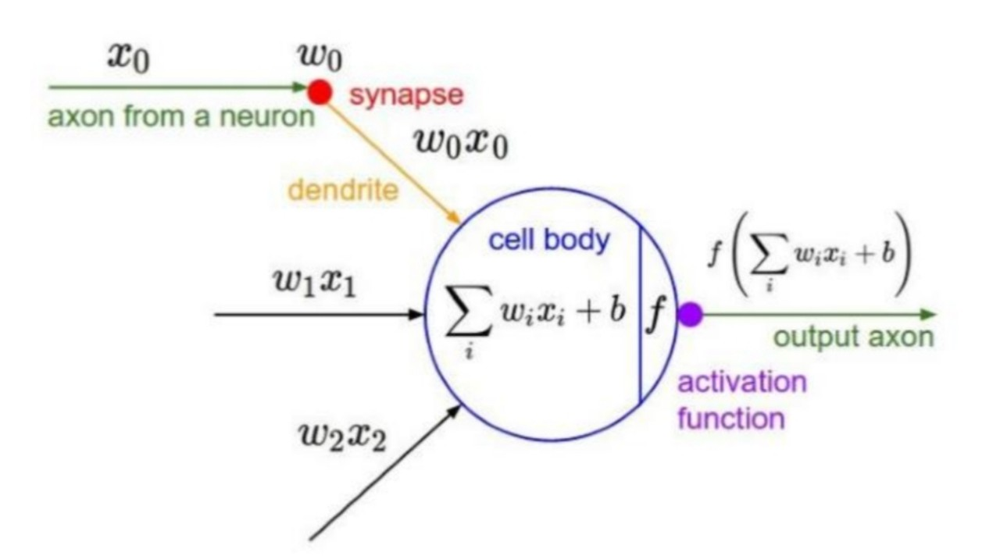
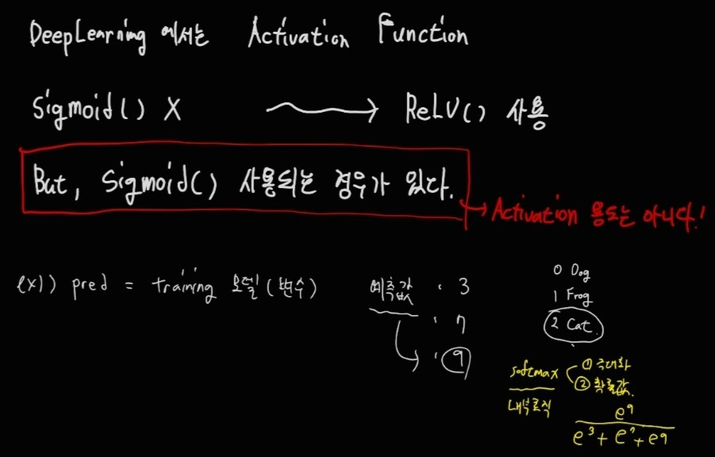
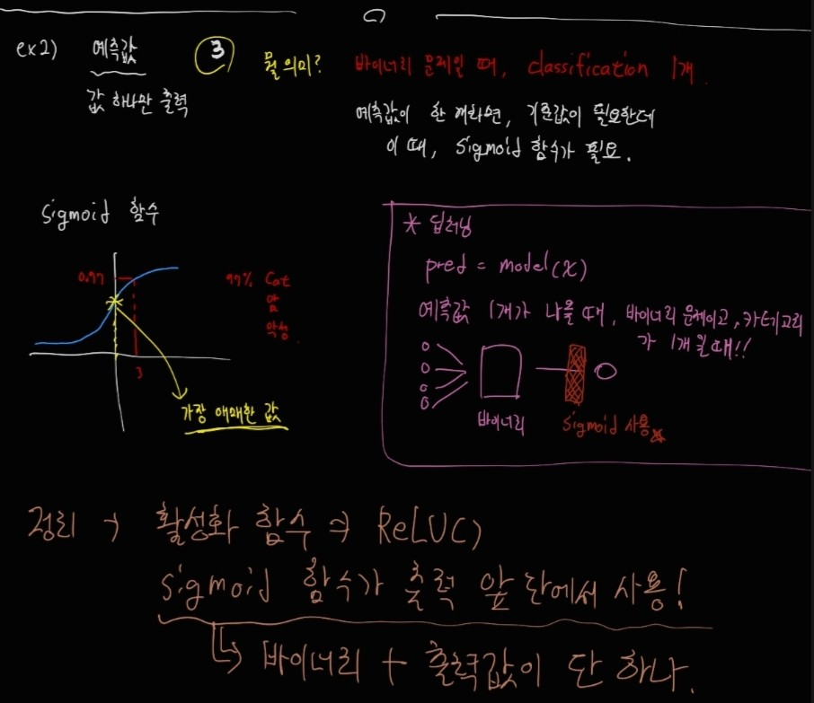
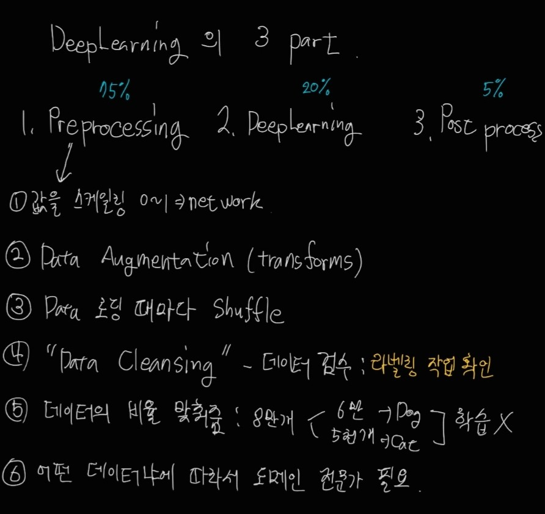
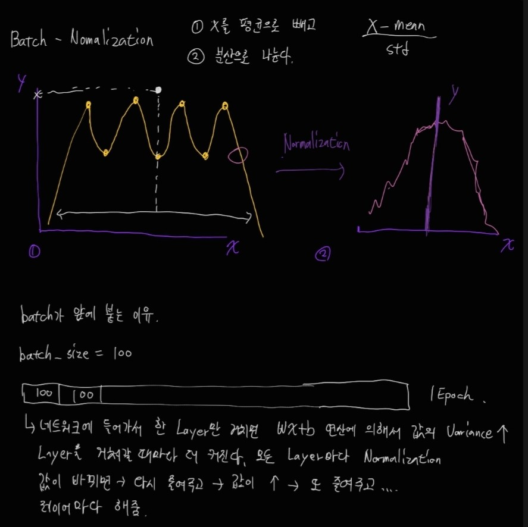
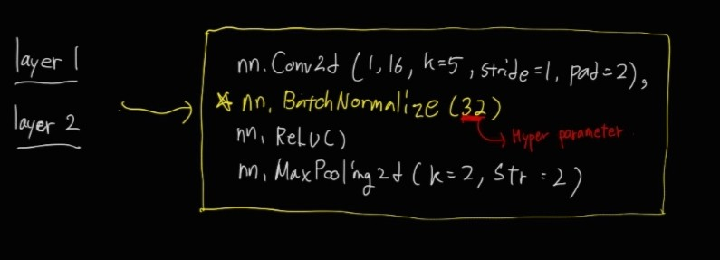

## Classification
1. Linear classifier

2. Fully Connected Network
    - FCL을 여러개 쌓은 상태
3. Convolutional Neural Network
    - 공간 정보 유지
    - Computer Cost가 상대적으로 적다.
4. Optimizer
5. BackPropagation

### Deep Learning Pipeline
1. Training Data Loading
2. Training Data Augmentation
    - transforms(학습 데이터가 늘어나 학습효과를 높인다.) + shuffle
3. Deep Neural Network Training with Training Data, Validation Data
***
여기까지가 batch-size looping

4. Deep Neural Network Testing with Testing Data (정답이 있음)
5. Inference with verified Deep Neural Network (정답이 없음)

## Training Neural Network
- NN을 어떻게 학습시킬까?

### Activation Function
- 의미 있는 값만을 채택하게 한다.
- 선형 함수는 한계가 있어서 비선형으로 바꿔준다.

- Alexnet 이후로 활성화 함수는 ReLU를 사용한다.

#### Sigmoid 함수가 쓰일 때

정리를 하자면 활성화 함수는 ReLU가 쓰이는 것이 맞다. 그리고 Sigmoid 함수는 출력 앞 단에서 바이너리 문제일 때, 출력값이 단 하나일 때 사용이 된다.

### 1. Data Preprocessing

- 스케일링
    - RGB Image Range : 0~255
    - Network Input Range : 0~1
    - nework_input = image_matrix / 255

- Data Augmentation
    - 명암 조절
    - 회전
    - 자르기 등등

- Batch Normalization
    - 모든 레이어에 반드시 들어가야 한다.
    - 레이어를 거듭할수록 중요값은 커지고, 중요하지 않은 값은 작아지는데(Overfitting 유발) Batch Normalization이 이 벌어지는 격차를 줄여준다.
    - 위의 문장을 다른 말로 하면 
    네트워크의 각 레이어를 거칠 때마다 input값의 Variance가 달라진다고 한다.(Distribution이 커진다.)

코드 상에서는 nn.BatchNormalize(값)을 convolution과 activation 함수 중간에 넣어줘서 실행해준다.

### Babysitting the Learning Process

- Step 1: Preprocessing the data(+ Data Augmentation)

- Step 2: Network Architecture 설계

- Step 3: Loss function / Optimizer 설정

- Step 4: Train model and Analyze results
    - Visualize train & Validation Loss
    - Check Overfitting 
    - Check Learning rate

### Hyperparameter Optimization

- choice about the algorithm that we set rather than learn
