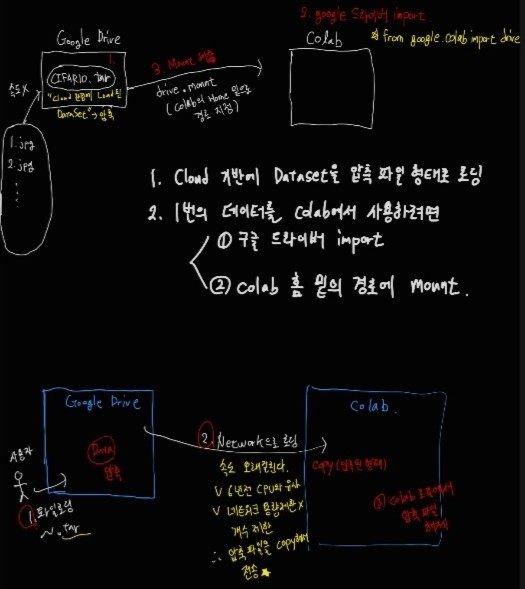
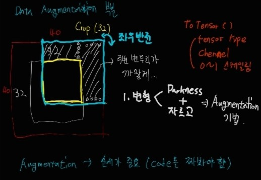
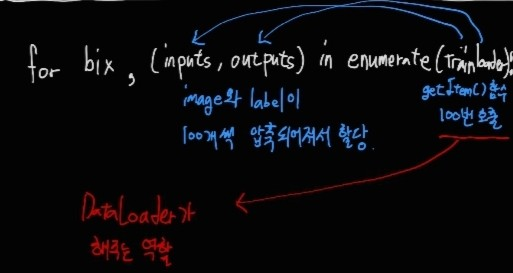

## Colab과 Google Driver 연결하기

**<실습 코드>**

``` python
# Mount Google Drive Folder (/content/drive/My Drive/Colab)
# colab에서 구글 드라이버를 사용하기 위해서 import 하는 부분
from google.colab import drive

# 구글 드라이버의 데이터를 마운트 해오는 위치를 지정. content가 코랩의 로컬홈. 이 밑의 무조건 drive 하위로 잡아야 한다.
drive.mount('/content/drive')

# import user defined files 
import sys
import_dir ="/content/drive/My Drive/Colab Notebooks/2. Classification/pytorch-cifar"
sys.path.insert(0, import_dir)

# import ipynb files...
!pip install import_ipynb 
import import_ipynb

%run '/content/drive/My Drive/Colab Notebooks/2. Classification/pytorch-cifar/dataset.ipynb'

import easydict 
# 파이썬에서 실행할 때 값입력 python main.py --lr 0.01 --resume False
# ipynb 라인기반으로 작동하기 떄문에 위처럼 값입력 안된다.
args = easydict.EasyDict({ "lr": 0.1, "resume": False})

# Debugging Tool
import pdb

# Download & Unzip Dataset (Move from google drive to local)
# 3. 구글 드라이브에 있는 cifar.tgz 압축파일을 카피해서 로컬(content/sample_data) 이 안으로 저장해오겠다.
%cp -r '/content/drive/My Drive/Colab Notebooks/Dataset/CIFAR10/cifar.tgz' '/content/sample_data'

# 4. 코랩의 로컬 위치에서 (content/sample_data) 이 안에서 압축을 풀었다.
!tar -xvf  '/content/sample_data/cifar.tgz'

# Initilize Additional parameters
train_root = "/content/cifar/train"
test_root = "/content/cifar/test"
```



1. Cloud 기반에 데이터셋을 압축 파일 형태로 로딩한다.
2. 구글 드라이버에 import
3. colab 홈 밑의 경로에 mount

``` python
'''Train CIFAR10 with PyTorch.'''
import torch
import torch.nn as nn
import torch.optim as optim
import torch.nn.functional as F
import torch.backends.cudnn as cudnn

import torchvision
import torchvision.transforms as transforms

import os
import argparse

'''
from models import *
models 패키지에 있는 모든 걸 다 가져와라... *
models 안으로 들어가면 여러개의 파일이 있다.
1. __init__.py 이걸 먼저 찾게 되어 있다. 이게 제일 먼저 import 된다.
2. __init__.py 이 안으로 다시 들어가보자.
    우리가 선택해서 사용할 수 있는 여러 모델들이 다 나와있다.
    모델들이 import 되어진다.

결론은 __init__이 먼저 import 되고 / __init__에 들어있는 것들이 나중에 import 되어지는 
이중적인 구조로 되어 있다.
''' 
from models import *
from utils import progress_bar

'''
# Removed Code (Because ipynb file does not support argparse)
# Even removed, these lines are substitued by easydict code

parser = argparse.ArgumentParser(description='PyTorch CIFAR10 Training')
parser.add_argument('--lr', default=0.1, type=float, help='learning rate')
parser.add_argument('--resume', '-r', action='store_true',
                    help='resume from checkpoint')
args = parser.parse_args()
'''

device = 'cuda' if torch.cuda.is_available() else 'cpu'
best_acc = 0  # best test accuracy
start_epoch = 0  # start from epoch 0 or last checkpoint epoch

# Data
print('==> Preparing data..')
# 데이터 변형(Data Augument)
transform_train = transforms.Compose([
    transforms.RandomCrop(32, padding=4), # 이미지 자르기
    transforms.RandomHorizontalFlip(), # 수평 뒤집기
    transforms.ToTensor(),
    #transforms.Normalize((0.4914, 0.4822, 0.4465), (0.2023, 0.1994, 0.2010)),
])

transform_test = transforms.Compose([
    transforms.ToTensor(),
    #transforms.Normalize((0.4914, 0.4822, 0.4465), (0.2023, 0.1994, 0.2010)),
])

# Modified for custom dataset
#trainset = torchvision.datasets.CIFAR10(root='./data', train=True, download=True, transform=transform_train)
trainset = Dataset(root=train_root, transforms=transform_train)
trainloader = torch.utils.data.DataLoader(
    trainset, batch_size=128, shuffle=True, num_workers=os.cpu_count(), drop_last=True) # num_workers : 데이터 로딩에 사용하는 subprocess개수

# Modified for custom dataset
#testset = torchvision.datasets.CIFAR10(root='./data', train=False, download=True, transform=transform_test)
testset = Dataset(root=test_root, transforms=transform_test)
testloader = torch.utils.data.DataLoader(
    testset, batch_size=100, shuffle=False, num_workers=os.cpu_count(), drop_last=True)

classes = ('plane', 'car', 'bird', 'cat', 'deer',
           'dog', 'frog', 'horse', 'ship', 'truck')

print('==> Building model..')
# net = VGG('VGG19')
# net = ResNet18()
# net = PreActResNet18()
# net = GoogLeNet()
# net = DenseNet121()
# net = ResNeXt29_2x64d()
net = MobileNet() # 가장 가벼운 모델
# net = MobileNetV2()
# net = DPN92()
# net = ShuffleNetG2()
# net = SENet18()
# net = ShuffleNetV2(1)
# net = EfficientNetB0()
# net = RegNetX_200MF()


net = net.to(device)

if device == 'cuda':
    net = torch.nn.DataParallel(net) # 모델을 병렬로 실행하여 다수의 GPU 에서 쉽게 작업을 실행
    cudnn.benchmark = True # 내장된 cudnn 자동 튜너를 활성화하여, 하드웨어에 맞게 사용할 최상의 알고리즘(텐서 크기나 conv 연산에 맞게?)을 찾는다.

if args.resume:
    # Load checkpoint.
    print('==> Resuming from checkpoint..')   
    assert os.path.isdir('checkpoint'), 'Error: no checkpoint directory found!' # assert 조건, "메시지" -> 가정 설정문
    checkpoint = torch.load('./checkpoint/ckpt.pth')
    
    net.load_state_dict(checkpoint['net']) # 모델의 매개변수들을 불러옴/ state_dict:각 계층을 매개변수 텐서로 매핑되는 Python 사전(dict) 객체
    best_acc = checkpoint['acc']
    start_epoch = checkpoint['epoch']

criterion = nn.CrossEntropyLoss()
optimizer = optim.SGD(net.parameters(), lr=args.lr,
                      momentum=0.9, weight_decay=5e-4)


# Training
def train(epoch):
    print('\nEpoch: %d' % epoch)
    net.train()
    train_loss = 0
    correct = 0
    total = 0    

    for batch_idx, (inputs, targets) in enumerate(trainloader): # 
        inputs, targets = inputs.to(device), targets.to(device)
        optimizer.zero_grad()
        outputs = net(inputs)
        loss = criterion(outputs, targets)
        loss.backward()
        optimizer.step()
        train_loss += loss.item() 
        _, predicted = outputs.max(1)        
        total += targets.size(0) 
        correct += predicted.eq(targets).sum().item() # 객체 간의 비교 연산 eq() : '=='

        progress_bar(batch_idx, len(trainloader), 'Loss: %.3f | Acc: %.3f%% (%d/%d)'
                     % (train_loss/(batch_idx+1), 100.*correct/total, correct, total))
        #print(batch_idx,'/', len(trainloader), 'Loss: %.3f | Acc: %.3f%% (%d/%d)'
        #             % (train_loss/(batch_idx+1), 100.*correct/total, correct, total))


def test(epoch):
    global best_acc
    net.eval()
    test_loss = 0
    correct = 0
    total = 0
    with torch.no_grad():
        for batch_idx, (inputs, targets) in enumerate(testloader):
            inputs, targets = inputs.to(device), targets.to(device)
            outputs = net(inputs)
            loss = criterion(outputs, targets)

            test_loss += loss.item()
            _, predicted = outputs.max(1)
            total += targets.size(0)
            correct += predicted.eq(targets).sum().item()

            progress_bar(batch_idx, len(testloader), 'Loss: %.3f | Acc: %.3f%% (%d/%d)'
                         % (test_loss/(batch_idx+1), 100.*correct/total, correct, total))
            #print(batch_idx,'/', len(testloader), 'Loss: %.3f | Acc: %.3f%% (%d/%d)'
            #             % (test_loss/(batch_idx+1), 100.*correct/total, correct, total))

    # Save checkpoint.   
    acc = 100.*correct/total
    if acc > best_acc:
        print('Saving..')
        state = {
            'net': net.state_dict(),
            'acc': acc,
            'epoch': epoch,
        }
        if not os.path.isdir('checkpoint'): # 경로가 존재하는지 확인하기
            os.mkdir('checkpoint') # 새로운 폴더 만들기
        torch.save(state, './checkpoint/ckpt.pth') 
        best_acc = acc


for epoch in range(start_epoch, start_epoch+20):
    train(epoch)
    test(epoch)
```



Augmentation에서 padding을 4로 주고 자르면 기존의 자르는 효과와 함께 명암을 주는 효과도 줄 수 있다.



getItem() 함수 부분은 직접 만들어서 image와 label이 100개씩 압축되어져서 할당되지만 100번 호출하는 것은 DataLoader가 해주는 역할이다.