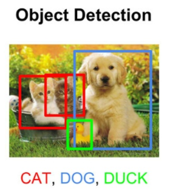
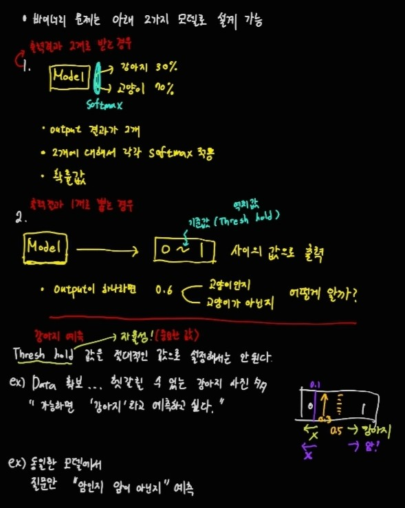

## Segmentaion

1. Semantic Segmentation
-> 각 영역의 픽셀값이 어느 영역에 해당하는지 구분하는 것(같은 class의 object들에 대해 서로 구분지을수 없다는 단점)
즉, 픽셀들이 각 class에 대해서 binary하게 포함이 되는지 안되는지 여부만 따진다.

2. Object Detection
-> classification + localization
여기서 localization이란 객첼라고 판단되는 곳에 직사각형을 그려주는 것

3. instance Segmentation
-> 각 픽셀별로 object가 있는지 없는지 여부만 계산한다.

- 위 3개 중 computation Cost가 가장 많이 드는 것은? Instance Segmentation

### FPS(Frame Per Seconds) 
1초마다 처리하는 이미지의 개수

- 인간의 눈은 1초당 10개 정도의 이미지를 처리하고 10개 이상이면 하나의동작이 자연스럽게 이어진다.

- FPS 0.1
10초마다 이미지 하나를 처리한다.

- FPS가 높을수록 Computation Cost가 낮아진다.(서로 trade off 관계)

#### FPS를 높이기 위한 다양한 시도
- LowAndModel : 속도가 빠르면 성능이 떨어진다.
- HighAndModel : 
성능은 좋지만 속도가 느리다.

=> 속도와 정확도는 Trade-off 관계

### Semantic Segmentation

- 그동안 봐왔던 CNN은 512x512x3 -> 256x256x16 -> 128x128x32 이런식으로 사이즈를 줄여서 특징을 압축하고 연산량도 줄여준다. 그러면서 채널을 높여서 특징 종류를 추가한다.

- 하지만 이렇게 하게 되면 Computation Cost가 많이 든다는 단점이 있고, 연산량의 사이즈가 방대해진다.

- 그림에서보면 input에서 부터 오른쪽으로 점점 사이즈가 줄고, 채널이 늘어나게 되는데 이부분은 downsampling(Convolution) 부분이고, 사이즈가 늘고, 채널이 줄어들게 되는 부분은 Upsampling(Deconvolution, Transpose Convolution)이라고 한다.

- 이미지의 사이즈는 서서히 줄었다가 다시 원래 이미지 사이즈와 동일한 사이즈로 늘리는 것이 Sementic Segmentation의 원리가 나온 동기이다.

#### Batch Normalization

- batch마다 weight가 곱해지고 bias가 더해지면서 속성값이 큰 경우는 더 커지고, 작은 경우는 더 작아지는 현상이 발생한다.

- Batch Normalization을 안해주면 높은 값을 제외한 나머지 값은 의미가 없어지고 이는 학습 효과를 떨어뜨린다. 
즉, Variance가 커지게 되는 원인이 된다. 

- 따라서 batch마다 정규화 작업을 해줘서 분산을 줄여준다. 이는 convolution에서 하나의 과정이다.

### Upsampling

1. Bed of Nails
- 의미없는 0 값으로 채워준다. 하지만 이 방법은 학습이 되지 않는다.
또한 0으로 채우게 되면 이미지 상에서 드문드문 검은색 줄무늬가 나타날 수 있다.

2. Interpolation(보간법)

- "Nearest Neighbor"
가장 큰사치 값으로 채워넣는 방법이다.

- 무작정 0으로 채울 때보다 학습효과가 좋다.
하지만 학습이 되는 건 여전히 아니다.

3. Transpose Convolution

- weight값이 학습이 되고, 숫자가 겹쳐지는 곳에 일정한 pattern이 생긴다.

#### Interpolation VS Deconvolution

- Interpolation : trainable하지는 않지만 가성비가 좋다고 할 수 있다.

- Deconvolution : 성능이 생각보다 좋지 않고, trainable해서 연산량이 많아진다.

- 따라서 실제로는 Interpolation이 더 많이 쓰인다고 한다.

