## Object Detection

### Object Detection 분류

1. Region proposal based
- R-CNN

 

2. Regression based
- YOLO

### Object Detection 모델
- 입력 : 사진
- 출력 : 박스 바운더리 정보 & 라벨 정보

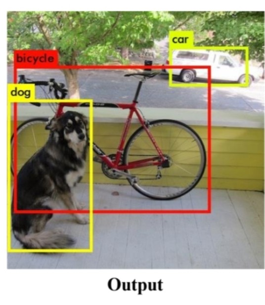

box1 : (x1,y1,h1,w1,cls1-dog)
box2 : (x2,y2,h2,w2,cls2-car)
box3 : (x3,y3,h3,w3,cls3-bicycle)

 

x,y -> 박스의 중심점
w,h -> 박스 height, width
cls -> 출력 카테고리 중 가장 큰 값으로 예측한 값

### R-CNN(Region-CNN)
- 2013년 Segmentation 이전에 나온 모델이다. 이때까지의 CNN은 Classification 밖에 못하는 네트워크였다.

- 1단계 : 이미지 삽입

- 2단계 : Region Proposal을 추출
    - Selective Search Algorithm
        - 색깔별로 덩어리를 묶어준다.
        1. 인공지능 알고리즘이 아니다.
        -> 학습이 되지 않음
        2. 비슷한 색,패턴,질감끼리 묶어주는 알고리즘
        -> 단순해보이지만 내부적으로 복잡

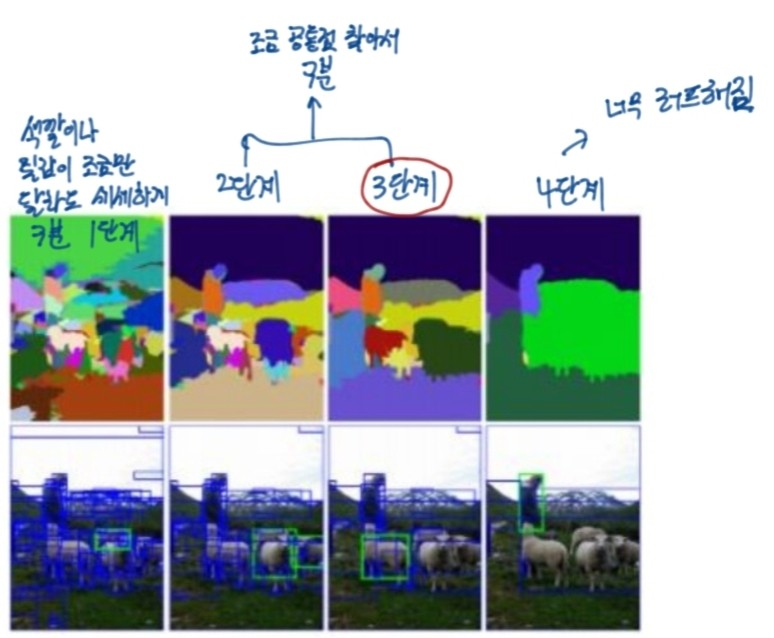

하지만 Selective Search Algorithm 만으로는 안 묶이는 것이 굉장히 많아서 box를 굉장히 많이 쳐주게 된다.

따라서 Region Proposal을 하면 거의 2000개에 가까운 box가 만들어졌다.

- 3단계 : 일정한 사이즈로 압축시킨다.
    - 2000개 정도의 Region Proposal로 제안된 모든 이미지들을 동일한 사이즈로 압축시킨다.
    - 이때, 압축된 모든 이미지들이 CNN의 forward 과정에 들어간다.
        - 따라서 Computation Cost가 엄청나다는 최대의 단점이 있다. 이 모델에서 이미지 한 장을 처리하기 위해 1분 정도가 소요된다고 한다.

- 4단계 : 압축된 이미지 2000개가 네트워크를 거쳐서 2000개 하나하나에 대한 분류 작업이 진행한다.(이때, 머신러닝의 모델인 SVM이 사용된다.)
    - 해당 박스들을 작업하면서 객체가 있는지 없는지를 확인한다. 그 후에 객체가 있으면 어떠한 객체인지 분류해준다.

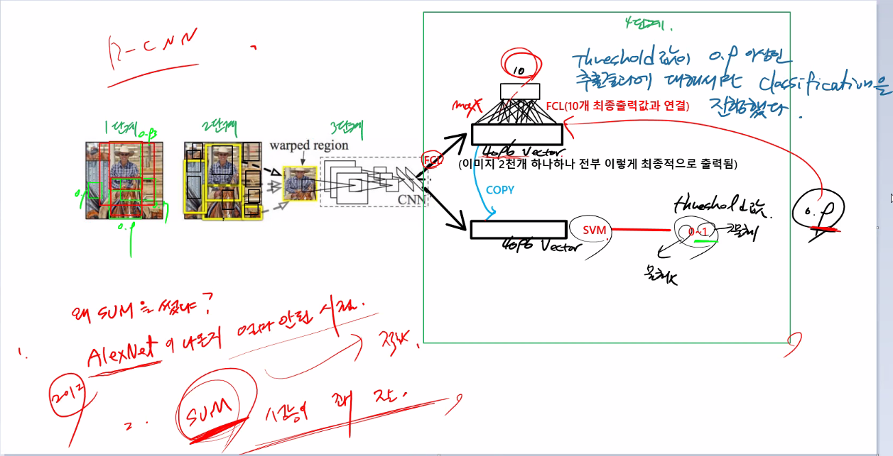

4단계에서 Threshold 값이 0.9 이상인 추출 결과만 SVM으로 classification을 진행하여 10개의 최종 출력값과 연결하였다.

SVM을 사용한 이유는 크게 2가지이다.

1. AlexNet(2012)이 나온지 얼마 안된 시점이었다.
2. SVM은 다른 모델들과 비교해서 성능이 꽤 잘 나오는 모델이었기 떄문이다.

#### R-CNN의 문제점
1. 시간이 너무 오래 걸려서 Computation Cost가 많이 들었다.
2. Selective Search algorithm과 SVM은 학습이 되지 않는 알고리즘들이다.

향후 이러한 속도문제를 해결하기 위해서 Fast R-CNN, Faster R-CNN 등이 탄생하기도 했다.

### YOLO(You Only Look Once)
- 딱 한번만 forward 진행한다.
- 기본적으로 LowAndModel, 속도는 빠르고 성능은 조금 떨어지는 모델이다.

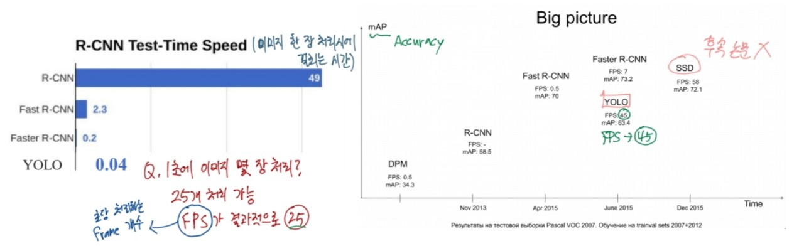

앞서 봤던 R-CNN과 비교하여 처리 속도가 월등히 빠르다는 것을 볼 수 있다.

YOLO는 실행되는 Computer power에 따라서 차이가 있다. 따라서 논문에 성능 평가 시에는 반드시 무슨 GPU를 사용했는지 기재해야 한다.

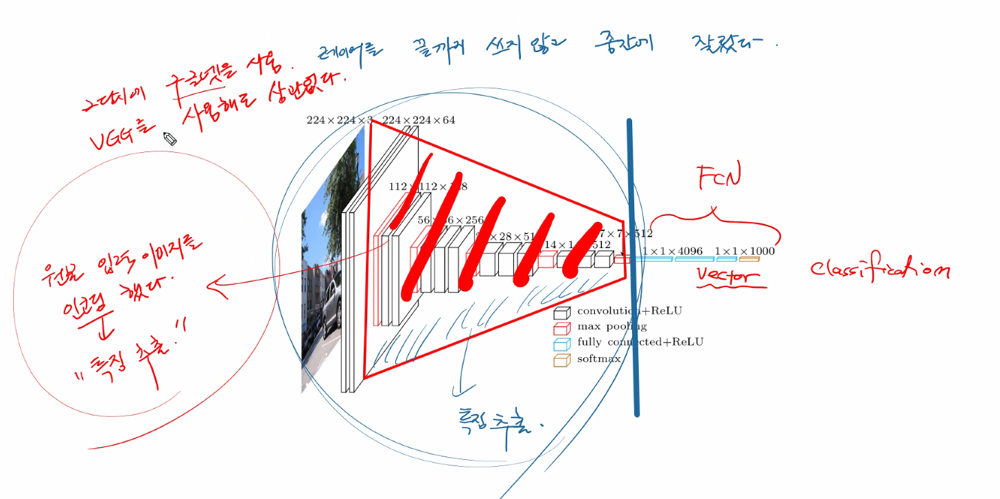

원래는 GoogleNet을 사용했는데 VGG를 사용해도 상관이 없다. 우선 원본 입력 이미지를 인코딩(특징 추출)하여 레이어를 끝까지 쓰지 않고 중간에 잘랐다.

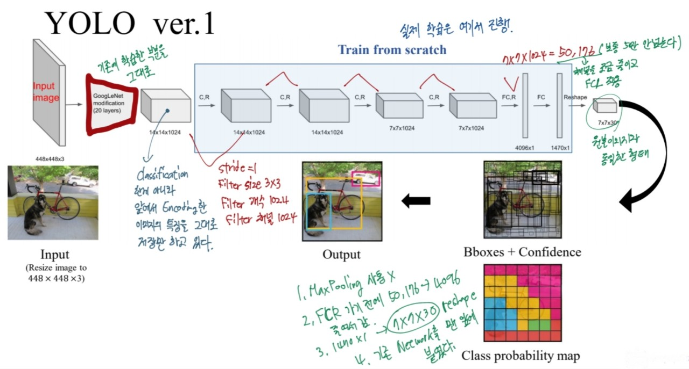

그후, 앞에서 Encoding한 이미지의 특징을 그대로 가지고 있는 것을 저장한 레이어부터 시작이 된다. 
실제로 그림과 같이 학습이 진행하게 되고 FCR로 가기 전에 50,176을 4096으로 줄이ㅔㄱ 된다. 그 후에 reshape하여 7x7x30, 원본 이미지와 동일한 형태로 바꾼다.  

- GoogleNet => pre-training, transfer training

    - 20개의 레이어 -> 깊은 레이어이다. 이것은 속도와 연관이 있다.
    1000개의 카테고리를 분류하는 이미지넷인데 결과적으로는 학습 속도가 빠르다.

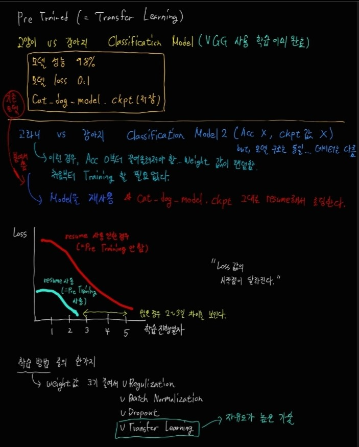

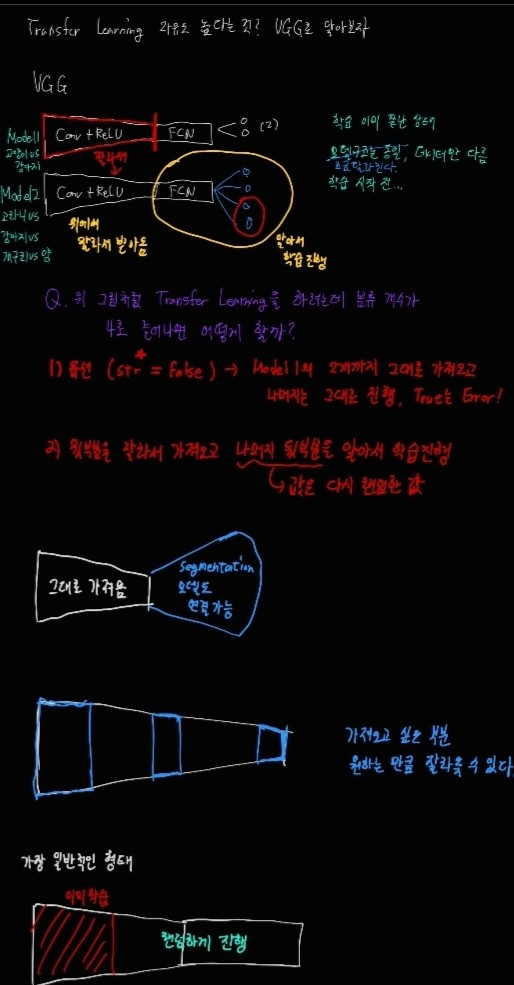

    - 얼려서 사용, 얼리지 않고 사용

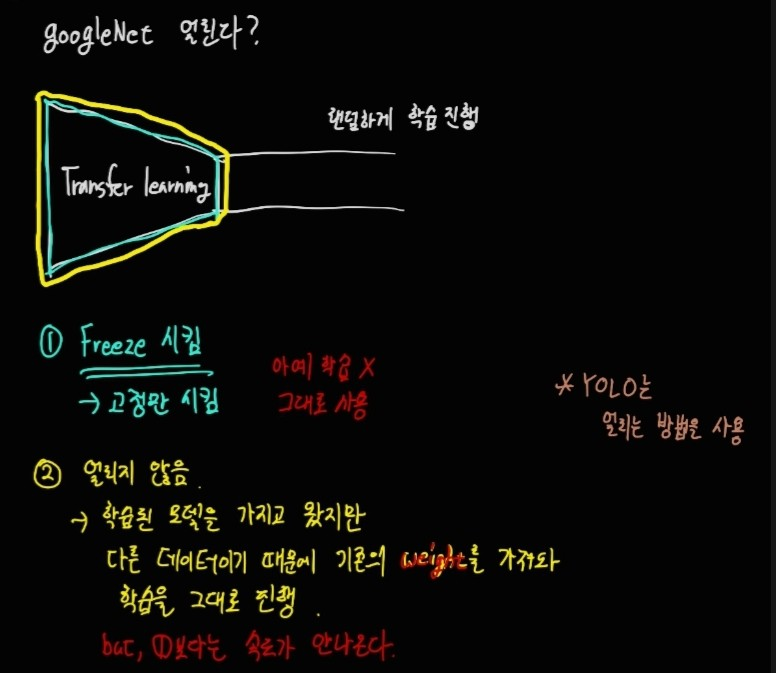

- Train from scratch 부분(실제 학습이 진행되는 부분)
    - 성능을 높이기 위해서 FC 부분을 늘리면 Computation Cost가 많이 들기 때문에 중간 레이어인 Conv를 늘려준다. 물론 이렇게 하면 속도는 줄어들지만 성능향상에 도움이 된다.

그렇다면 이제 남은 부분은 FC를 reshape하고 Bboxes + Confidence부분과 class probability map 부분이다.

- Bboxes + Confidence
    - 카테고리의 정보는 없다
    - 98개...
    - 박스의 굵기가 다르다.(c값이 크면 진하게, c값이 작으면 가늘게...)

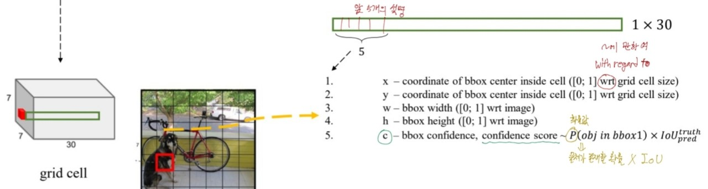

우선 Bboxes + Confidence 부분은 마지막에 만들어진 7x7x30부터 시작이 된다. 30개의 채널 중에서 5개의 채널과 관련이 있는 부분이다. 
각각 한 칸씩 x,y,h,w,c 이렇게 자리를 차지하게 된다.

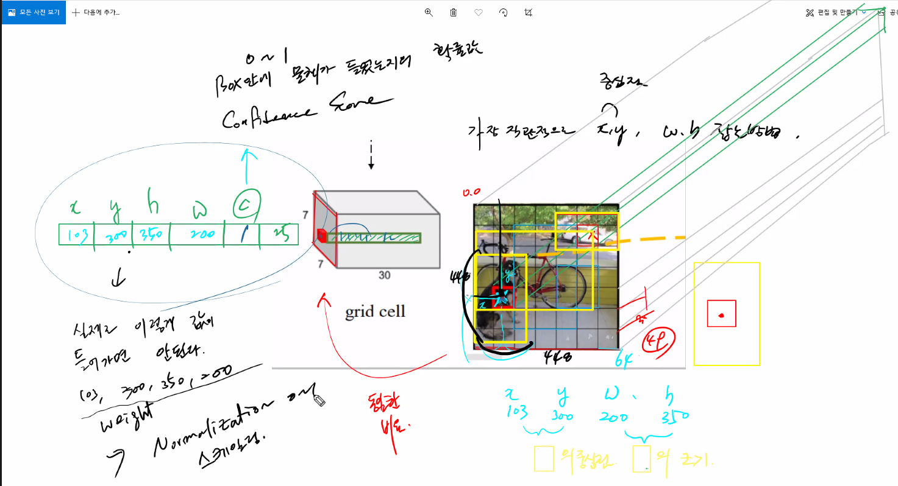

**x,y**는 그림에서 빨갛게 있는 그리드 셀의 중심점 위치를 잡기 위한 것이다.
**w,h**는 그림에서 노란 박스의 중심점을 잡기 위한 것이다. 
이때, 이것들은 가장 직관적으로  x,y,w,h를 잡는 방법이다.
마지막의 c는 box 안에 물체가 들었는지의 확률값에 IOU를 곱한 값이다.(0~1) -> **Confidence Score**

실제 물체가 존재할 확률값은 Threshold값을 적용한다. 그래서 값이 높을수록 box가 적게 그려지고, 값이 낮을수록 box가 많이 그려진다.(0.8 이상이면 박스가 많이 쳐지지 않는다.)

주의할 점은 실제로 값을 넣을 때 정규화, 스케일링 과정이 필요하다는 것이다.

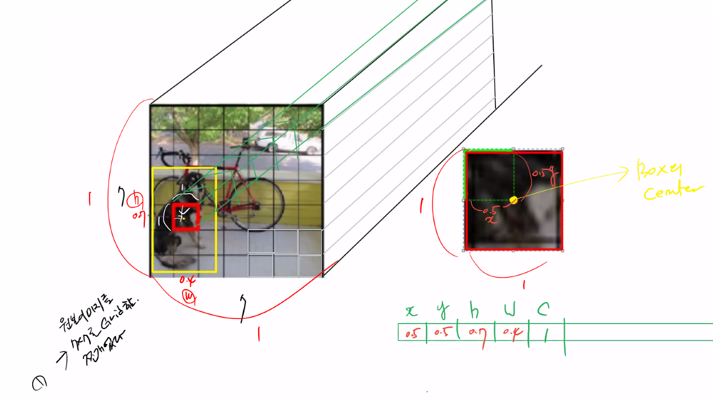

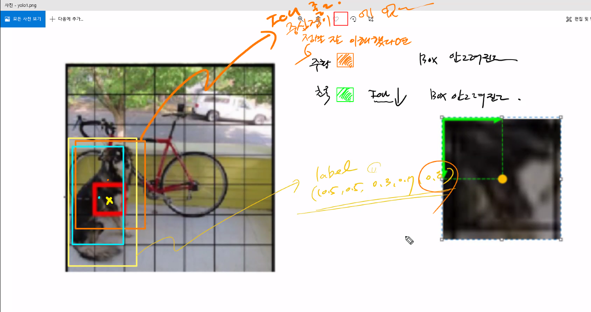

이 그림의 경우, 주황색 박스는 빨간 grid 안에 중심점이 없기 때문에 실질적으로 박스가 그려지지 않는다는 것을 보여준다.
초록색 박스는 IOU가 너무 낮아서 박스가 안 그려진다.

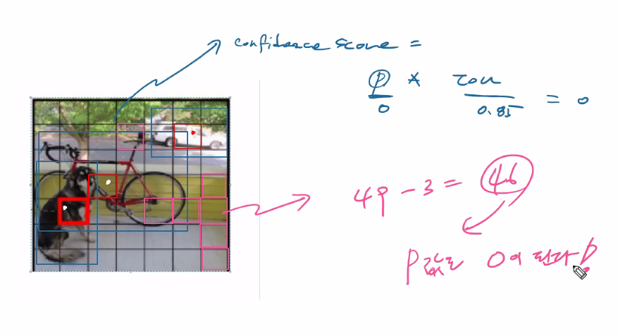

이 그림에서 설명하려는 것은 7x7 전체 그리드가 49개 그려지는데 실질적으로 박스가 그려지는 개수는 3개라는 것이다. 나머지 46개의 P값은 0이 되기 때문에 그려지지 않는다.

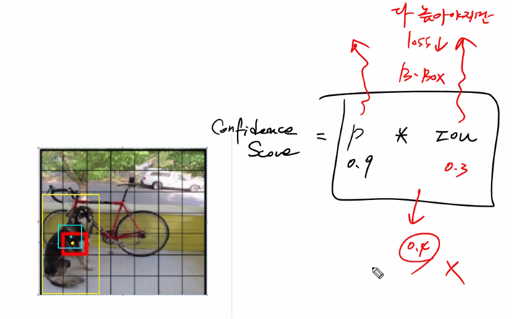

중요한 점은 confidence score은 p값만이 아니라 IOU값도 고려를 해야 한다는 점이다. 따라서 IOU가 낮아도 박스가 형성되지 않는다.

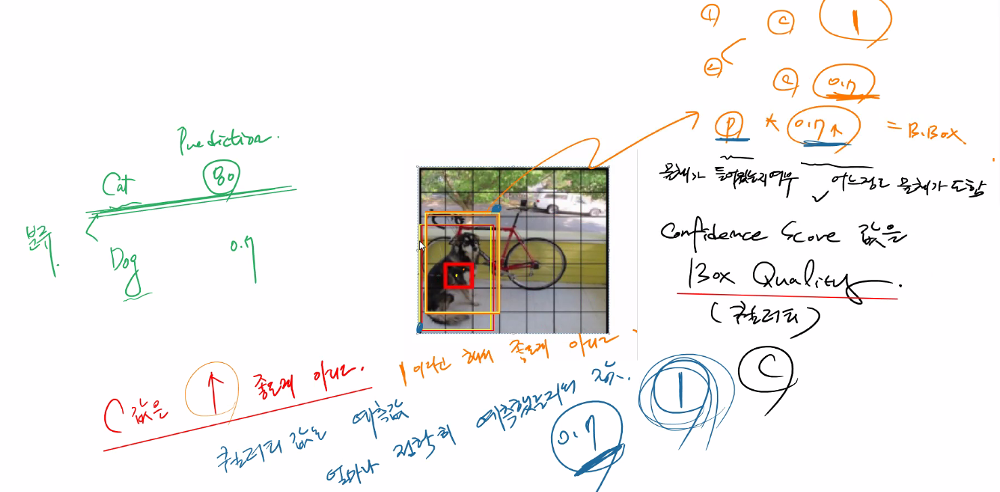

이 그림에서는 confidence score의 값이 높은 것이 무조건 좋은게 아니라는 것을 보여준다.

- Class probability map

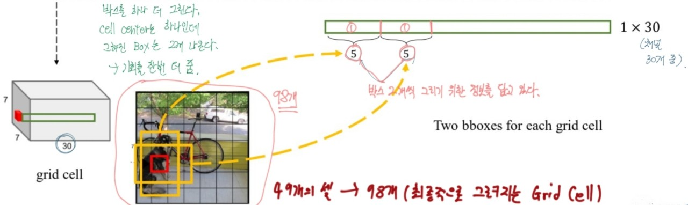

앞에서는 30개의 채널 중에서 맨 앞 5개의 채널을 살펴보았다. 그 다음에 5개는 Class probability map에 대한 정보이다.

- 앞서 그린 박스와 별개로 박스를 하나 더 그린다. 즉, cell의 center는 하나인데 박스는 2개가 나온다.
- 따라서 최종적으로 그려지는 grid cell은 49개가 아닌 98개가 되는 것이다.

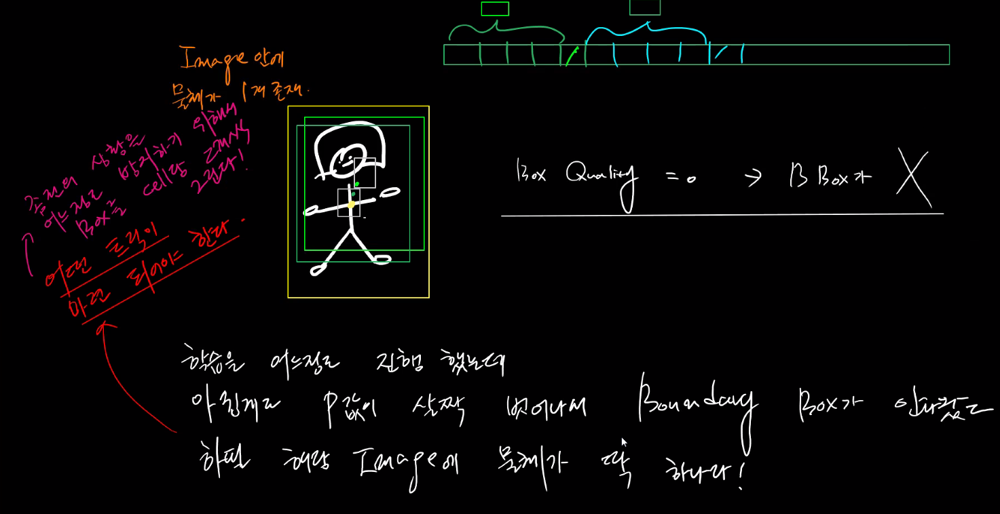

- 나머지 20개

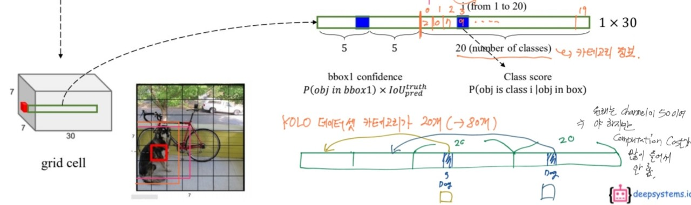

앞의 10칸(5,5)에서는 box 안에 들어갈 물체 존재 여부만 다루고 정작 box 안의 물체가 무엇인지는 아직까지 모른다.
box 안의 물체가 무엇인지는 마지막 20개의 칸 정보 20개의 값 중에서 가장 큰 확률값에 해당하는 인덱스가 box 안에 물체이다.

**정리**
YOLO ver.1

1. 속도가 빠른 network(45~155fps)

2. 성능은 다소 떨어진다.

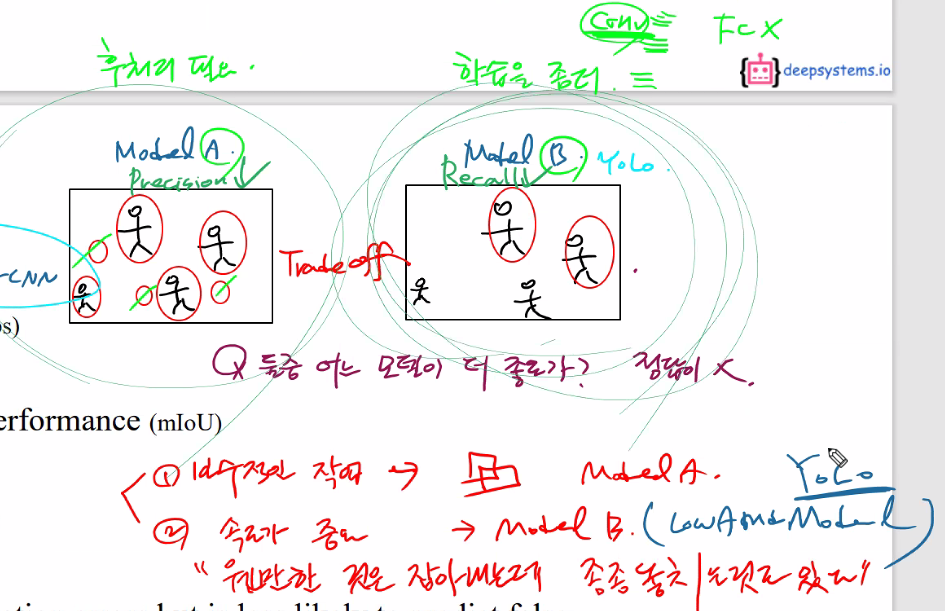

3. End-to-end training  

4. 더 많은 지역적인 에러를 만들지만 배경에 틀린 값들을 예측하지 않을 것이다.

- batch Normalization은 시기 상으로 도입할 겨를이 없어서 사용되지 않았다.(YOLO2에서는 사용)

**문제점**

1. FC layer + reshape

2. No anchor

3. 상대적으로 낮은 재현율

4. 20개의 작은 카테고리 개수
