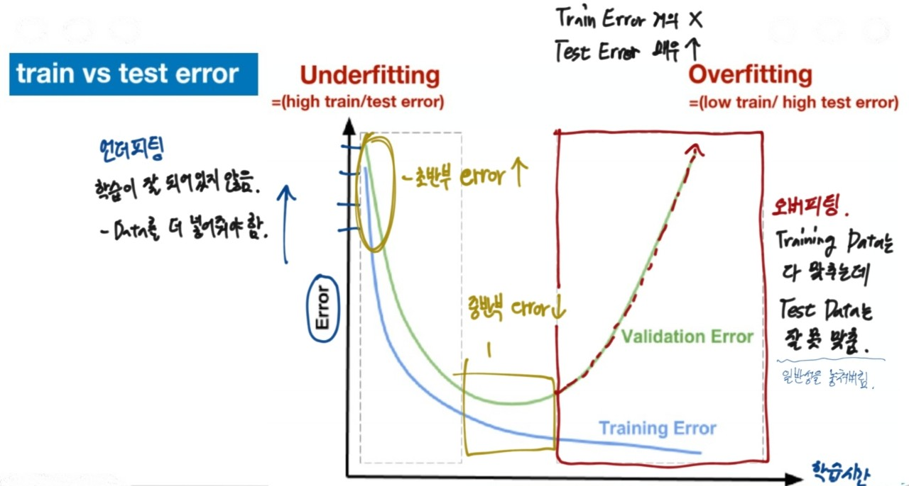

## 머신러닝
- 어떤 작업(T)을 하는데, 특정한 기준(P)으로 측정된 성능이 경험(E)에 의해 형성되었다면 그 작업은 경험으로부터 배웠다고 할 수 있다.

 *T: **Task** -> 내가 하려는 일
 eg) 고객이 상품을 구매할 확률을 50%로 올린다.
 *P: **Performance Measure** -> Task에 도달하는 Performance
 *E: **Training Experience** -> Data(task와 밀접한 데이터)로 학습

- 머신러닝은 기본적으로 **데이터**를 이용하는 것이다.
- train 데이터로 모델을 학습시키고, 새로운 데이터로 모델의 예측값을 뽑아내는 작업이다.
- **사람의 개입 없이 모델이 스스로 학습한다.**


전체적인 프로세스를 보면 다음과 같다.

- 보통 프로그래밍은 명시적 기법으로 개발자의 알고리즘을 알 수 있지만 머신러닝의 경우, 기계가 학습을 해서 알고리즘을 알 수는 없다.(명료한 programming x)


- 보통 기업이나 현업 측면에서 AI는 그림과 같이 얼굴인식, 자율검색 등과 같은 Narrow AI의 형태이다.

### 머신러닝 학습 분류

1. 지도학습(Supervised Learning)
    - 데이터를 학습시킬 때 답을 알려주는 것
    eg) SVM, Decision Tree, Random Forest, Boosting, Linear Regression
    *데이터: 속성, Feature, X
    *답: 라벨, y
    

2. 비지도학습(Unsupervised Learning)
    - 데이터를 학습시킬 떄 답을 알려주지 않고, 모델이 스스로 데이터의 특성에 따라 유의미한 결과를 뽑아내도록 하는것
    eg) Clustering(군집화)

3. 강화학습(Reinforcement Learning)
    - Agent가 현재 상태에서 선택 가능한 행동들 중 보상을 최대화하는 방식으로 학습
    - 모델이 여러 번 시행착오를 겪으며 보상이 최대화되는 행동을 하도록 학습함


그림에서 보면 알 수 있듯이 지도학습은 또 분류와 회귀로 분류 된다.

- 지도학습은 label과 feature로 구성되어 있고, feature 즉, 데이터는 training, test 데이터로 분류된다.
<br>

#### 분류와 회귀의 차이


우선 회귀는 어떠한 특정한 값을 예측하는 것이고, 분류는 범주형의 자료 중에서 특정한 범주로 예측을 하는 것이다.

#### 군집(Clustering)


비지도학습에서는 정해진 답인 Label이 따로 존재하지 않는다.

### 데이터
앞서 데이터는 training과 test로 분류된다고 했다. 데이터에 대해서 자세히 알아보자.

- Training(학습)
    - 라벨이 붙어있는 데이터를 이용하여 모델을 학습시킴
    - 모델은 N개의 클래스로 분류하는 모델(eg: 고양이, 자동차)

- Test(추론, 예측)
    - 학습 떄 사용하지 않은 새로운 데이터를 모델에 넣고 결과값을 예측하는 과정
    - 예측한 것 중 얼마나 맞췄는지에 따라 그 모델의 성능을 평가




- Training error(학습 오차)
    - 라벨이 붙어있지만 모든 데이터를 다 perfect하게 맞추는 모델은 아니다.

- Test error(예측오차)
    - 새로운 데이터를 넣어서 결과를 예측했을 때의 오차
    - 예측오차가 작으면, 일반화가 잘되는 좋은 모델이다.
- Underfitting
    - 학습이 잘 되어 있지 않아서 Data를 더 추가해줘야 한다.
- Overfitting
    - Training 데이터는 잘 맞추는데 Test 데이터는 잘 못 맞추는 경우이다.


## SVM(Support Vector Machine)
- 주로 이진분류(classification) 및 회귀분석에 쓰이는 지도학습 모델
    - 비확률적 이진 선형 분류 모델
    - 두 집단을 분류하는 경계선을 찾는다고 생각하면 된다.
- 데이터를 선형으로 분리하는 최적의 선형 결정 경계를 찾는 알고리즘이다.
- Margin은 두 데이터군이 결정경계와 떨어져 있는 정도를 의미한다.(마진이 클수록 더 좋다!)


그림에서 빨간색 선을 결정경계라고 하고, Gap이라고 쓰여진 부분이 마진이다.
결정경계와 가장 가까운 부분의 데이터들은 벡터형태를 띈다.

- Support Vector
    - 분류하는 경계선 또는 경계면이 가장 가까운 점과 가장 먼 거리를 가지도록 한다.
    - 경계를 결정하는(support) 데이터 점(vector)들을 가리긴다.

### Classification - SVM
- SVM의 기본 형태는 두 클래스(집단)를 선형을 분리시키는 것이다.
- **매개변수 C와 gamma**
- 매개변수 cost(비용) C
    - 결정경계선을 어떻게 그어야할지 고민일 때, cost값을 지정한다.
    - cost가 낮으면, outliers를 많이 허용하여 일반적인 경계를 찾는다.
    - cost가 높으면, 최대한 세심하게 분류하는 경계를 찾는다.


- 선형분류가 힘들 데이터의 경우 어떻게 할까?
    1) 더 높은 차원에서 경계를 찾아 분류한다.

    

    2) 이상치(outliers)들을 몇 개 정도 허용한다.

    

그림과 같은 경우에는 별모양의 이상치를 포기한다.

<br>

- 커널 함수
    - 기본적으로는 가우시안 방사 기저 함수
    - 더 높은 차원으로 데이터를 사상시키는(mapping) 함수

- 커널 함수의 gamma
    - 각 데이터 점들이 영향을 미치는 거리
    - gamma가 클수록, 거리가 짧아져서 경계가 굴곡지게 된다. 집단을 여러개로 분리(결정선이 여러개)
    - gamma가 작으면, 거리가 길고 더 일반화된 경계를 찾는다.

- 커널 함수의 cost
    - C는 얼마나 많은 데이터 샘플이 다른 클래스에 놓이는 것을 허용하는지를 결정한다.
    - C는 커져도 2개의 집단을 여러개로 분리하지 않는다.

**C는 두 데이터를 정확하게 구분하는데 초점을 두고 있고, gamma는 개별 데이터마다 결정선을 지정하는 것에 초점을 둔다.**

**C든 gamma든 2개의 값이 커질수록 알고리즘이 복잡해져서 기존 데이터에 의존하게 되므로 overfitting의 원인이 된다.**


이 그림은 아래로 갈수록 c가 커지고, 오른쪽으로 갈수록 gamma가 커지는 것을 각각의 그래프로 나타내서 보여주고 있다. 보면 gamma가 커지면 집단을 여러개로 묶는 모습을 보여준다.
<br>
<br>

**<SVM 실습>**

## 1. Module Configuration

```python
import pandas as pd
from sklearn.svm import SVC

# 추가 모듈 -> train 데이터와 test 데이터를 분리
from sklearn.model_selection import train_test_split

# 추가 모듈 -> 정확도 측정
from sklearn.metrics import accuracy_score
```

## 2. Data Loader

4개의 속성과 1개의 라벨
sepal.length -> 꽃받침 길이
sepal.width -> 꽃받침 넓이
petal.length -> 꽃잎 길이
petal.width -> 꽃잎 넓이
variety -> 품종

iris가 유명한 데이터셋인 이유 - task의 집결과 밀접한 관련이 있는 feature가 존재

``` python
iris = pd.read_csv("../data/iris.csv")
iris
```


- iris 데이터의 단점
1. 셔플이 안되어 있음 - 오버피팅의 위험성
2. 150개 전체를 training model에만 씀 - Test 모델도 만들어야 함(default - 75%,25%)

## 3. Data Split and Shuffle

``` python
label = iris["variety"]
feature = iris[["sepal.length","sepal.width","petal.length","petal.width"]]
feature
label

train_data, test_data, train_label,test_label = train_test_split(feature, label)
```

- **train_data, test_data, train_label,test_label = train_test_split(feature, label)**

- train과 test 데이터를 분리하고 섞는 코드이다.
중요한 점은 train_test_split함수 반환값이 4개인 점과 반환되는 순서대로 받아줘야 한다!!!!

## 4. Model 생성 및 학습하기

``` python
model1 = SVC()
model1.fit(train_data,train_label)
```

- 학습할 때는 전체 데이터를 학습하는 것이 아니라 학습용 모델 데이터만 적용해야 한다.
- 별다른 옵션을 사용하지 않으면 전체 데이터의 75%가 학습용으로 빠진다.

## 5. 예측하기

- 학습 때 사용하지 않은
미지의 데이터를 입력해서
예측값을 출력해본다.

``` python
pred = model1.predict(test_data)
print(pred)
```

['Virginica' 'Versicolor' 'Virginica' 'Versicolor' 'Setosa' 'Setosa'
 'Setosa' 'Virginica' 'Virginica' 'Virginica' 'Versicolor' 'Virginica'
 'Setosa' 'Versicolor' 'Setosa' 'Versicolor' 'Setosa' 'Versicolor'
 'Virginica' 'Virginica' 'Setosa' 'Setosa' 'Virginica' 'Virginica'
 'Virginica' 'Virginica' 'Setosa' 'Virginica' 'Versicolor' 'Setosa'
 'Versicolor' 'Virginica' 'Virginica' 'Setosa' 'Setosa' 'Virginica'
 'Setosa' 'Setosa']

 ``` python
 print(test_label)
 ```
117     Virginica
69     Versicolor
120     Virginica
91     Versicolor
14         Setosa
40         Setosa
47         Setosa
109     Virginica
144     Virginica
119     Virginica
80     Versicolor
116     Virginica
45         Setosa
138     Virginica
5          Setosa
98     Versicolor
18         Setosa
71     Versicolor
142     Virginica
125     Virginica
41         Setosa
27         Setosa
143     Virginica
102     Virginica
103     Virginica
115     Virginica
49         Setosa
108     Virginica
68     Versicolor
11         Setosa
90     Versicolor
124     Virginica
139     Virginica
46         Setosa
1          Setosa
136     Virginica
36         Setosa
29         Setosa
Name: variety, dtype: object

## 6. 정확도 구하기

``` python
score = accuracy_score(pred,test_label)
score
print(score*100)
```

97.36842105263158

- score가 0~1 사이의 값으로 나오기 때문에
100을 곱해주면 퍼센트 값을 알 수 있다.
