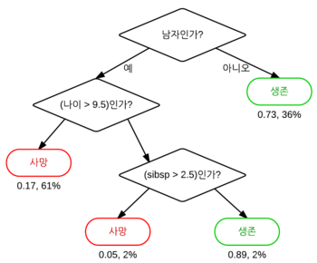
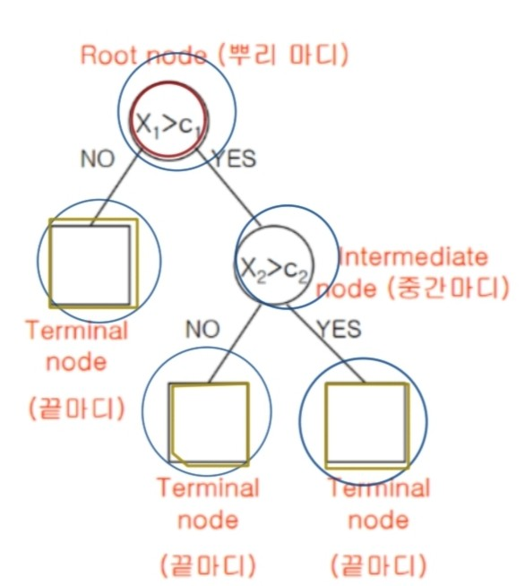
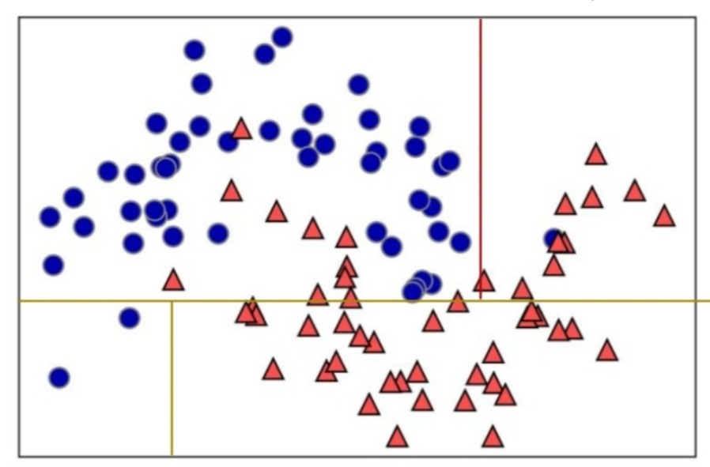
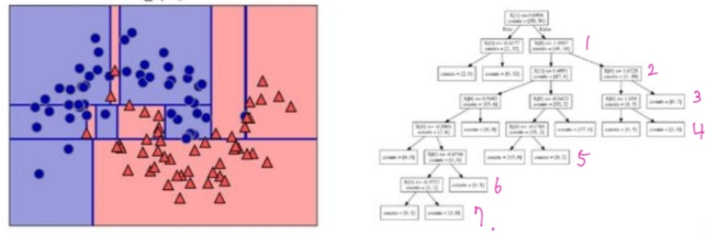
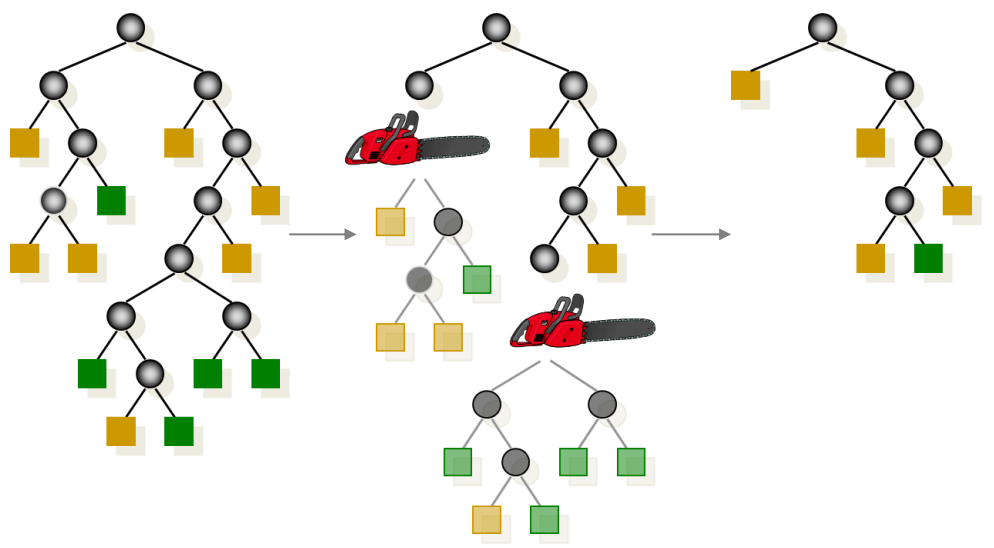
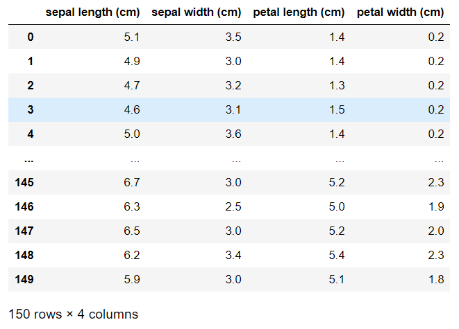
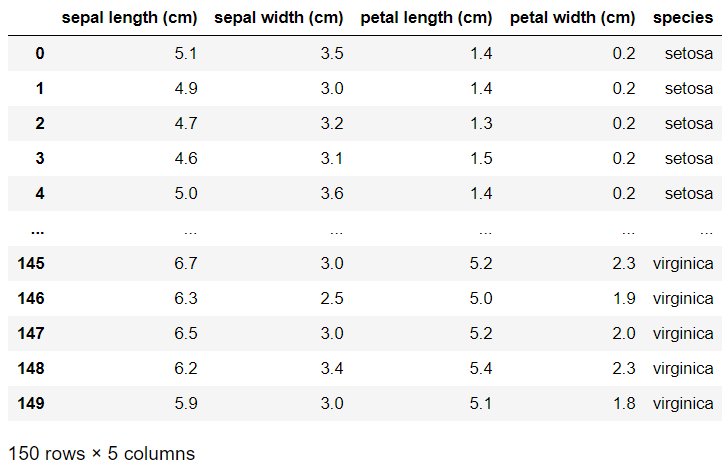

## Decision Tree
- 의사결정나무는 특정기준(질문)에 따라서 데이터를 구분하는 모델이다.
분류와 회귀 문제에서 가장 널리 사용되는 모델이다.



- 결정트리 구조
    - 결정트리에서 질문이나 네모상자를 노드(Node)라고 한다.
    맨 위의 노드를 Root Node라고 하고 각 질문에 대한 마지막 노드를 Leaf Node라 한다.
    엣지(edge)는 질문의 답과 질문을 연결하는 선이다.



- Decision Tree는 SVM과는 다르게 직선만으로 분류를 한다.
- 의사결정을 할 때, 특정한 영역 안에 하나의 카테고리만 있도록 만든다.



그림은 각 클래스에 데이터 포인트가 50개씩 있고 반달 두개가 포개진 듯한 모양을 하고 있는 데이터셋이다.

**의사를 결정할 때 중요한 것은 순도가 높아지는 방향으로 의사결정이 이루어져야 한다는것이다.**

그래서 이 그림에서도 순도가 높아지는 방향으로 계속해서 직선을 그어가고 있다.



그렇게 계속해서 선을 그어가다 보면 문제가 생긴다. 

오른쪽 그림에서 적혀진 숫자를 depth라고 하는데 이 depth가 깊어질수록 학습 데이터에 지나치게 의존해서 overfitting의 위험성이 있다.
그래서 보통 depth가 4를 넘어가지 않게 해야 한다고 권고한다.

### 가지치기(pruning)
- 최대로 형성할 수 있는 결정트리(Full node)에서 특정 노드 밑의 하부 트리를 제거하여 일반화 성능을 높여 overfitting을 방지하는 기법이다.



- **depth**,leaf node의 최대개수, 노드가 분할하는 최대 개수 같은 속성을 제한한다.

- **min_sample_split** 파라미터를 조정하여 한 노드에 들어있는 최소 데이터 수를 정해줄 수도 있다.

- depth나 min_sample_split은 하이퍼 파라미터라고 할 수 있다.

**인간의 경험치에 의해서 직접 설정해야 하는 값 => 하이퍼 파라미터**

### 엔트로피(Entropy)와 불순도(Impurity)
- 불순도(Impurity)란 해당 범주 안에 서로 다른 데이터가 얼마나 섞여 있는지를 뜻한다.
- 엔트로피(Entropy)는 이러한 불순도를 수치적으로 나타낸 척도이다.
    - 엔트로피가 1이면 불순도가 최대이다.
- 앞서 얘기했다시피 결정 트리는 불순도를 최소화(순도를 최대화)하는 방향으로 학습을 진행한다.

**<실습진행>**

``` python
import numpy as np
import pandas as pd
import matplotlib.pyplot as plt
import seaborn as sns
from sklearn import datasets

iris = datasets.load_iris()
print(iris.feature_names)
print(iris.target)
print(iris.target_names)
print(iris.data.shape)
```

['sepal length (cm)',
 'sepal width (cm)',
 'petal length (cm)',
 'petal width (cm)']

array(['setosa', 'versicolor', 'virginica'], dtype='<U10')

(150, 4)

## DataFrame Visualization

``` python
pd = pd.DataFrame(iris.data, columns = iris.feature_names)
pd
```



``` python
pd["species"] = np.array([iris.target_names[i] for i in iris.target])
pd
```



## Data Split and Shuffle

``` python
from sklearn.model_selection import train_test_split

X_train, X_test,y_train, y_test =train_test_split(iris.data,iris.target, test_size=0.2, random_state=10)
print(X_train.shape)
print(X_test.shape)
print(y_train.shape)
print(y_test.shape)
print(y_test)
```

(120, 4)
(30, 4)
(120,)
(30,)
[1 2 0 1 0 1 1 1 0 1 1 2 1 0 0 2 1 0 0 0 2 2 2 0 1 0 1 1 1 2]

## Model Generator and Training

``` python
from sklearn.tree import DecisionTreeClassifier

# 결정트리 모델 생성
iris_tree = DecisionTreeClassifier(random_state=10)

# 학습 진행
iris_tree.fit(X_train,y_train)
```

DecisionTreeClassifier(random_state=10)

## Predict

``` python
pred = iris_tree.predict(X_test)
print("예측결과 : ", pred)
print("정답 : ",y_test)
```

예측결과 :  [1 2 0 1 0 1 2 1 0 1 1 2 1 0 0 2 1 0 0 0 2 2 2 0 1 0 1 1 1 2]
정답 :  [1 2 0 1 0 1 1 1 0 1 1 2 1 0 0 2 1 0 0 0 2 2 2 0 1 0 1 1 1 2]

## Accuracy Evaluation
- score(), accuracy_score()

``` python
score_train = iris_tree.score(X_train,y_train)
score_test = iris_tree.score(X_test, y_test)

print("{:.3f}".format(score_train))
print("{:.3f}".format(score_test))
```

score 함수는 인자값으로 (X데이터셋, y데이터셋) 입력한다.
내부적으로 predict()를 수행한다. 그리고 그 결과를 정답과 확인해서
맞는 경우의 확률을 score에 돌려준다.
자동적으로 얼마나 예측한 값이 실제 정답과 일치하는지를 결과적으로
보여주는 함수이다.

``` python
from sklearn.metrics import accuracy_score

accuracy_score(y_test,pred)
```

accuracy_score 함수는 predict()를 내부적으로 호출하지 않는다.
앞서서 미리 예측값을 뽑아놓아야 한다.
함수의 인자값으로 정답, 예측한 값이 순서대로 들어간다.

score() 함수를 사용하건, accuracy_score() 함수를 사용하건 결과값은 동일하다.

## 오버핏팅을 낮추는 방법 --- max_depth

``` python
iris_tree2 = DecisionTreeClassifier(max_depth=3 ,random_state=100)

iris_tree2.fit(X_train, y_train)
```

DecisionTreeClassifier(max_depth=3, random_state=100)

``` python
score_train = iris_tree2.score(X_train,y_train)
score_test = iris_tree2.score(X_test, y_test)

print("{:.3f}".format(score_train))
print("{:.3f}".format(score_test))
```

0.967
0.933

- 수치를 보면 위에서는 training 데이터가 1이여서 overfitting의 위험성이 있었는데 depth를 조정하니까 0.967으로 낮아진 것을 볼 수 있다.
