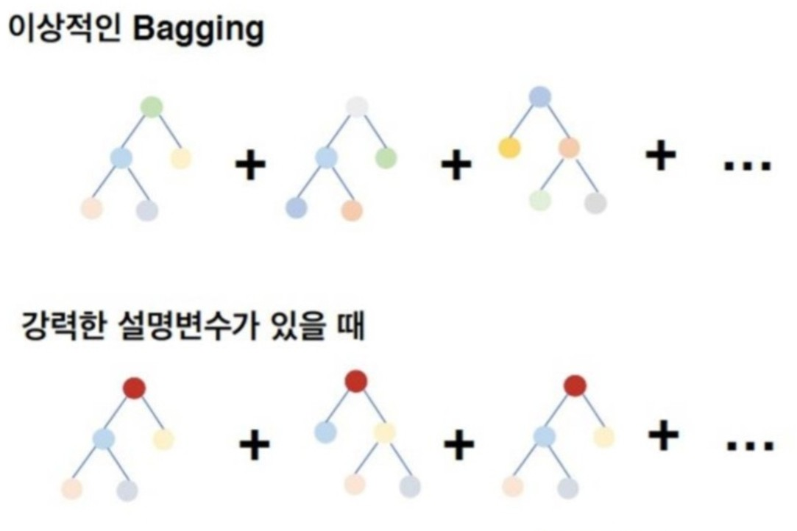
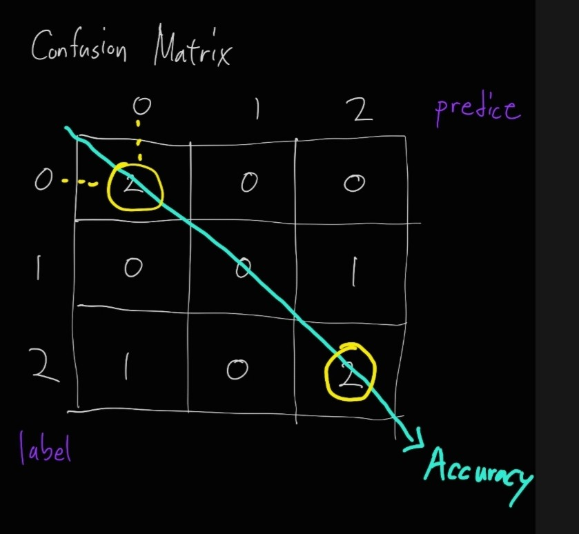
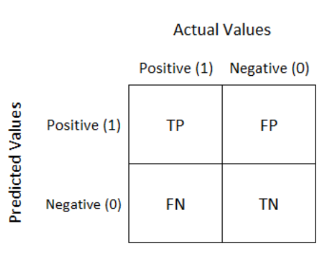
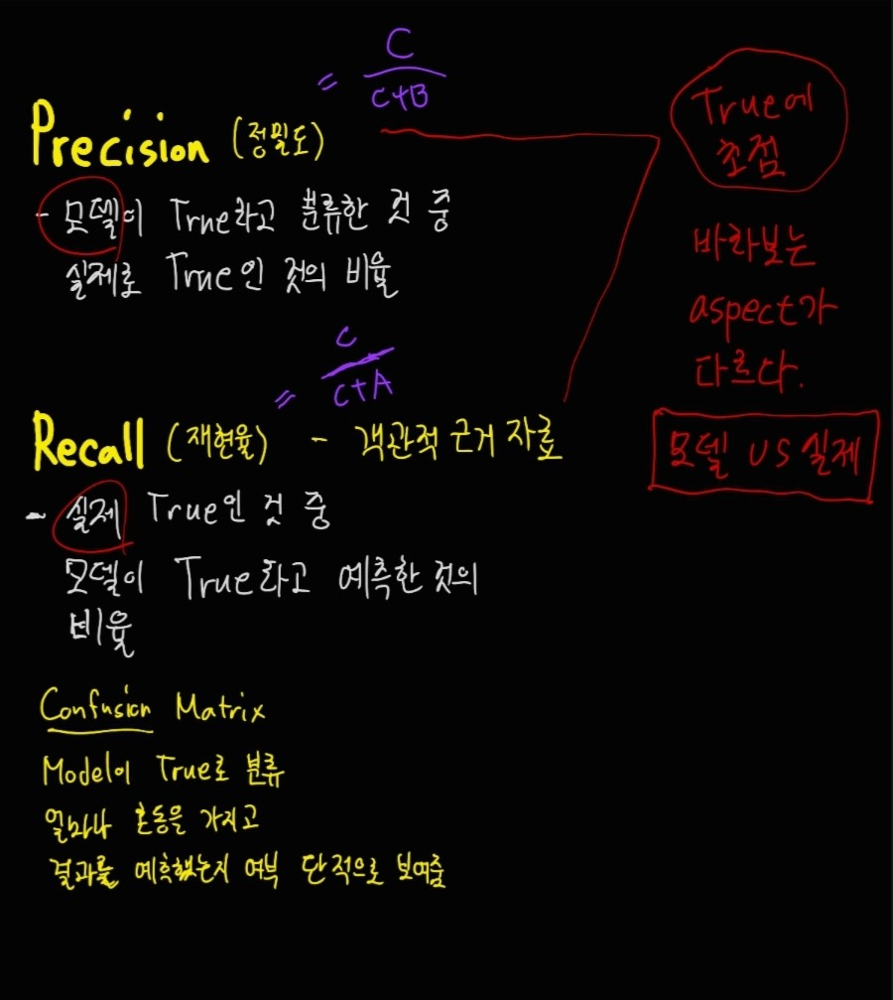
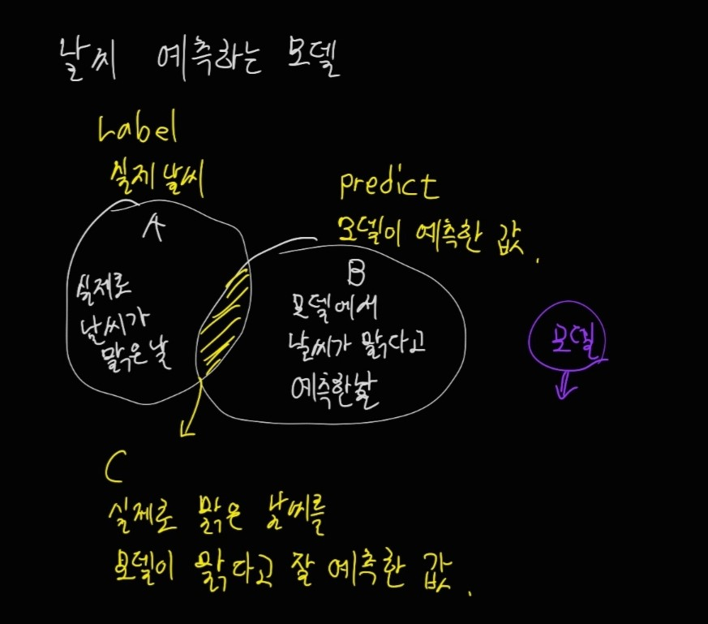
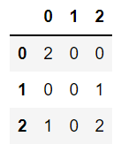
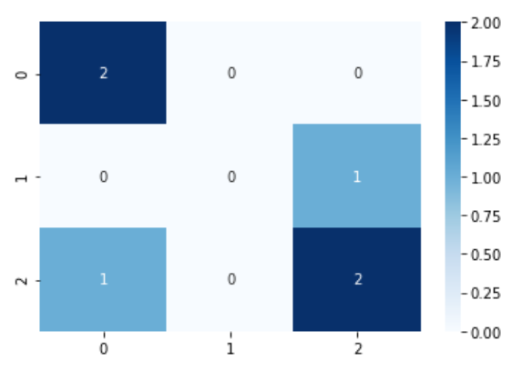

## Ensemble Random Forest

### Bagging(Bootstrap Aggregation)
배깅은 원 표본에서 중복을 허용하여 표본을 추출(복원추출).
(학습)데이터셋을 여러 개 만들 수 있는데 데이터가 각 셋마다 다르다.
- Feature 중 랜덤으로 **일부의 Feature만 선택**하여 하나의 결정 트리를 만들고, 또 랜덤으로 또 다른 결정 트리를 만들고 일부의 Feature를 계속해서 반복하여 여러 개의 결정 트리를 만들 수 있다. 이렇게 하면 결정 트리 하나마다 예측값을 내놓고 예측값 중에서 가장 많이 나온 값을 최종 예측값으로 정한다. 이럴 때, **다수결의 원칙**을 따른다.

<br>

### 랜덤포레스트(Random Forest)
의사결정나무를 여러 개 모아놓으면 숲이 되는데 이 숲을 구성하는 방법을 random으로 하다. 나무마다 독립변수가 다르게 들어갈 수 있도록 그 수를 제한시킨다. 이 때, 배깅 기법을 사용한다.
(bagging + Random selection of features)
즉, 각각의 의사결정나무들의 합의 평균을 구해서 답을 도출한다.

    1) 결정트리의 갯수가 많아야 한다.(100개)
    2) 엄청나게 결과를 잘 예측하지는 않지만 Overfitting이 낮아진다.

- 회귀와 분류에 있어서 랜덤 포레스트는 현재 가장 널리 사용되는 머신러닝 알고리즘이다.
- 랜덤 포레스트는 성능이 매우 뛰어나고 매개변수 튜닝을 많이 하지 않아도 잘 작동하여, 데이터의 스케일을 맞출 필요도 없다.
- 기본적으로 랜덤 포레스트는 단일 트리의 단점을 보완한 장점들이 있다.

**<주의할 점>**
- random_state를 다르게 지정하면 전혀 다른 모델이 만들어진다.
- 차원이 높고 희소한 데이터에는 잘 작동하지 않는다.
    - Data의 차원이 높다 
    => feature의 개수가 많다.
    => feature의 개수가 많으면 자동적으로 Row도 늘어나야 한다.


#### Random Forest Parameter
- **n_estimators** : 램덤 포레스트 안의 결정 트리 개수
    - n_estimators는 클수록 좋고, 결정 트리가 많을수록 더 깔끔한 Decision Boundary 생성한다. 하지만 메모리와 훈련 시간이 증가한다.(연산량 증가)
- **max_features** : 무작위로 선택할 Feature의 개수
    - max_features = n_features이면 30개의 feature 중 30개의 feature 모두를 선택해 결정 트리를 생성한다.
    - max_featrues 값이 크면 랜덤 포레스트의 트리들이 매우 비슷해지고, 가장 두드러진 특성에 맞게 예측을 할 것이다.
    - max_features 값이 작으면 랜덤 포레스트의 트리들이 서로 매우 달라질 것이고, 오버피팅이 줄어들 것이다.
- **n_jobs** : 매개변수를 이용하여 사용할 코어 수를 지정
(n_jobs=-1로 지정하면 컴퓨터의 모든 코어를 사용)

### Random Forest의 문제점
- 강력한 Feature가 있으면 tree에서 그 변수가 영향을 미쳐서 대부분 비슷해진다.



### 부트스트랩(Bootstrap sampling)
- 적은 데이터일 때, 학습량을 늘리게 만들게 유도할 수 있다.
- 매번 트리를 생성할 때, 뭔가 새로운 데이터가 들어와서 학습을 더 많이 진행하게 되는 효과가 있다.

### Confusion Matrix

- 학습을 통해서 얻은 예측 값을 실제 값과 비교하기 위한 Matrix이다. 모델의 정확도 | 실제 값을 정확히 예측한 값의 정밀도 | 재현도를 확인할 수 있다.





- Accuracy(정확도) : 얼마나 잘 맞췄는가

- Precision(정밀도) : 모델이 True라고 분류한 것 중 실제로 True인 것의 비율, 모델입장에서 바라본 것

- Recall(재현율) : 실제 True 인 것 중 모델이 True라고 예측한 것의 비율, 정답입장에서 바라본 것





<br>

**<실습>**
### 머신러닝 플로우
머신러닝 단계는 크게 데이터분석(데이터 로더 -> feature 추출 -> 데이터 전처리) -> 모델 생성 -> 모델 학습 -> 예측 -> 평가(Accuracy 측정)
이렇게 크게 프로세스가 나뉜다.

이 중 성능평가단계에서 정확도 측정 / 혼동행렬(Confusion Matrix)를 볼 것이다.

### Bagging 기법
앙상블 알고리즘 중 다양한 영역에서 높은 예측 결과 성능을 보이고 있는 Random Forest이다.
Random Forest는 Bagging 알고리즘이 적용된 모델이다. 여러 개의 결정트리가 전체 데이터셋에서 Bagging 방식으로 각자의 데이터셋을 샘플링해 개별적으로 학습을 수행한 뒤에 최종적으로 투표방식을 통해서 가장 보편적인(다수결의 원칙) 예측 결정을 하게 된다.

사이킷런은 RandomForestClassifier 클래스를 통해서 랜덤 포레스트 기반의 분류를 지원한다.

### Sklearn IRIS DataSet Loader

``` python
import numpy as np
import pandas as pd
import matplotlib.pyplot as plt
import seaborn as sns

from sklearn import datasets
from sklearn.model_selection import train_test_split

iris = datasets.load_iris()
#iris
```

``` python
iris.feature_names
iris.target_names
iris.data
iris.target

iris.data.shape
```

(150, 4)

``` python
## Train, Test DataSet 섞는다. 기본으로 75:25, 시드값 42, 원본 비율과 동일한 라벨이 나오도록 옵션
X_train,X_test, y_train, y_test = train_test_split(iris.data, iris.target,random_state=42,stratify = iris.target)
```

``` python
X_test.shape
X_train.shape
```

(112, 4)

### RandomForest Model 생성

``` python
from sklearn.ensemble import RandomForestClassifier

forest = RandomForestClassifier(n_estimators=100, random_state=42, n_jobs=-1)
forest
```

RandomForestClassifier(n_jobs=-1, random_state=42)

### Model 학습

``` python
forest.fit(X_train,y_train)
```

### Model Accuracy 측정하기
1) 직접 일일히 확인하기
2) 사용자 함수 정의해서 확인
3) score(), accuracy_score() 라이브러리 함수 사용하기

- **직접 확인하기**

``` python
y_pred = forest.predict(X_test)
y_pred
```

array([0, 1, 1, 1, 0, 1, 1, 2, 2, 2, 1, 2, 1, 1, 0, 0, 0, 1, 0, 1, 2, 1,
       2, 1, 2, 1, 0, 2, 0, 2, 2, 2, 0, 0, 0, 0, 2, 1])

``` python
y_test
```

array([0, 1, 1, 1, 0, 1, 2, 2, 2, 2, 2, 2, 1, 1, 0, 0, 0, 1, 0, 1, 2, 1,
       2, 1, 2, 1, 0, 2, 0, 1, 2, 2, 0, 0, 0, 0, 2, 1])

- **list(zip())**
    - zip() -> 2개의 리스트를 병렬적으로 비교할 수 있는 함수

``` python
y_tuple = list(zip(y_test,y_pred))
y_tuple

for a,b in y_tuple:
    if not a == b:
        print('unmatched : (y_test, y_pred) =(',a,',',b,')')
```

unmatched : (y_test, y_pred) =( 2 , 1 )
unmatched : (y_test, y_pred) =( 2 , 1 )
unmatched : (y_test, y_pred) =( 1 , 2 )

``` python
score = forest.score(X_test,y_test)
print(score)

score2 = accuracy_score(y_test,y_pred)
print(score2)
```

0.9210526315789473
0.9210526315789473

### Confusion Matrix

``` python
from sklearn.metrics import confusion_matrix
label = [2,0,2,2,0,1]
predict = [0,0,2,2,0,2]
confusion_matrix(label,predict)

cm = pd.DataFrame(confusion_matrix(label,predict))
cm
```



``` python
sns.heatmap(cm,annot=True,cmap=plt.cm.Blues)
```

