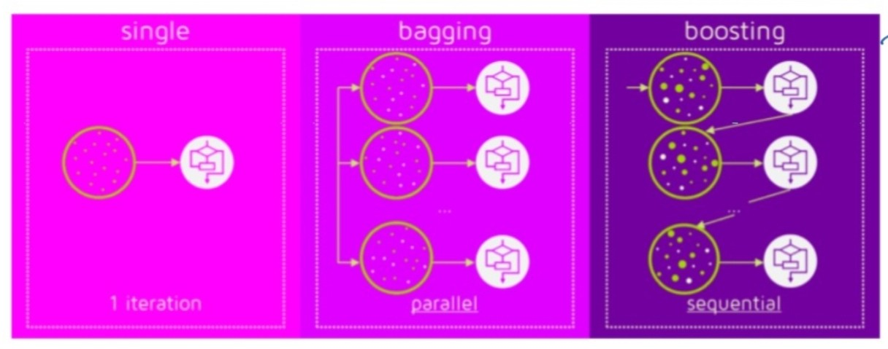

## Boosting
- Bagging이 일반적인 모델을 만드는데 집중되어 있다면, Boosting은 맞추기 어려운 문제를 맞추는데 초점이 맞춰져 있다.



- 그림과 같이 순차적으로 학습시켜서 나온 결과에 따라서 가중치를 주어서 재분배를 한다.

- **learning_rate : 학습 속도를 조절하는 매개변수**
    -  학습을 거듭할수록 속도르 조절해야 한다.

**<장점>**
- Bagging의 문제점인 연산시간이 많고, 학습시간이 길어지는 것을 해결한다. 즉, bias를 감소시킨다.

**<단점>**
- 하이퍼파라미터 조절에 신경을 많이 써야 한다.
- 트리기반 특성상 고차원 데이터에서는 잘 작동하지 않는다.

## Bias, Variance
- 머신러닝 모델의 에러로 변향과 분산은 서로 다르게 움직여서 Trade-off 관계라고 한다.

- Bias 
    - 높은 Bias는 underfitting이 된 상태

- Variance
    - 높은 Variance는 overfitting이 된 상태

**<실습내용>**

### GBM

``` python
from sklearn.datasets import load_breast_cancer
from sklearn.ensemble import GradientBoostingClassifier
from sklearn.model_selection import train_test_split
import matplotlib.pyplot as plt
import numpy as np

cancer = load_breast_cancer()

X_train,X_test,y_train,y_test = train_test_split(cancer.data,cancer.target,random_state=0)

#1. 훈련세트 정확도 1이 나옴...일반화, 가지치기
#2. Boosting 기법 중에서 가장 중요한 하이퍼파라미터...learning_rate 값 부여
#gbm = GradientBoostingClassifier(random_state=0) # 1.0/0.965
#gbm = GradientBoostingClassifier(random_state=0, max_depth=1) #0.991/0.972
gbm = GradientBoostingClassifier(random_state=0, learning_rate=0.01) #0.988/0.965
gbm = GradientBoostingClassifier(random_state=0, max_depth=2, learning_rate=0.01) #0.927/0.958
gbm.fit(X_train,y_train)
```

GradientBoostingClassifier(learning_rate=0.01, max_depth=2, random_state=0)

``` python
train_score = gbm.score(X_train,y_train)
test_score = gbm.score(X_test,y_test)

print("훈련세트 정확도 : {:.3f}".format(train_score))
print("테스트세트 정확도 : {:.3f}".format(test_score))
```

훈련세트 정확도 : 0.974
테스트세트 정확도 : 0.965

### 특성중요도 시각화

``` python
# 특성 중요도 시각화하기
def plot_feature_importances_cancer(gbm):
    n_features = cancer.data.shape[1]
    plt.barh(range(n_features), gbm.feature_importances_, align='center')
    plt.yticks(np.arange(n_features), cancer.feature_names)
    plt.xlabel("Feature Importance")
    plt.ylabel("Feature")
    plt.ylim(-1, n_features)


plot_feature_importances_cancer(gbm)
```

### Grid Search

``` python
from sklearn.model_selection import GridSearchCV

# 1. 하이퍼파라미터의 조합을 일단 딕셔너리 형태로 생성
param_grid = {
    "n_estimators" : [100,150,200,250],
    "max_depth" : [4,6,9],
    "learning_rate" : [0.1,0.01,0.001]
}

# 2. 우리가 적용할 모델을 생성
gmodel = GradientBoostingClassifier()

# 3. GridSearch를 실행 
#1) 모델과 파라미터를 가진 GridSearchCV 생성
#2) GridSearchCV 학습
grid_search = GridSearchCV(
                            gmodel,
                            param_grid = param_grid,
                            n_jobs = -1,
                            verbose=2
                        )
grid_search.fit(X_train,y_train)
```

GridSearchCV(estimator=GradientBoostingClassifier(), n_jobs=-1,
             param_grid={'learning_rate': [0.1, 0.01, 0.001],
                         'max_depth': [4, 6, 9],
                         'n_estimators': [100, 150, 200, 250]})

### Best Parameter를 이용해서 GBM 생성

``` python
gbm = GradientBoostingClassifier(random_state=0, learning_rate=0.1,max_depth=4,n_estimators=250)

gbm.fit(X_train,y_train)

train_score = gbm.score(X_train,y_train)
test_score = gbm.score(X_test,y_test)

print("훈련세트 정확도 : {:.3f}".format(train_score))
print("테스트세트 정확도 : {:.3f}".format(test_score))
```

훈련세트 정확도 : 1.000
테스트세트 정확도 : 0.965

