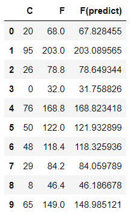

## Linear Regression
- 독립변수와 종속변수의 관계를 분석
- 새로운 데이터가 들어왔을 떄 결과값을 예측하는 것
- 결과값이 연속적인 수로 나타낸다.
- 즉, 독립변수 X를 이용해서 종속변수 Y를 예측하고 설명하는 작업이다.


그림에서 그어진 직선을 가설이라고 하고 H(w) = wx + b라고도 표현한다.

### Cost function


해당 직선이 학습 데이터를 잘 표현하고 있는지 살펴보려면 예상값과 실제 데이터 값이 얼마나 차이가 있는지 확인한다. 이때, 직선 위의 점과 실제 점 사이의 거리 차가 좁을수록 정확도가 높아진다.

이렇게 거리를 측정하는 것이 Cost Function이고 위의 그림이 공식이다.
여기서 제곱을 해준 이유는 첫번째로 거리는 음의 값이 없기 때문에 양의 값으로 만들어주기 위해서이고, 두번째로 잘 예측하지 못한 값에 대하여 패널티를 강하게 주기 위해서이다.

Cost Function은 0에 가까울수록 정확해진다.


여기에서 cost는 error를 의미하기 때문에 그림과 같은 Convex function에서 Weight를 0으로 줄이는 방향으로 학습을 해야 한다. 

### Gradient Descent
- cost 함수에서 0으로 줄이기 위해서 Greadient Descent라는 방법을 사용한다.
- 이것은 경사도 즉, 기울기를 이용해서 Cost를 0으로 최대한 줄이는 학습 알고리즘이다.
 


- 처음에는 기울기가 급해서 학습속도를 빠르게 주어도 괜찮지만 점점 0으로 가까워질수록 학습속도를 줄여야 한다. 그렇게 하지 못하면 발산해버린다.

**수학적인 공식은 생략하고 코드로 구현해야 하는 결론부분만 보자면**


이렇게 표현할 수 있다.

**<실습진행>**

### 예측선 그리기

기말고사를 준비하는 학생들을 대상으로 자료를 조사한 결과를 바탕으로 공부한 시간을 통해서 시험성적을 예측하자. <br/>
     X = [2,  4,  6,  8] <br/> 
     Y = [81, 93, 91, 97]

``` python
import numpy as np
import pandas as pd
import matplotlib.pyplot as plt

import platform
from matplotlib import font_manager, rc
plt.rcParams['axes.unicode_minus'] = False

if platform.system() == 'Darwin':
    rc('font', family='AppleGothic')
elif platform.system() == 'Windows':
    path = "c:/Windows/Fonts/malgun.ttf"
    font_name = font_manager.FontProperties(fname=path).get_name()
    rc('font', family=font_name)
else:
    print('Unknown system!!') 

X = [2, 4, 6, 8]
Y = [81, 93, 91, 97]

plt.scatter(X,Y)

plt.xlabel("공부한 시간")
plt.ylabel("기말고사 성적")

plt.show()
```


### 최소제곱법
일차함수의 기울기 a와 절편 b를 구할수 있다
    
a = (x-x평균)(y-y평균)의 합 / (x-x평균)**의 합
b = y의 평균-(x의 평균x기울기a)
    
a = 2.3    b = 79

### <span style="color:red"><center>y = 2.3x + 79</center></span>

``` python
mx = np.mean(X)
my = np.mean(Y)

# 최소제곱근 공식 중에서 분모의 값
divisor = sum([(i-mx)**2 for i in X])

# 분자에 해당하는 값을 구하는 함수 정의 부분
def top(X,mx,Y,my):
    d = 0
    for i in range(len(X)):
        d +=(X[i] - mx) * (Y[i]- my)
    return d
dividend = top(X,mx,Y,my)

a = dividend/divisor

b = my-(mx*a)

print(a)
print(b)
```

2.3
79.0

``` python
a = 2.3
b = 79

X = np.array(X)
Y = np.array(Y)
print(Y)

predict = a*X + b
predict
```

[81 93 91 97]
array([83.6, 88.2, 92.8, 97.4])

### 평균제곱 오차 


#### 평균제곱 오차가 작다는 것은 실제값과 예측값 사이의 간극이 크지 않다는 것을 말한다.
앞으로 딥러닝과 머신러닝을 공부할때 굉장히 많이 나오는 공식으로 이 값이 작으면 작을수록 예측한값의
정확도가 높아짐을 의미한다.
#### 선형회귀란 임의의 직선을 그어서 이에 대한 평균제곱 오차를 구하고 이 값을 가장 작게 만들어주는  a와 b값을 찾아가는 작업이다.

``` python
def mse(y_hat, y):
    return ((y_hat - y) ** 2).mean()

mse(predict,Y)
```

8.299999999999985

### MSE 실습하기

``` python
data = [[2,81],[4,94],[6,93],[8,97]]

x = [i[0] for i in data]
y = [i[1] for i in data]

print(x)
print(y)
```

[2, 4, 6, 8]
[81, 94, 93, 97]

``` python
# 임의로 a,b 값을 지정해보자
temp_a_b = [3,76]

# 일차방정식 Y = aX + b 를 반환하는 함수 정의
def predict(x):
    return temp_a_b[0]*x + temp_a_b[1]

# 평균제곱근(MSE)공식을 그대로 파이썬 함수로 정의.
def mse(y_hat, y):
    return ((y_hat - y)**2).mean()

# MSE() 함수에 값을 입력하여 최종값을 구하는 함수를 정의
def mse_val(predict_result, y): 
    return mse(np.array(predict_result), np.array(y))

predict_result = [] # 예측값이 들어갈 빈 리스트
for i in range(len(x)): # 모든 x값을 한번씩 다 i에 대입한다.
    predict_result.append(predict(x[i]))
    print("공부시간=%.f, 실제점수=%.f, 예측점수=%.f" %(x[i],y[i],predict(x[i]))) 

print("MSE 최종값 : "+ str(mse_val(predict_result,y)))
```

공부시간=2, 실제점수=81, 예측점수=82
공부시간=4, 실제점수=94, 예측점수=88
공부시간=6, 실제점수=93, 예측점수=94
공부시간=8, 실제점수=97, 예측점수=100

MSE 최종값 : 11.75

### Gradient Descent
윗부분과 관계없이 Gradient Descent부분 코드만 확인할 예정이다.

``` python
num_epoch = 100000 #epoch : 학습을 몇번 반복할지의 횟수 지정, for문을 몇번 돌릴지와 연결(하이퍼파라미터)
learning_rate = 0.0003 # 학습이 진행됨에 따라서 보폭을 결정하는 하이퍼파라미터

# 정규분포 안에 랜덤한 값으로 w,b를 얻어온다
w = np.random.uniform(low=-1.0, high=1.0) # 가중치
b = np.random.uniform(low=-1.0, high=1.0) # 편차

for epoch in range(num_epoch):
    y_predict = w * X + b # 일단 먼저 예측한 가설이 나온다.
    
    error = np.abs(y_predict - y).mean() # 현재 오차를 구한다. 오차는 MSE() 사용해도 무방(값이 여러개여서 평균을 냄)
    
    # error(loss, cost)가 0에 가까워지면 학습을 멈추도록 한다.
    if error < 0.1:
        break
        
    # if 조건이 만족될 때까지 w,b 값을 보정해 나가야 한다.
    w = w - learning_rate * ((y_predict - y) * X).mean()
    b = b - learning_rate * (y_predict - y).mean()
    
    if epoch % 10000 == 0:
        print(f'{epoch:5}, w={w:.6f},b={b:.6f} ,error={error:.6f}')
        
# 최종 결과를 출력
print("-------" * 10)
print(f'{epoch:5}, w={w:.6f},b={b:.6f} ,error={error:.6f}')
```

0, w=2.469756,b=-0.065163 ,error=138.358021
10000, w=2.019846,b=16.770436 ,error=6.314920
20000, w=1.904408,b=24.767290 ,error=2.999034
30000, w=1.849585,b=28.565096 ,error=1.424279
40000, w=1.823548,b=30.368721 ,error=0.676408
50000, w=1.811183,b=31.225285 ,error=0.321234
60000, w=1.805311,b=31.632078 ,error=0.152558

----------------------------------------------------------------------
65673, w=1.803481,b=31.758826 ,error=0.099995

### Predict

``` python
# 위에서 Cost 0,099일 때 받은 w,b값으로 가설을 다시 세워보자
y_predict = w * C + b
y_predict[:5]
```

### DataFrame and Plot Visualization

``` python
# 처음에 나왔던 섭씨, 화씨온도와 표로 예측한 온도를 비교해보자
result = pd.DataFrame({"C":C,"F":F,"F(predict)":y_predict})
result.head(10)
```



``` python
plt.scatter(C,F)
plt.plot(C,y_predict,c = "r")
```


