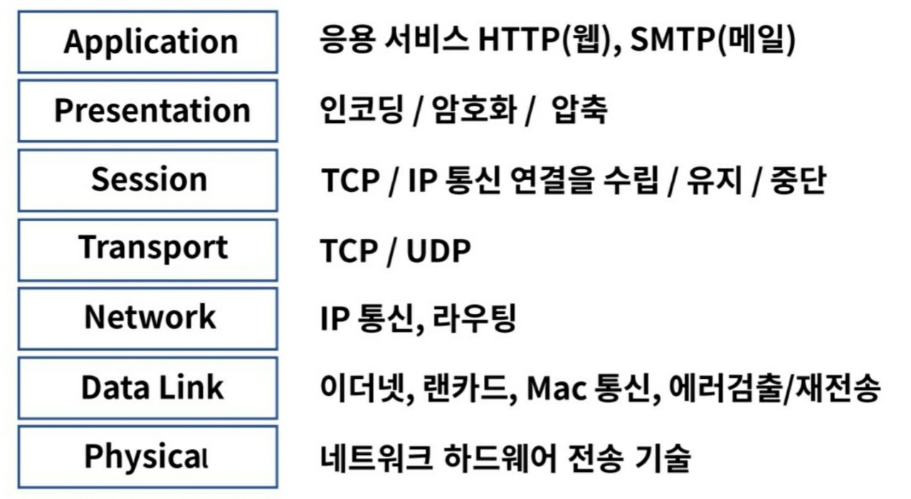

## OSI 7 Layer

네트워크 프로토콜과 통신을 7 계층으로 표현한 것이다.

- 목적
프로토콜을 기능별로 나누고 계층별로 구분하였다.
벤더 간 호환성을 위한 표준이 필요한 상태에서 쉬운 접근성으로 기술의 발전을 일으켰다.

가장 기계적인 물리계층에서부터 어플리케이션까지 계층별로 나뉘어져 있다.

**1계층- Physical**
- 장치와 통신 매체 사이의 비정형 데이터의 전송을 담당한다.
- 디지털 bit(0&1)를 전기, 무선 또는 광 신호로 변환한다.
- 케이블, 인터페이스, 허브, 리피터 등이 이에 속한다.

**2계층- Data Link**
- 동일 네트워크 내에서 데이터 전송, 링크를 통해서 연결을 설정하고 관리하는 부분이다.
- 물리계층에서 발생할 수 있는 오류를 감지하고 수정한다.
- 모뎀, 스위치가 이에 속한다.

**3계층 - Netwrok**
- 다른 네트워크로 데이터를 전송하고, IP주소로 통신한다.
- 출발지IP에서 목적지IP로 데이터 통신 시 중간에서 라우팅 처리를 한다.
- 데이터가 큰 경우 분할 및 전송 후 목적지에서 재조립하여 메시지를 구현한다.
- L3스위치, 라우터가 이에 속한다.

**4계층 - Transport**
- 호스트 간의 데이터를 전송하는 부분이다.
- 데이터 전송 이외에도 오류 복구 및 흐름 제어를 하고, 완벽한 데이터 전송을 보장한다.
- L4 계층을 특정하등웨어로 구분하기가 모호하고, L4 로드밸런서가 있다.
(L4 로드 밸런서: Port를 제어한다는 의미)

**5계층 - Session**
- 로컬 및 원격 어플리케이션 간의 IP/Port 연결을 관리해주는 부분이다.
- Session table을 통해서 3단계와 4단계를 관리한다.

**6계층 - Presentation**
- 사용자 프로그램과 네트워크 형식간에 데이터를 변환하여 표현과 독립성을 제공한다.
- 주요 기능은 인코딩, 디코딩, 암호화, 압축 등이 있다.

**7계층 - Application**
- 사용자와 가장 밀접한 소프트웨어이다.
- 주요 기능으로는 이메일 서비스인 SMTP, 파일전송 FTP 등이 있다.