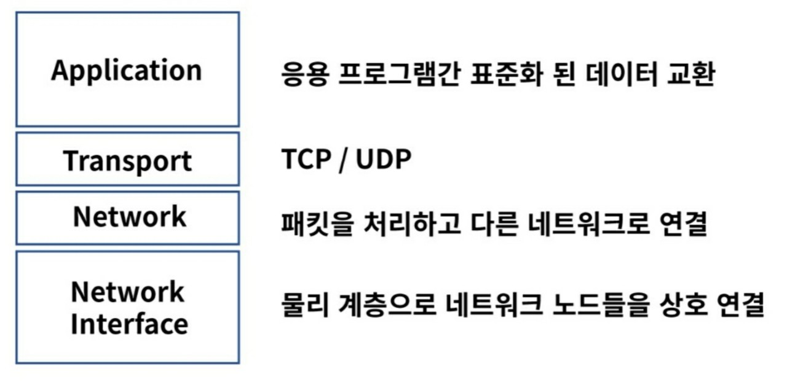
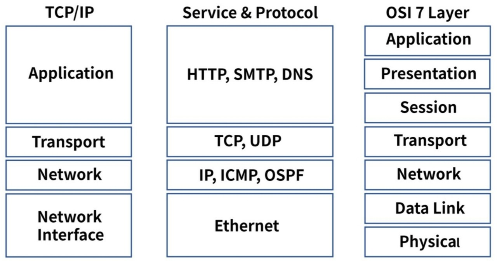
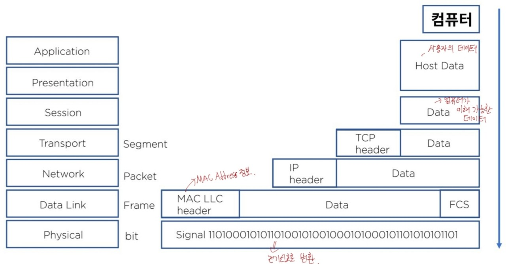
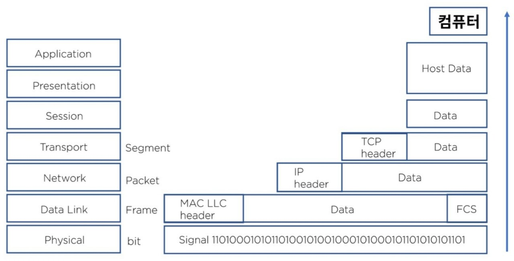

## TCP/IP

네트워크 프로토콜의 모음으로 패킷 통신 방식의 IP와 전송 조절 프로토콜인 TCP로 이루어져 있다.   

**TCP/IP 모델**

**TCP/IP와 OSI 7 Layer 비교**

**인캡슐레이션**

- 하위계층으로 가면서 header가 붙는 형태 

  

**디캡슐레이션**

- 상위 계층으로 가면서 불필요한 부분이 사라지는 형태 

