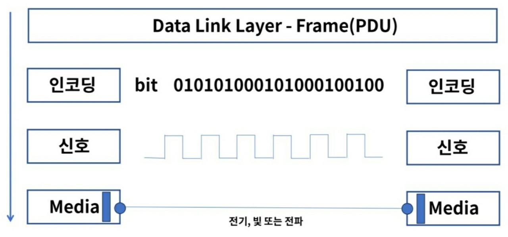
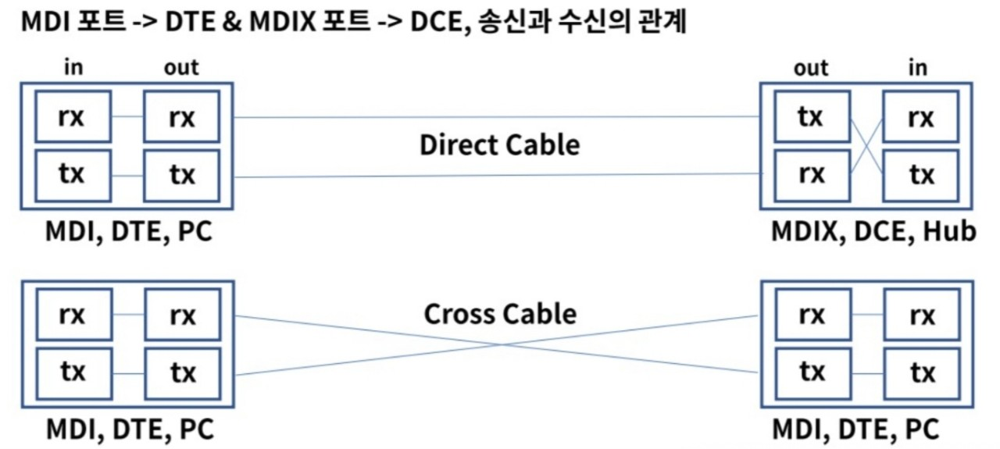
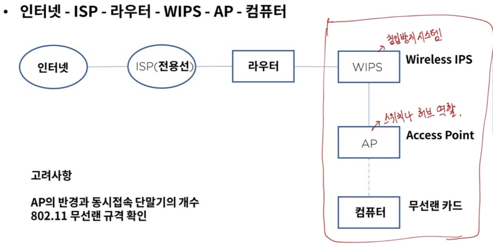

## 물리계층
OSI 7 계층의 1계층으로 하드웨어로 표현되는 단계이다.
네트워크 장치의 전기적, 기계적 속성 및 전송하는 수단을 정의한다. 
상위 계층인 데이터링크 계층의 프레임을 신호로 인코딩하여 네트워크 장치로 전송한다.
통신 장치와 커넥터, 인코딩, 송수신을 담당하는 회로 등의 요소가 있다.
 
**Signal의 종류**

- 전기 -> Copper 케이블을 사용하며 전화선, UTP, 동축케이블 등...

- 광 -> Optical Fiber 케이블이 이에 속하며 빛의 패턴을 신호로 사용

- 전파 -> 마이크로파 패턴을 신호로 사용하며, 와이파이 등과 같은 무선이 이에 속함
 

**Signaling의 전송 방식**

비트를 인코딩하여 2계층과 통신한다.

## 물리계층 장비와 케이블

### 물리계층 장비
 

- **허브와 리피터**
    허브: 전기신호를 증폭하여 포트에 연결된 PC들끼리 통신을 가능하게 한다.

    리피터: 현재 거의 쓰지 않는 장비로 신호의 세기를 증폭하여 좀 더 먼거리까지 통신이 가능
 
- **허브의 동작방식**
단순한 중계기의 역할로 허브에 연결된 PC1이 다른 PC2에게 데이터를 보내려고 하면 허브에 연결된 모든 pc들에게 그 데이터를 전달하게 된다.
    - 브로드캐스팅 통신
        **1->All**
    - 유니캐스팅 통신
        **1->1**
    - 멀티캐스트 통신    
        **1->n(특정한 개수만)**
 

- **CSMA/CD(carrier sense multiple access/collision detection)**

송신노드는 데이터를 전송하고, 다음 채널에서 다른 노드의 데이터 충돌 발생을 계속 감지한다. 충돌이 발생한다면 모든 노드에게 충돌 발생을 통지하고 재전송을 시도한다.
총 3가지의 단계를 거치게 된다.

1. Carrier Sensing
데이터를 보내기 전에 다른 노드에서 데이터를 보내는 중인지 확인

2. Multiple Access
데이터를 보내는 곳이 없다면 전송 시작

3. Collison Detection
동 시간대에 데이터를 보내게 되면 충돌이 일어나고 정지.
그 이후에 특정 시간이 지나면 다시 첫번째 단계로 반복된다.
 

- **전송방식**

1. Simplex -> 단방향 통신
2. Half Duplex -> 반이중 전송방식으로 양방향 통신이기는 하지만 송수신 시간이 정해짐
3. Full Duplex -> 전이중 전송방식으로 동시 양방향 통신이 가능

### 케이블과 커넥터

전송 장치에 신호를 전달하는 통로로 TP, 동축, Fiber 등이 있다.

- TP(Twisted Pair)
총 8가닥으로 구성되며 두 개의 선을 서로 꼬아 놓는다.
이렇게 하면 자기장 간섭을 최소화하여 성능이 향상된다.
 

- 동축
선 중앙에 심성이 있으며 그 주위를 절연물과 외부 도체로 감싸고 있다. 전화 또는 회선망 등 광범위하게 사용된다.
 

- Fiber
전기신호의 자기장이 없는 빛으로 통신하기 때문에 장거리 고속 통신이 가능하다.

## UTP 케이블
- UTP(Unshielded Twisted Pair)는 주로 근거리 통신망(LAN)에서 사용되는 케이블이다. 이더넷 망 구성시 가장 많이 보게 되는 케이블이다.

### 코드배열
- 8P8C
8개의 선 배열에 따라 다이렉트 또는 크로스 케이블로 구성한다.
    - Direct Cable: PC에서 Hub 연결 -> DTE to DCE
    - Cross Cable: PC에서 PC, 허브에서 허브연결 -> DTE to DTE, DCE to DCE(동일 계층의 장비끼리...)
        * DTE(Data Terminal Equipment): 데이터의 끝이나 변경되는 지점
        * DCE(Data Communication Equipment): 데이터가 들어오면 바로 Forward

- Standard
    - ISO/ IEC 11801
    Copper & Fiber 케이블 등을 정의
    - TIA-568
    통신 제품 및 서비스를 위한 상업용 케이블 스펙을 정의
    - EIA-568
    최초 통긴 시스템 케이블링의 표준을 정의했고 이후 TIA로 이관

- Auto MDI-X
어떤 노드의 연결인지에 따라서 다이렉트와 크로스 케이블을 선택하는 것이 불편해서 케이블 타입에 관계없이 노드 상호간 자동으로 통신이 가능하게 하는 기술이다.

## Wi-Fi
- 비영리 기구인 Wi-Fi Aliance의 상표로 전자기기들이 무선랜에 연결할 수 있게 하는 기술이다.
- 1999년 몇몇 회사들이 무선 네트워킹 기술의 발전을 위해 협회를 결성하였고 2000년에 Wi-Fi 용어를 채택했다.

#### 무선랜 구성

이 때, WIPS와 AP가 있어야 와이파이가 가능하다.