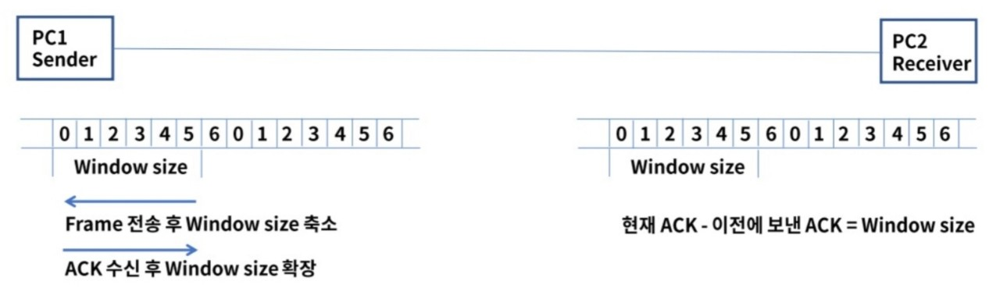

## 데이터 링크 계층

- OSI 7 계층의 2계층으로 인접한 네트워크 노드끼리 데이터를 전송하는 기능과 절차를 제공한다.
- 물리계층에서 발생할 수 있는 오류를 감지하고 수정한다.
- 대표적인 프로토콜 : 이더넷
  대표적인 장비 : 스위치

#### 구성
- **MAC(Media Access Control)** => 컴퓨터간 네트워크 인터페이스
  물리적인 부분으로 매체 간의 연결방식을 제어하고 1계층과 연결
 

- **LLC(Logical Link Control)**
  논리적인 부분으로 Frame을 만들고 3계층과 연결

#### MAC 주소
- 48bit(6 Bytes) 6자리로 구성하고 각 16진수로 표현한다.
- 앞 3자리는 OUI(Organization Unique Identifier)...제조사 식별코드이다.
- 나머지 3자리는 제조사 내 일련번호이다.

 

#### Framing

- 데이터그램을 캡슐화해서 프레임단위로 만들고 헤더와 트레일러를 추가한다.
- 헤더에는 목적지, 출발지 주소 그리고 데이터 내용을 정의한다.
(데이터링크에서 어떠한 디바이스로 통신하는지에 대해 알 수 있다.)
- 트레일러는 비트 에러를 감지한다.

#### 주요기능

1. **회선 제어**
신호간 충돌이 발생하지 않도록 제어한다.

**ENQ/ACK방법** 사용 => 장비와 장비가 1대1로 연결될 때 사용하는 방법이다.

**Polling 방법**
- select 모드 : 송신자가 나머지 수신자들을 선택하여 전송 
- Poll 모드 : 수신자에게 데이터 수신 여부를 확인하여 응답을 확인하고 전송

2. **흐름 제어**
- 송신자와 수신자의 데이터를 처리하는 속도 차이를 해결하기 위한 제어이다.
- Feedback 방식의 flow Control이며 상위 계층은 Rate 기반이다.

데이터 송수신시에 문제
1) Frame을 전달하고 ACK이 회선 문제로 응답하지 않는 경우

해결

2) Frame을 재전송하여 동일한 패킷이 2개 갈 경우

해결

Sequence number(1 bit)를 사용하여 동일 frame인지 구분하여 상위 계층으로 전달한다.

3) Stop & wait의 비효율성

개선

Sliding Window -> ACK 응답 없이 여러 개의 프레임이 연속으로 전송 가능

    * Window size는 전송과 수신측의 데이터가 저장되는 버퍼의 크기

3. **오류제어**
전송 중에 오류나 손실 발생시 수신측은 에러를 탐지 및 재전송

    * ARQ(Automatic Repeat Request) : 프레임 손상 시 재전송이 수행되는 과정

#### 이더넷 프레임 구조

Ethernet v2
데이터 링크 계층에서 MAC 통신과 프로토콜의 형식을 정의

Preamble : 이더넷 프레임의 시작과 동기화 
Dest Addr : 목적지 MAC주소, Src Addr : 출발지 MAC주소
Type : 캡슐화 되어 있는 패킷의 프로토콜을 정의
Data : 상위 계층의 데이터로 46~1500바이트의 크기, 46바이트보다 작은 면 뒤에 패딩(0 또는 1의 숫자)이 붙는다.
FCS : 에러 체크