## 인터넷 통신
 
인터넷에서 컴퓨터는 클라이언트에서 요청과 서버에서의 응답을 주고 받으면서 통신을 하는데 거리가 멀기 때문에 중간에 수많은 중간 노드가 있는 복잡한 인터넷 망을 이용하게 된다.

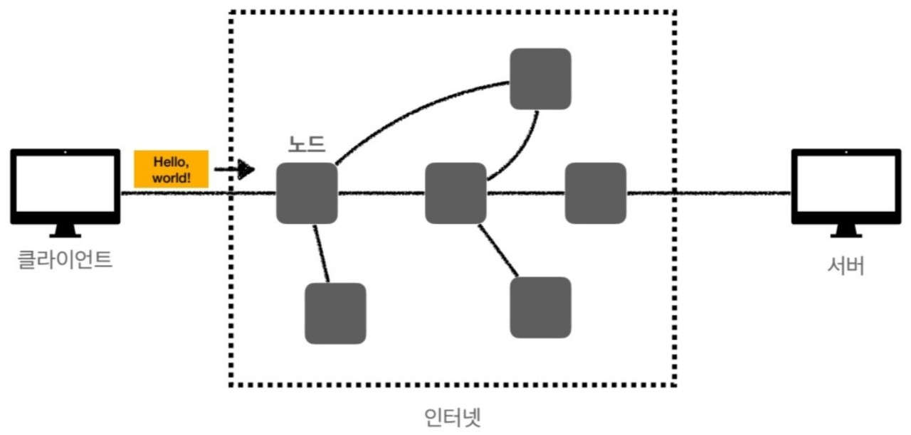

## IP
- 인터넷 프로토콜 역할
    - 지정한 IP(IP address)에 데이터 전달
    - 패킷(Packet)이라는 통신 단위로 데이터를 전달

#### IP 패킷정보
IP 패킷정보에는 출발지 IP(나의 IP), 목적지 IP(상대방 IP), 기타 등이 있다. 이러한 패킷정보는 전송할 데이터를 둘러쌓는 형태를 취한다.

#### 클라이언트 및 서버 패킷 전달

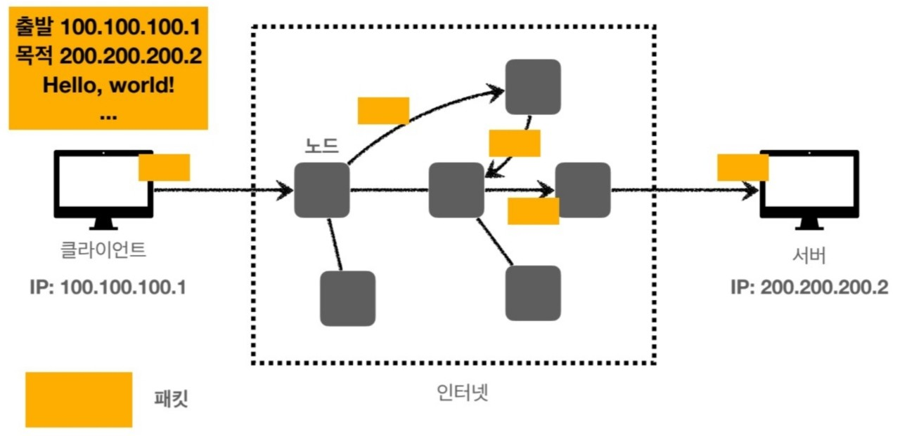

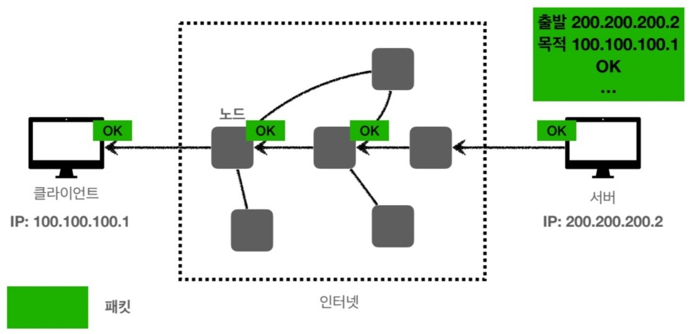

클라이언트에서 출발지 IP와 목적지 IP, 데이터를 넣고 인터넷망에 던지면 서버가 잘 받았다고 OK를 하고 그 패킷을 다시 인터넷망으로 던져서 클라이언트에게 전달한다.
이때, 인터넷 망이 복잡해서 클라이언트가 전달할 때와 친구가 나에게 전달할 때 다른 중간노드를 거치면서 전달될 수 있다.

#### IP 프로토콜의 한계

1. **비연결성**
- 패킷을 받을 대상이 없거나 서비스 불능 상태여도 패킷을 전송한다.

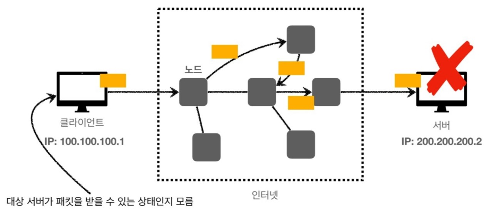

2. **비신뢰성**
- 중간에 패킷이 사라지거나 순서가 뒤바뀌는 경우도 있다.

패킷소실
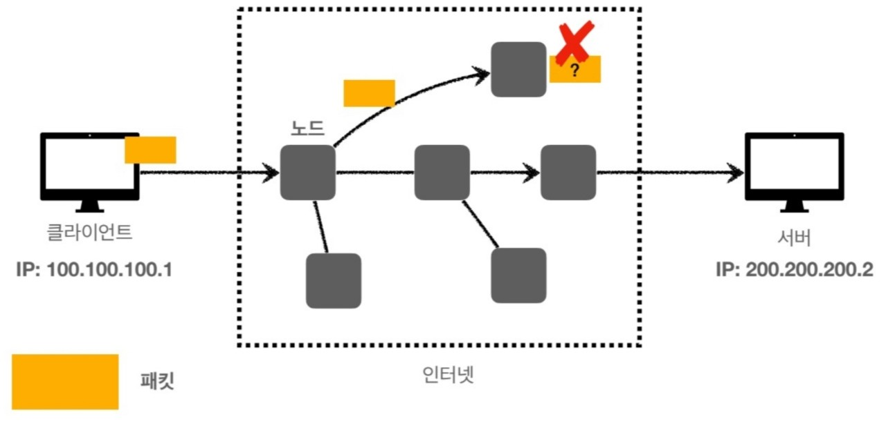
중간 노드에 문제가 생겨서 데이터 소실이 될 수 있다.

패킷 전달 순서 문제
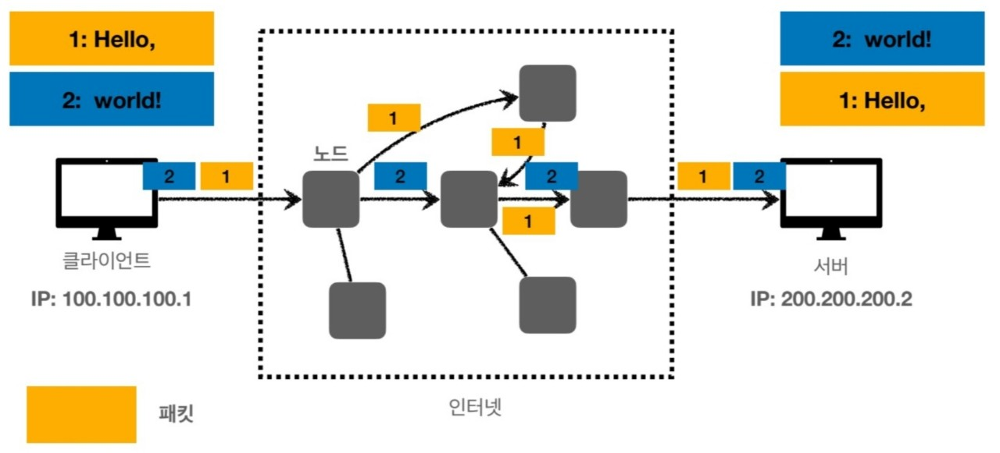
패킷이 중간에 다른 노드를 탈 수가 있어 순서가 변경될 수 있다.

3. **프로그램 구분**
- 같은 IP를 사용하는 서버에서 통신하는 애플리케이션이 둘 이상일 때 구분할 수가 없다.

## TCP, UDP
- TCP : 전송 제어 프로토콜(Transmission Control Protocol)
- UDP : 사용자 데이터그램 프로토콜(User Datagram Protocol)

#### 인터넷 프로토콜 스택의 4계층
애플리케이션 계층 - HTTP, FTP
전송 계층 - TCP, UDP
인터넷 계층 - IP
네트워크 인터페이스 계층 - LAN 카드 등등...

#### 프로토콜 계층

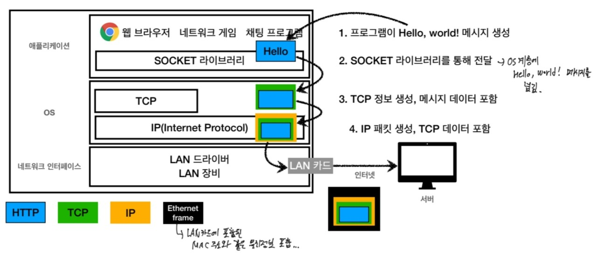

그림에서 보는 것과 같이 채팅프로그램에서 Hello, world!라는 메시지를 생성하게 되면 socket 라이브러리를 통해서 OS계층에 메시지를 넘기고 OS 계층에 있는 TCP정보를 생성하고 메시지 데이터를 포함해서 넘긴다. 그리고 IP 패킷을 생성하여 TCP 데이터를 포함해서 네트워크 인터페이스 계층의 LAN카드를 통해서 인터넷망에 전달되고 서버에 전달된다.
이때, Ethernet Frame 정보가 생성되면서 보내지는데 Ethernet Frame은 LAN카드에 포함된 MAC주소와 같은 정보를 포함하고 있다.

#### TCP 패킷정보

TCP 패킷정보에는 전송제어, 순서, 검증 정보 등이 있다. 

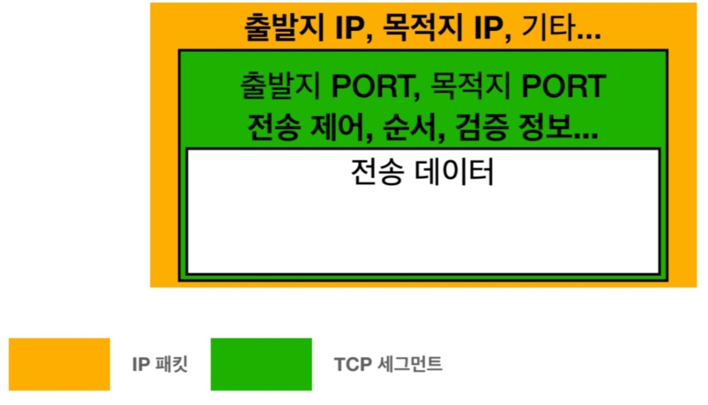

전체적인 모습을 보면 IP패킷 안에 전송 데이터를 포함한 TCP 패킷정보가 들어가 있다는 것을 알 수 있다.

#### TCP 특징

1. 연결지향 - TCP 3 way handshake(가상연결)

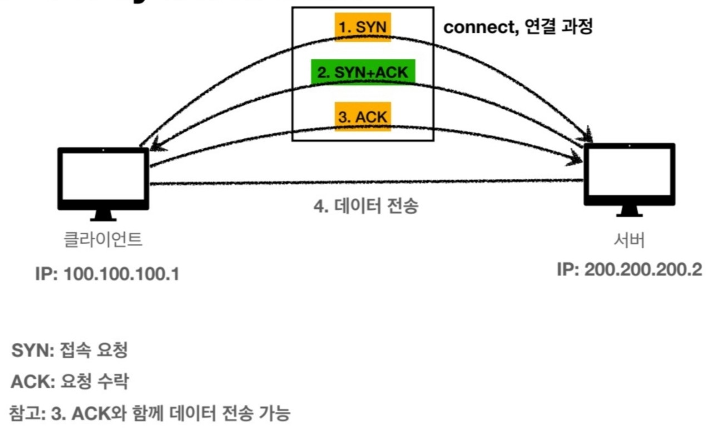

이 과정을 통해 클라이언트도 서버를 믿고 서버도 클라이언트를 믿을 수 있어서 연결한 후 데이터를 전송하게 된다.

2. 데이터 전달 보증
- 클라이언트 쪽에서 데이터를 전송하게 되면 서버에서 데이터를 잘 받았다고 응답한다.

3. 순서 보장

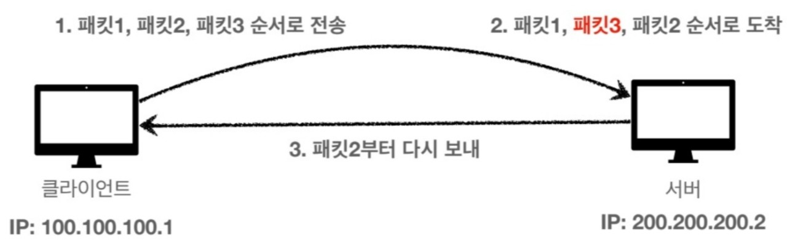

- 신뢰할 수 있는 프로토콜
- 현재는 대부분 TCP를 사용함

#### UDP 특징
- 기능이 거의 없다.(연결지향, 데이터 전달 보증, 순서 보장과 같은 기능이 없음)
- 데이터 전달 및 순서가 보장되지 않지만 단순하고 빠르다.
- IP와 비슷하고 PORT와 체크섬 정도만 추가되었다.
    * port -> 하나의 IP에서 여러 애플리케이션이 실행될 때, 구분하기 위해 쓰인다.
    * 체크썸 -> 메시지에 대해서 맞는지 검증해주는 부분이다.
- TCP에서 3way handshake에 시간이 걸리고 연결을 하고 데이터를 넣고 하면 전송 속도도 빠르게 만들기 어려워서 최적화가 힘들다.
이때, 이러한 부분을 더 최적화 하기 위해서 UDP를 사용한다.

## PORT
- 하나의 IP에서 여러 애플리케이션이 실행될 때, 구분하기 위해 쓰인다.

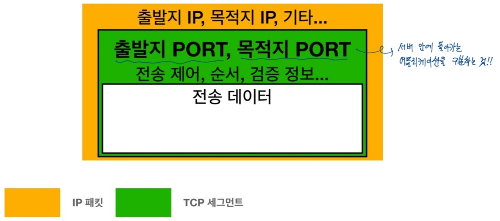

TCP 세그먼트 안에 출발지, 목적지 PORT 번호로 서버 안에 돌아가는 어플리케이션을 구분한다.

- 실생활을 예로 들면 IP가 아파트라고 하면 PORT는 몇동 몇호가 될 수 있다.

- 0 ~ 65535 할당 가능하다.
- 0 ~ 1023은 잘 알려진 포트여서 사용하지 않는 것이 좋다.
    - FTP : 20,21
    - TELNET : 23
    - HTTP : 80
    - HTTPS : 443

## DNS
- DNS : 도메인 네임 시스템(Domian Name System)
- IP는 기억하기 어렵고, 변경될 수가 있다. 따라서 이러한 한계점을 극복하기 위해서 DNS를 사용한다.

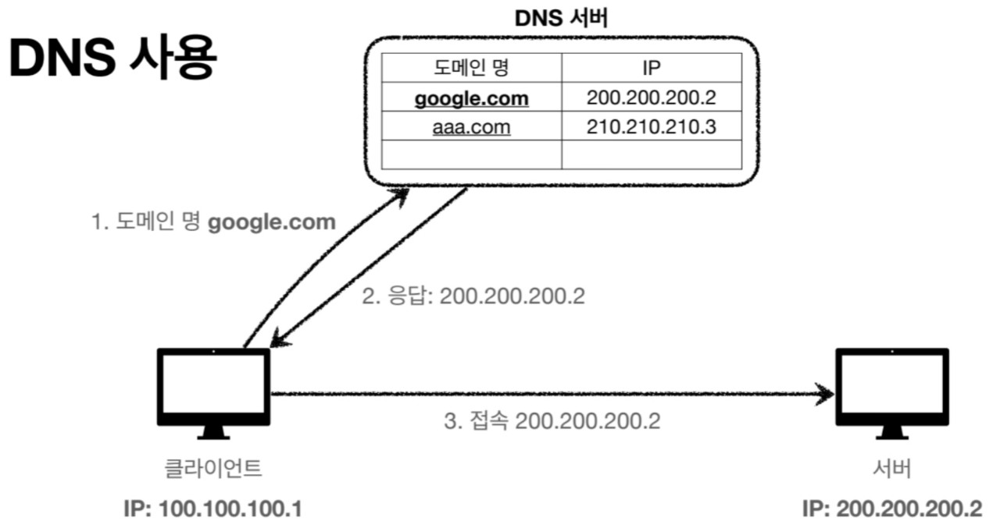

