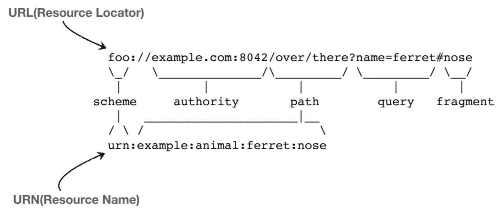
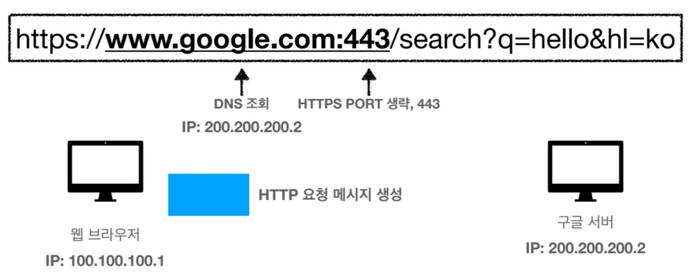
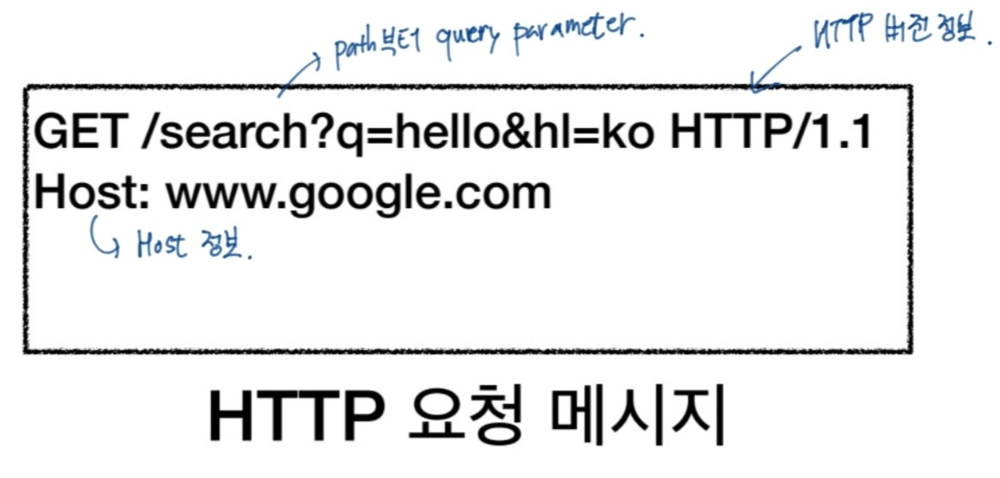
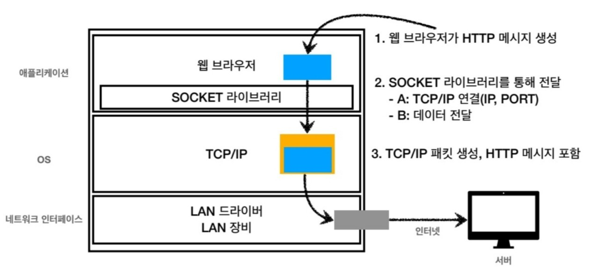
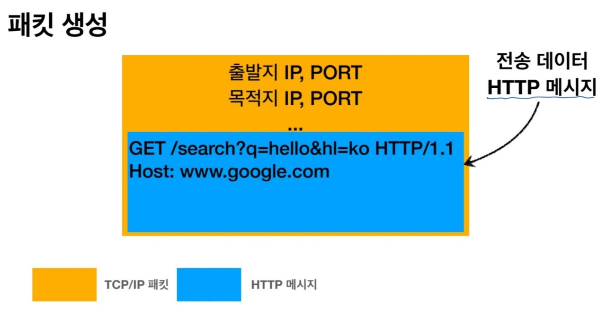
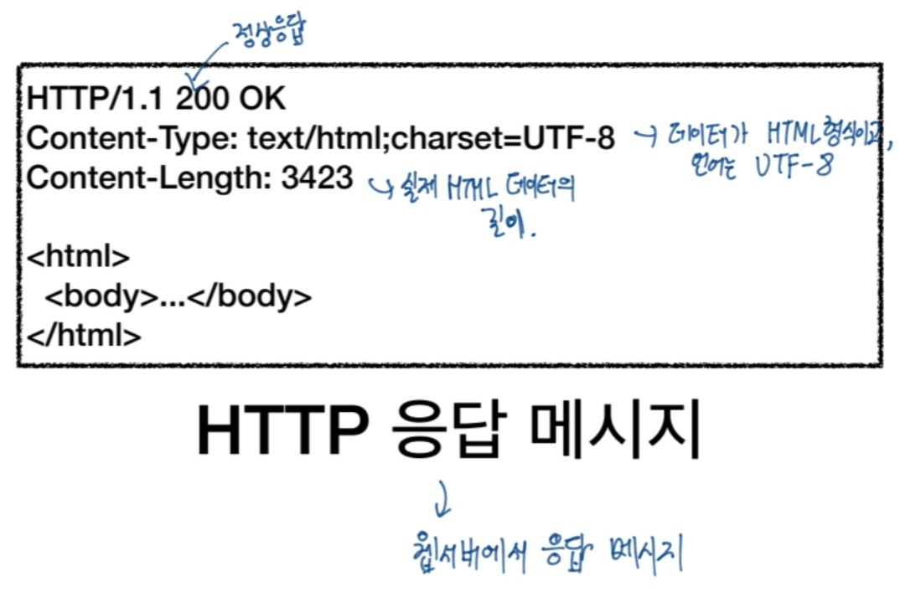
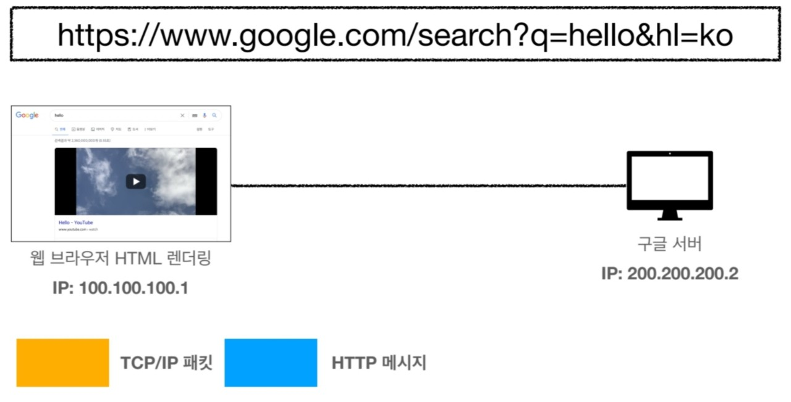

## URI(Uniform Resource Identifier)
- 리소스를 식별하는 통합된 방법
- **URI는 위치(locator), 이름(name) 또는 둘 다 추가로 분류될 수 있다.**

URN의 경우 이름을 부여하지만 찾을 수가 없어서 매핑하기가 힘들다는 문제가 있다.

#### URI
Uniform : 리소스 식별하는 통일된 방식
Resource : URI로 식별할 수 있는 모든 것
Identifier : 다른 항목과 구분하는데 필요한 정보

#### URL, URN
URL - Locator : 리소스가 있는 위치 지정
URN - Name : 리소스에 이름을 부여

- 위치는 변할 수 있지만 이름은 변하지 않는다.
- 하지만 이름만으로 실제 리소스를 찾을 수 있는 방법이 보편화 되지 않다.

<URL 분석>

**https://www.google.com/search?q=hello&hl=ko**

구글창에 이 주소를 치면 hello라는 검색을 했을 때의 검색 결과가 나온다.
- 여기에서 q=hello는 검색쿼리가 hello인 것을 의미하며 hl=ko는 언어가 한국어인 검색결과를 나타내라는 뜻이다.

#### URL 전체문법

- **scheme://[userinfo@]host[:port][/path][?query][#fragment]**
- https://www.google.com:443/searh?q=hello&hl=ko

프로토콜 : https
호스트명 : www.google.com
포트번호 : 443
패스 : /search
쿼리 파라미터 : q=hello&hl=ko

#### URL 문법 세부내용

#### scheme

**scheme:**//[userinfo@]host[:port][/path][?query][#fragment]
**https** : //www.google.com:443/searh?q=hello&hl=ko

- 주로 프로토콜 사용한다.
    * 프로토콜 : 어떤 방식으로 자원에 접근할 것인가 하는 약속 규칙
    e.g) http, https, ftp 등
- http는 80포트, https는 443 포트를 주로 사용하는데 포트가 정해져 있는 프로토콜이 올 경우에 포트는 생략 가능하다.

#### userinfo

scheme:// **[userinfo@]** host[:port][/path][?query][#fragment]
https://www.google.com:443/searh?q=hello&hl=ko

- URL에 사용자정보를 포함해서 인증하는데 거의 사용하지 않는다.

#### host

scheme://[userinfo@]**host**[:port][/path][?query][#fragment]
https:// **www.google.com** :443/searh?q=hello&hl=ko

- 호스트명을 의미하며 도메인명 또는 IP 주소를 직접 사용 가능하다.

#### port

scheme://[userinfo@]host **[:port]** [/path][?query][#fragment]
https:// www.google.com:**443**/searh?q=hello&hl=ko

- 접속포트이며 일반적으로 http는 80, https는 443이므로 생략을 한다. 만약 특정 서버에 따로 접근 시에는 입력해야 한다.

#### path

scheme://[userinfo@]host[:port]**[/path]**[?query][#fragment]
https:// www.google.com:443/**searh**?q=hello&hl=ko

- 리소스 경로(path)를 의미하며 계층적 구조를 이룬다.
e.g) /home/file1.jpg
     /members/100, items/iphone12

#### query

scheme://[userinfo@]host[:port][/path]**[?query]**[#fragment]
https:// www.google.com:443/**searh**?**q=hello&hl=ko**

- 기본적으로 key=value 형태이다.
- ?로 시작하며, &로 추가 가능하다.
- query parameter, query string 등으로 불리는데 query parameter인 이유는 웹서버에 제공하는 파라미터이기 때문이고, query string인 이유는 숫자가 들어있어도 문자 형태로 처리하기 때문이다.

#### fragment

scheme://[userinfo@]host[:port][/path][?query]**[#fragment]**
https://docs.spring.io/spring-boot/docs/current/reference//html/getting-started.html **#getting-strated-introducing-spring-boot**

- html 내부 북마크 등에 사용되고, 서버에 전송하는 정보가 아니다.

## 웹 브라우저 요청 흐름

클라이언트 측에서 http 요청 메시지를 생성해서 서버로 보낸다.

이때, http 요청 메시지에는 그림에서 보는 것과 같이 요청하는 메서드 방식, path부터 query parameter, http 버전 정보, host 정보가 담겨져 있다.
 

#### HTTP 메시지 전송

http 메시지를 전송할 때, 우선 웹브라우저에서 http 메시지를 생성하면 socket 라이브러리를 통해 OS계층으로 전달하게 되고, OS 계층 안에 TCP/IP 계층에서 http 메시지를 포함한 패킷을 생성하게 된다.
그 이후에 네트워크 인터페이스 계층을 거쳐서 최종적으로 서버에 전송된다.

간략히 보자면 생성되는 패킷에서 전송데이터의 겉을 TCP/IP 패킷이 둘러싸고 있고, 전송되는 데이터는 웹브라우저에서 생성한 http 메시지이다.
 
 

이렇게 서버는 클라이언트측에서 보낸 http 메시지를 해석한 후 다시 클라이언트 측에 응답을 하는 메시지를 보내게 된다.

응답 메시지에는 http 버전 정보, 응답 상태 정보, 데이터 형식과 언어, 데이터의 길이 등이 담겨져서 클라이언트 측으로 향한다.

서버에서 응답 메시지를 보내게 되면 클라이언트 측에서 HTML을 랜더링하여 웹 페이지로 출력 결과를 보여주게 된다.

