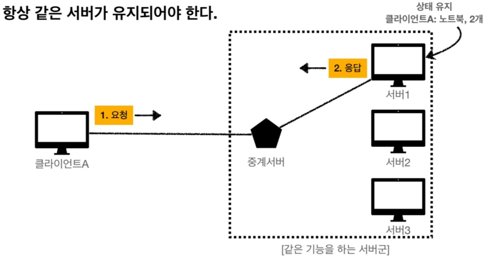

## HTTP(HyperText Transfer Protocol)
- HTTP 메시지에 모든 것을 전송한다.
e.g) HTML, TEXT, Image, 음성, 영상, 파일, JSON, XML 등등 거의 모든 형태의 데이터 전송이 가능하다.
- 서버 간에 데이터를 주고 받을 떄도 대부분 HTTP를 사용한다.

### HTTP 역사
- HTTP/0.9 1991년: GET 메서드만 지원, HTTP 헤더는 없었다.
- HTTP/1.0 1996년: 메서드, 헤더 추가
- **HTTP/1.1 1997년 : 가장 많이 사용하는 버전, 개발자에게 가장 중요한 버전(대부분의 기능이 들어있음)**
- HTTP/2 2015년 : 성능 개선
- HTTP/3 진행중 : TCP 대신에 UDP 사용, 성능 개선

### 기반 프로토콜
- TCP : HTTP/1.1, HTTP/2
-> TCP의 경우, 3 way handshake도 해야 되고, 데이터도 너무 많고, 구조적인 부분부터 속도가 빠르지가 않음
- UDP : HTTP/3 (애플리케이션 레벨에서 성능 최적화한 버전)

### HTTP 특징
1. 클라이언트 서버 구조
2. 무상태 프로토콜(Stateless), 비연결성
3. HTTP 메시지
4. 단순함, 확장 가능

### 1. 클라이언트 서버 구조
- Request, Response 구조
- 클라이언트는 서버에 요청을 보내고, 응답을 대기한다.
- 서버가 요청에 대한 결과를 만들어서 응답한다.

* **클라이언트와 서버를 분리하는 것이 좋은 이유**
    - 비즈니스 로직, 데이터는 서버에 넣는다.
    - 클라이언트는 사용성, UI에 집중한다.
    => **클라이언트와 서버가 독립적으로 진화가능**

### 2. 무상태 프로토콜(Stateless)
- 서버가 클라이언트의 상태를 보존하지 않는다.
- 장점: 서버 확장성이 높음(스케일 아웃)
- 단점: 클라이언트가 추가 데이터 전송

#### Stateful과 Stateless 차이
- 상태 유지 - Stateful
    - 서버가 클라이언트의 이전 상태를 보존한다.
    - 이전 상태를 유지하기 떄문에 중간에 서버가 바뀌면 데이터가 존재하지 않는다.

 

- 무상태 - Stateless
    - 중간에 서버가 바뀌어도 아무런 지장이 없다.
    - 갑자기 클라이언트 요청이 증가해도 서버를 대거 투입할 수 있다. 
    - 무상태는 응답 서버를 쉽게 바꿀 수 있다. -> **무한한 서버 증설 가능**

#### Stateless의 실무적 한계
- 모든 것을 무상태로 설계할 수 있는 경우도 있고 없는 경우도 있다.
- 무상태
    e.g) 로그인이 필요없는 단순한 서비스 소개 화면
- 상태 유지
    e.g) 로그인

 

- 로그인한 사용자의 경우 로그인 했다는 상태를 서버에 유지해야 한다.
- 일반적으로 브라우저 쿠키와 서버 세션 등을 사용해서 상태를 유지한다.
- **상태 유지는 최소한만 사용**
 
 

### 비연결성(Connectionless)

- HTTP는 기본이 연결을 유지하지 않는 모델이다.
- 일반적으로 서버는 초 단위 이하의 빠른속도로 응답한다.
- 1시간동안 수천명이 서비스를 이용해도 실제 서버에서 동시에 처리하는 요청을 수십개 이하로 매우 작다.
    e.g) 웹 브라우저에서 계속해서 검색 버튼을 누르지 않음
- 서버 자원을 매우 효율적으로 사용할 수 있다.

#### 연결을 유지하는 모델
- 기본적으로 TCP/IP는 연결을 유지한다.

- 연결을 유지하게 되면 서버의 자원을 소모한다는 단점이 있다.

#### 연결을 유지하지 않는 모델

- 연결을 유지하지 않게 되면 최소한의 자원만 유지하게 된다.
- 그렇기 때문에 서버 입장에서는 서버 유지 자원을 최소한으로 줄일 수 있게 된다.

#### 한계와 극복
- 새로 연결할 때마다 TCP/IP 연결을 새롭게 해야 한다.
-> 3 way handshake 시간 추가
- 웹 브라우저로 사이트를 요청하면 HTML 뿐만 아니라 자바스크립트, css, 추가 이미지 등 수많은 자원이 함께 다운로드 되므로 시간이 더더욱 걸린다.
- 지금은 **HTTP 지속 연결(Persistent Connections)** 로 문제를 해결하였다.

그림을 보게 되면 각각의 HTML, 자바스크립트, 이미지들마다 연결하고 종료하여 시간적인 낭비가 있었다.

하지만 지속연결을 활용하여 시간적인 문제를 해결하였다. 기존의 각각의 데이터들을 연결하고 종료하는 것이 아닌 데이터를 연결할 때부터 끝날 때까지 지속적으로 연결하여 응답 시간을 줄였다.

### HTTP 메시지

#### HTTP 메시지 구조

기본적으로 HTTP 메시지 구조는 그림과 같다.
 
 

#### HTTP 요청 메시지

요청 메시지도 body 본문을 가질 수 있다.

#### <시작 라인> 

 

**요청 메시지**
- start-line = request-line
- request-line => method SP(공백) request-target(path) SP HTTP- version CRLF(엔터) 

    - HTTP 메서드(GET:조회)
    - 요청 대상(/search?q=hello&hl=ko)
    - HTTP Version

**HTTP 메서드**
- 종류 : GET, POST, PUT, DELETE...
- 서버가 수행해야 할 동작 지정
    - GET : 리소스 조회
    - POST : 요청 내역 처리

**요청 대상**
- absolute-path[?query] (절대경로[?쿼리])
- 절대경로 = "/"로 시작하는 경로
  * 참고: *, http://...?x=y와 같이 다른 유형의 경로 지정 방법도 있다.

**HTTP 버전**
- HTTP Version(HTTP/1.1 등)

#### <HTTP 헤더>

- header-field = field-name ":" OWS field-value OWS (OWS: 띄어쓰기 허용)
- field-name은 대소문자 구분 없음(value는 대소문자 구분)

#### HTTP 응답 메시지

#### <시작 라인> 

 

**응답 메시지**
- start-line = status-line
- status-line = HTTP-version SP status-code(상태코드) SP reason-phrase CRLF

    - HTTP 버전
    - HTTP 상태 코드 : 요청 성공, 실패를 나타낸다.
        - 200 : 성공
        - 400 : 클라이언트 요청 오류
        - 500 : 서버 내부 오류

    - reason-phrase : 사람이 이해할 수 있는 짧은 상태 코드 설명 글

#### <HTTP 헤더>

- header-field = field-name ":" OWS field-value OWS (OWS: 띄어쓰기 허용)
- field-name은 대소문자 구분 없음(value는 대소문자 구분)

**용도**

- HTTP 전송에 필요한 모든 부가정보
e.g) 메시지 바디의 내용, 메시지 바디의 크기, 압축, 인증, 요청 클라이언트(브라우저) 정보, 서버 애플리케이션 정보, 캐시 관리 정보...
- 표준 헤더가 너무 많다.
- 필요할 시 임의의 헤더를 추가할 수 있다.

#### <HTTP 메시지 바디>

- 실제 전송할 데이터
- HTML 문서, 이미지, 영상, JSON 등등 byte로 표현할 수 있는 모든 데이터를 전송 가능하다.

### 단순함 확장가능
- HTTP는 단순하다.
- HTTP 메시지도 매우 단순하다.
- 크게 성공하는 표준 기술은 단순하지만 확장 가능한 기술이다.