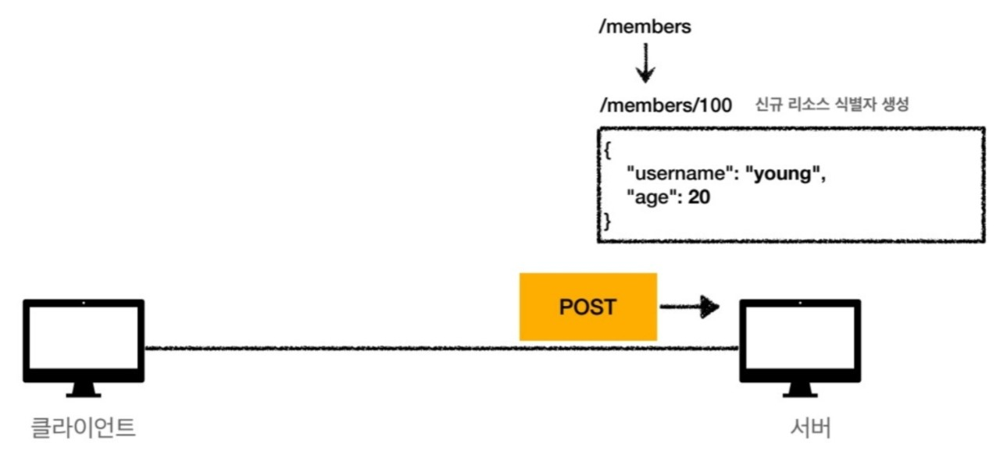
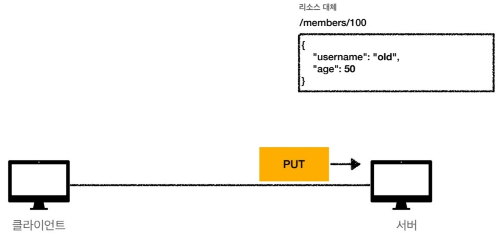

## HTTP 메서드

### HTTP API 만들기

회원 정보 관리 API를 만들 때,
- 회원 목록 조회
- 회원 조회
- 회원 등록
- 회원 수정
- 회원 삭제

이러한 요구사항을 토대로 API URI를 설계하게 된다.

이때, 가장 중요한 것은 **리소스 식별**이다.

- 리소스의 의미
    - 회원을 등록하고 수정하고 조회하는 행위는 리소스가 아니다.
    - **회원이라는 개념 자체가 리소스다.**

- 리소스의 식별
    - 회원을 등록하고 수정하고 조회하는 것을 모두 배제한다.
    - **회원이라는 리소스만 식별하면 된다 -> 회원 리소스를 URI에 매핑**

### API URI 설계 - 리소스 식별, URI 계층 구조 활용
- 회원 목록 조회 /members
- 회원 조회 /members/{id} 
- 회원 등록 /members/{id}
- 회원 수정 /members/{id}
- 회원 삭제 /members/{id}

그렇다면 조회, 등록, 수정, 삭제는 어떻게 구분해야 하는가?

**리소스와 행위를 분리**

- URI는 리소스만 식별한다.
- 리소스와 해당 리소스를 대상으로 하는 행위를 분리한다.
    - 리소스 : 회원
    - 행위 : 조회, 등록, 삭제, 변경
- 리소스는 명사, 행위는 동사로 분리한다.

### HTTP 메서드 종류
**주요 메서드**
- GET : 리소스 조회
- POST : 요청 데이터 처리, 주로 등록에 사용
- PUT : 리소스를 대체, 해당 리소스가 없으면 생성
- PATCH : 리소스 부분 변경 e.g) 회원의 이름을 변경 등... 
- DELETE - 리소스 삭제

**기타 메서드**
- HEAD : GET과 동일하지만 메시지 부분을 제외하고, 상태 줄과 헤더만 반환
- OPTIONS : 대상 리소스에 대한 통신 가능 옵션(메서드)을 설명(주로 CORS에서 사용)
- CONNECT : 대상 자원으로 식별되는 서버에 대한 터널을 설정
- TRACE : 대상 리소스에 대한 경로를 따라 메시지 루프백 테스트를 수행

  * 참고로 CONNECT, TRACE는 거의 사용되지 않는다.

#### GET
- 리소스 조회를 한다.
- 서버에 전달하고 싶은 데이터는 query(쿼리 파라미터, 쿼리 스트링)를 통해서 전달한다.
- 메시지 바디를 사용해서 데이터를 전달할 수 있지만, 지원하지 않는 서버가 많아서 권장하지 않는다.

클라이언트가 get방식으로 서버에 요청 메시지를 보내면 서버에서는 해당 경로에 있는 데이터를 응답 데이터 바디부분에 넣어서 전달해준다.

#### POST
- 요청 데이터를 처리한다.
- **메시지 바디를 통해서 요청 데이터 전달한다.**
- 서버는 요청 데이터를 처리한다.
    - 메시지 바디를 통해 들어온 데이터를 처리하는 모든 기능을 수행한다.
- 주로 전달되는 데이터는 신규 리소스 등록 및 프로세스 처리에 사용된다.

클라이언트 측에서 post방식으로 바디부분에 데이터를 넣어서 요청 메시지를 서버로 전달하게 되면 서버에서는 신규 리소스를 생성하게 된다. 그 후 클라이언트 측에 응답 메시지를 보낼 때, 신규생성되면 201 created가 되고, 자원이 신규 생성된 URI 경로를 Location이라는 key값으로 해서 추가해서 넣어서 보낸다.

 
 

**그렇다면 요청 데이터를 어떻게 처리한다는 뜻일까?**

정리를 하자면 **리소스 URI에 POST 요청이 오면 데이터를 어떻게 처리할지는 리소스마다 따로 정해야 하고 정해진 것은 없다.**

#### PUT
- **리소스를 대체**
    - 리소스가 있으면 대체하고, 리소스가 없으면 생성한다.
    - 덮어쓰기가 진행된다는 얘기이다.
- **클라이언트가 리소스를 식별**
    - 클라이언트가 리소스 위치를 알고 URI 지정
    - POST는 리소스만 알고 있고 위치는 알지 못한다.

- **리소스가 있는 경우**

서버에 리소스가 있는 경우, 데이터가 클라이언트 측에서 보낸 요청 메시지의 데이터로 대체 된다.

- **리소스가 없는 경우**

서버에 리소스가 없는 경우, 서버에 신규 리소스가 생성된다.

- 리소스를 완전히 대체한다.

주의할 점은 그림과 같이 일부 수정이 아니라 완전히 대체가 된다는 점이다.

#### PATCH
- put에서 완전히 대체되는 것과 달리 PATCH에서는 리소스를 부분 변경할 수 있다.

그림을 보면 부분적인 변경이 진행된 것을 알 수 있다.
patch의 경우, 지원이 안되는 서버가 있을 수 있는데 그럴 때는 post를 사용하면 된다.

#### DELETE
- 리소스를 제거한다.

