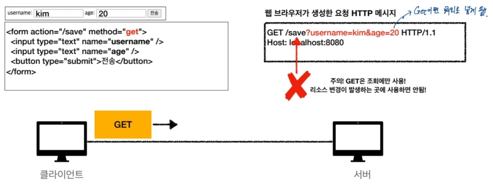

# HTTP 메서드 활용

## 클라이언트에서 서버로 데이터 전송

1. **쿼리 파라미터를 통한 데이터 전송**
    - GET 방식
    - 주로 정렬 필터(검색어)에서 활용

2. **메시지 바디를 통한 데이터 전송**
    - POST, PUT, PATCH 
    - 회원가입, 상품주문, 리소스 등록, 리소스 변경시에 활용

- 정적 데이터 조회
- 동적 데이터 조회
- HTML Form을 통한 데이터 전송
- HTTP API를 통한 데이터 전송

### 정적 데이터 조회


- 쿼리 파라미터 사용하지 않음
- 이미지, 정적 텍스트 문서
- 조회는 GET 메서드 사용
- 정적 데이터는 일반적으로 쿼리 파라미터 없이 **리소스 경로로 단순하게 조회 가능함**

<br>

### 동적 데이터 조회


- 쿼리 파라미터 사용
- 주로 검색, 게시판 목록에서 정렬 필터(검색어)
- 조회 조건을 줄여주는 필터, 조회 결과를 정렬하는 정렬 조건에 주로 사용
- 조회는 GET 메서드..
- GET은 쿼리 파라미터 사용해서 데이터를 전달함.

<br>

### HTML Form 데이터 전송
#### POST 전송 - 저장


- HTML Form submit 버튼 누르면 POST 전송
    - eg) 회원가입, 상품주문, 데이터 변경
- Content-Type : application/x-www-form-urlencoded 사용
    - form의 내용을 메시지 바디를 통해서 전송(key=value, 쿼리 파라미터 형식)
    - 전송 데이터를 url encoding  처리
        - eg) abc김 -> abc%EA%B9%80


#### GET 전송 - 저장

#### GET 전송 - 조회


- HTML Form은 GET 전송도 가능

#### Multipart/ Form-data


- Content-Type : multipart/form-data
    - 파일 업로드 같은 바이너리 데이터 전송시 사용
    - 다른 종류의 여러 파일과 폼의 내용 함께 전송 가능

 * HTML Form 전송은 GET, POST만 지원

#### HTTP API 데이터 전송

- 서버에서 서버
    - 백엔드 시스템 통신
- 앱 클라이언트
    - 아이폰, 안드로이드
- 웹 클라이언트
    - HTML에서 Form 전송 대신 자바 스크립트를 통한 통신에 사용(AJAX)
    - eg) React, Vue.js 같은 웹 클라이언트와 API 통신
- POST, PUT, PATCH
: 메시지 바디를 통해 데이터 전송
- GET
: 조회, 쿼리 파라미터로 데이터 전달
- Content-Type
: aplication/json을 주로 사용
    - TEXT, XML, JSON 등

<br>

## HTTP API 설계 예시
### 회원 관리 시스템
#### API 설계 - POST 기반 등록

```
- 회원 목록 /members -> GET
- 회원 등록 /members -> POST
- 회원 조회 /members/{id} -> GET
- 회원 수정 /members/{id} -> PATCH, PUT, POST
- 회원 삭제 /members{id} -> DELETE
```

#### POST - 신규 자원 등록 특징
- 클라이언트는 등록될 리소스의 URL을 모른다.
    - 회원등록 /members -> POST
    - POST /members
- 서버가 새로 등록된 리소스 URL을 생성해준다.
    - HTTP/1.1 201 Created
      Location: /members/100
- **컬렉션(Collection)**
    - 서버가 관리하는 리소스 디렉토리
    - 서버가 리소스의 URL을 생성하고 관리
    - 컬렉션은 **/members**

#### API 설계 - PUT 기반 등록

```
- 파일 목록 /files -> GET
- 파일 조회 /files/{filename} -> GET
- 파일 등록 /files/{filename} -> PUT
- 파일 삭제 /files/{filename} -> DELETE
- 파일 대량 등록 / files -> POST
```

#### PUT - 신규 자원 등록 특징
- 클라이언트가 리소스 URL을 알고 있어야 한다.
    - 파일 등록 /files/{filename} -> PUT
    - PUT files/star.jpg
- 클라이언트가 직접 리소스의 URL을 지정한다.
- **스토어(store)
    - 클라이언트가 관리하는 리소스 저장소
    - 클라이언트가 리소스의 URL을 알고 관리
    - 스토어는 **/files**

#### HTML FORM 사용
- HTML FORM은 GET, POST만 지원
- AJAX 같은 기술을 사용해서 해결 가능 -> 회원 API 참고
- GET, POST만 지원하므로 제약이 있음

```
- 회원 목록 /members -> GET
- 회원 등록 폼 /members/new -> GET
- 회원 등록 /members/new, /members -> POST
- 회원 조회 /members/{id} -> GET
- 회원 수정 폼 /members/{id}/edit -> GET
- 회원 수정 /members/{id}/edit, /members/{id} -> POST
- 회원 삭제 /members/{id}/delete -> POST
```

- **컨트롤 URL**
    - GET, POST만 지원하므로 제약이 있음 
    - 이런 제약을 해결하기 위해 동사로 된 리소스 경로 사용
    - POST의 /new, /edit, /delete 가 컨트롤 URI
    - HTTP 메서드로 해결하기 애매한 경우 사용함(HTTP API 포함)

++ 참고
- 문서(document)
    - 단일 개념(파일 하나, 객체 인스턴스, 데이터베이스 row)
    eg) /members/100, files/star.jpg
