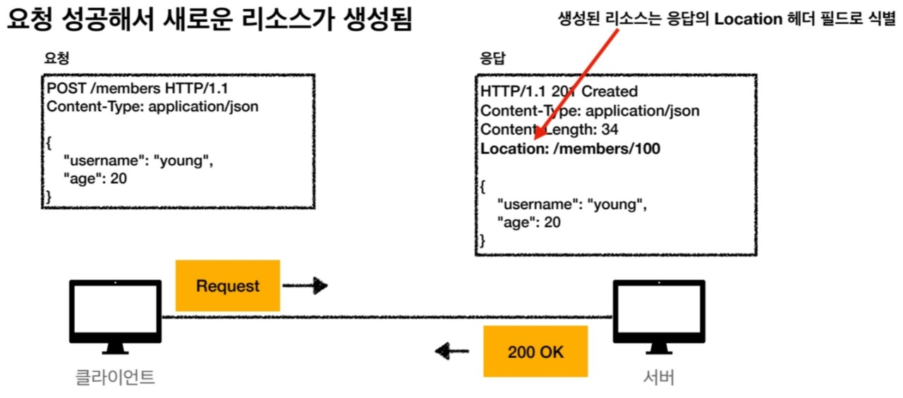
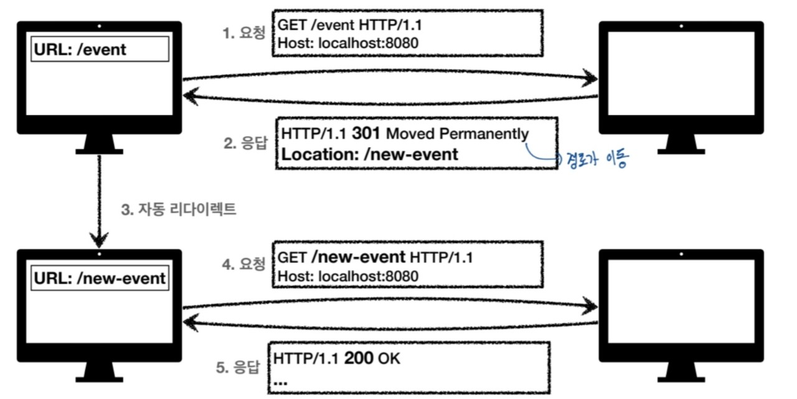

## HTTP 상태코드

### 상태 코드
클라이언트가 보낸 요청의 처리 상태를 응답에서 알려주는 기능

- 100대(Informational) : 요청이 수신되어 처리중(거의 사용하지 않는다.)
- 200대(Successful) : 요청 정상 처리
- 300대(Redirection) : 요청을 완료하려면 추가 행동이 필요함
- 400대(Client Error) : 클라이언트 오류, 잘못된 문법 등으로 서버가 요청을 수행할 수 없음
- 500대(Server Error) : 서버 오류, 서버가 정상 요청을 처리하지 못하는 경우

### 200대(Successful)
클라이언트의 요청을 성공적으로 처리

 

#### 200 OK - 결과를 정상적으로 출력

#### 201 Created - 요청 성공해서 새로운 리소스가 생성됨

클라이언트 측에서 post로 요청을 보냈는데  서버 쪽을 보면 새로운 리소스가 응답에서 Location 헤더 필드로 식별된다.

 

#### 202 Accepted - 요청이 접수되었지만 처리가 완료되지 않음

- 배처 처리에서 사용됨
eg) 요청 접수 후 1시간 뒤에 배치 프로세스가 요청을 처리한다.

#### 204 No Content
#### 서버가 요청을 성공적으로 수행했지만, 응답 페이로드 본문에 보낼 데이터가 없는 경우...

eg) 웹 문서 편집기에서 save 버튼을 눌렀을 경우..
- save 버튼의 결과로 아무 내용이 없어도 되지만 같은 화면을 유지해야 한다.
- 결과 내용이 없어도 204 메시지만으로 성공을 인식할 수 있다.

 
 

#### 300대(Redirection)
#### 요청을 완료하기 위해 유저 에이전트(주로 웹브라우저)의 추가적인 조치 필요

**리다이렉션**
- 웹 브라우저는 300대 응답의 결과에 Location 헤더가 있으면, Location 위치로 자동으로 이동된다.

자동 리다이렉트의 전체적인 흐름을 보면 그림과 같다. 처음에 이벤트 페이지를 요청으로 보냈는데 그 페이지가 새로운 이벤트로 인해 경로가 변경되면 서버측에서 응답을 보낼 때, 301 상태코드로 경로를 new-event로 바꾸게 된다. 이때, 자동으로 new-event 경로로 리다이렉트가 돠고 그 이후로는 정상적으로 동작하여 서버에서 응답으로 200을 보내게 된다.

**리다이렉션 종류**
- **영구 리다이렉션** - 특정 리소스의 URI가 영구적으로 이동
eg) 앞선 그림이 영구 리다이렉션이다.

- **일시 리다이렉션** - 일시적인 변경
    - 주문 완료 후 주문 내역 화면으로 이동
    - PRG : Post/Rediction/Get
- **특수 리다이렉션**
    - 결과 대신 캐시를 사용

#### 영구 리다이렉션 - 301, 308
- 리소스의 URI가 영구적으로 이동하는 경우이다.
- 원래의 URL을 사용하지 않고, 검색 엔진 등에서도 변경을 인지하고 있는 상태이다.
- **301 Moved Permanently**
    - 리다이렉트 시 요청 메서드가 Get으로 변하고, 본문이 제거될 수도 있다.
- **308 Permanent Redirect**
    - 301과 기능은 같다.
    - 리다이렉트 시 요청 메서드와 본문을 유지한다.
    eg) 처음 POST를 보내면 리다이렉트도 POST를 유지한다.

#### 301

- 처음에 POST를 사용해서 그림에 존재하는 메시지를 입력하려고 했는데 경로가 new-event로 이동하게 되면서 메서드가 GET으로 변경된다. 그래서 name=hello&age=20가 제거가 될수도 있고 안 될 수도 있지만 일단 제거가 된다고 쳤을 때, 원래 등록하려고 했던 것을 처음부터 다시 시작해야 한다..

#### 308

- 301과는 다르게 처음의 메서드를 그대로 유지하고 메시지도 그래도 유지하게 해주는 것을 그림으로 알 수 있다.

#### 일시적인 리다이렉션 - 302, 307, 303

- 리소스의 URI가 일시적으로 변경되므로 검색 엔진 등에서 URL을 변경하면 안된다.
- **302 Found**
    - 리다이렉트 시 요청 메서드가 Get으로 변하고, 본문이 제거될 수 있다.

- **307 Temporary Redirect**
    - 302와 기능은 같다.
    - 리다이렉트 시 요청 메서드와 본문 유지한다.(요청 메서드를 변경하면 안된다.)
- **303 See Other**
    - 302와 기능은 같다.
    - 리다이렉트 시 요청 메서드가 Get으로 변경된다.

### PRG : Post/Redirect/Get
### 일시적인 리다이렉션

- POST로 주문 후에 웹브라우저를 새로고침을 하면 새로고침이 다시 요청되면서 중복 주문이 될 수 있다.

- 이 그림은 PRG를 사용하기 전의 그림이다. 보게 되면 결과 화면에서 새로고침을 누르게 되면서 주문완료가 중복처리 되는 것을 볼 수 있다.

 

- PRG 이후 리다이렉트
 

POST로 주문 후에 새로 고침으로 인한 중복 주문을 방지한다. 주문 결과 화면을 GET 메서드로 리다이렉트하면서 새로고침을 해도 화면을 GET으로 조회하게 만든다.
이렇게 하게 되면 사용자의 사용성이 올라가고 서버 입장에서도 오류가 줄어드는 효과를 보여준다.

### 기타 리다이렉션 - 300, 304
- 300 Multiple Choices : 사용하지 않는다.
- 304 NOT Modified : 많이 쓴다.
    - 캐시를 목적으로 사용한다.
    - 클라이언트에게 리소스가 수정되지 않았음을 알려준다. 따라서 클라이언트는 로컬에 저장된 캐시를 재사용한다. 즉, 캐시로 리다이렉트한다.
    - 로컬 캐시를 사용해야 하므로 304 응답은 응답에 메시지 바디를 포함하면 안된다.

### 400대(Client Error)
- 클라이언트의 요청에 잘못된 문법 등으로 서버가 요청을 수행할 수 없을 때 사용된다.
- **오류의 원인이 클라이언트이다.**
- 클라이언트가 이미 잘못된 요청을 해서 데이터를 보내고 있기 때문에 똑같은 재시도가 실패한다.

#### 400 Bad Request
#### 클라이언트가 잘못된 요청을 해서 서버가 요청을 처리할 수 없다.
- 요청 구문, 메시지 등등이 오류가 있으니까 클라이언트는 요청 내용을 다시 검토하고 보내야 한다.
eg) 요청 파라미터가 잘못되거나, API 스펙이 맞지 않을 때

#### 401 Unauthorized
#### 클라이언트가 해당 리소스에 대한 인증이 필요한 경우
- 401 오류 발생시 응답에 WWW-Authenticate 헤더와 함께 인증 방법을 설명한다. 인증이 되지 않을 경우에 발생하는 오류이다.
    - 인증(Authentication) : 본인이 누구인지 확인(로그인 등)
    - 인가(Authorization) : 권한부여(ADMIN 권한처럼 특정 리소스에 접근할 수 있는 권한이다. 인증이 있어야 인가가 있다.)
    - 오류 메시지가 Unauthoized이지만 인증 되지 않는다.

#### 403 Forbidden
#### 서버가 요청을 이해했지만 승인을 거부한 경우이다.

- 인증 자격 증명은 있지만, 접근 권한이 불충분한 경우이다.
eg) 어드민 등급이 아닌 사용자가 로그인은 했지만, 어드민 등급의 리소스에 접근하는 경우이다.

#### 404 Not Found
#### 요청 리소스를 찾을 수 없다.

- 요청 리소스가 서버에 없거나 클라이언트가 권한이 부족한 리소스에 접근할 때 해당 리소스를 숨기고 싶을 때 나는 에러이다.

### 500대(Server Error)
- 서버 문제로 오류가 발생한다.
- 서버에 문제가 있기 때문에 재시도하면 성공할 수도 있다.

#### 500 Internal Server Error
#### 서버 문제로 오류 발생, 애매하면 500 오류이다.

#### 503 Service Unavailable
#### 서비스 이용 불가

- 서버가 일시적인 과부하 또는 예정된 작업으로 잠시 요청을 처리할 수 없는 경우이다.
- Retry-After 헤더 필드로 얼마뒤에 복구되는지 보낼 수도 있다.

