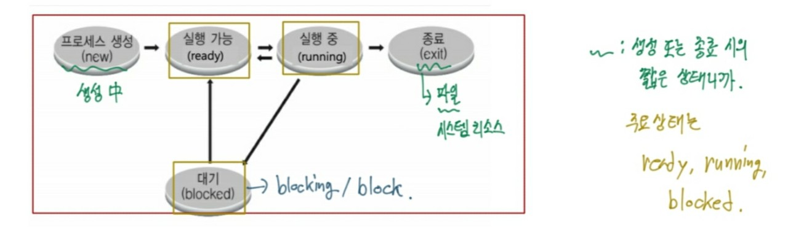
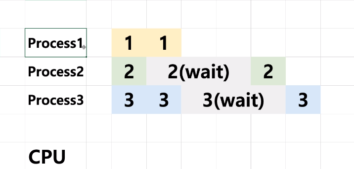

## 프로세스상태와 스케줄링

**멀티 프로그래밍과 wait**
- 멀티 프로그래밍: CPU 활용도를 극대화 하는 스케줄링 알고리즘
- wait: 간단히 저장매체로부터 파일 읽기를 기다리는 시간으로 지정

**프로세스 상태**
- running state: 현재 CPU에서 실행 상태
- ready state: CPU에서 실행 가능 상태
- block state: 특정 이벤트 발생 대기 상태
(특정 이벤트 발생 전까지는 blocked 되어 있는 상태)

**프로세스 상태간 관계**

- 기본 원리

- 단계적으로 이해하기

이렇게 만약에 2를 가장 먼저 CPU에 실행시켰을 떄 ready인 상태는 1과 3 두 개가 되고 나머지 2는 blocked된 상태가 된다. 그렇다면 3개의 프로세스 중에서 뭐가 우선적으로 선택되어지는 것일까?

그럴 때, 사용되어지는 것이 바로 FIFO 자료구조인 queue이다. queue는 처음 들어간 것이 처음 빠져나가는 구조여서 그림과 같이 1번이 먼저 들어갔으므로 1번이 먼저 실행된다.

그 후에 순서대로 2가 들어가서 CPU에 실행이 된다.이 때, 프로세스1에 아직 동작시켜야할 1이 남아있으므로 1을 ready 상태 큐에 넣어주자.

프로세스2의 경우, 한번 실행이 된 후에 wait가 되므로 block 상태에 머물러 있게 된다.

프로세스1은 2개인데 하나는 실행되었고, 나머지 하나는 ready 상태에 있게 된다. 그리고
프로세스2가 block상태에 머물러 있기 때문에 ready 큐에 프로세스3을 넣어준다.

그 후에 ready 큐에 있는 것을 계속 실행하다가 ready 큐에 있는 것들이 모두 실행되었을 것이다. 바로 이때, 3번의 턴동안 wait상태인 process2의 block이 풀리면서 ready상태로 간다.

그리고 process3도 2번이 실행되게 되면서 wait상태에 들어가게 되므로 block상태가 된다.

이렇게 CPU에서 process2가 실행이 되면 ready 큐에 또 실행대기 중인 프로세스가 없다.

이때, 그림을 보면 프로세스1번과 2번은 각각 2번씩 실행이 되었으므로 exit된 상태여서 프로세스3번만 실행이 된다면 프로그램이 종료된다. 하지만 프로세스3번은 3번의 턴동안 wait상태이므로 CPU에서 2번이 실행된 뒤로 2번의 턴동안을 쉬어야 하는 상황이 발생한다. 이 상태를 CPU idle상태라고 한다.

그렇게 idle상태 후에 3번 프로세스가 실행이 된다.

이 마지막 그림이 모든 프로세스가 실행이 된 프로세스의 상태가 되는 것이다.