## 선점형과 비선점형 스케줄러
- 선점형 스케줄러(Preemptive Schduling)
하나의 프로세스가 다른 프로세스 대신에 CPU를 차지할 수 있다.

- 비선점형 스케줄러(Non-preemptive Scheduling)
하나의 프로세스가 끝나지 않으면 다른 프로세스는 CPU를 사용할 수 없다.

## 선점형과 비선점형 스케줄러의 차이
- 비선점: 프로세스가 자발적으로 wait 상태로 들어가거나, 실행이 끝났을 때만 다른 프로세스로 교체 가능

- 선점형: 프로세스 running 중에 스케줄러가 이를 중단시키고, 다른 프로세스로 교체 가능

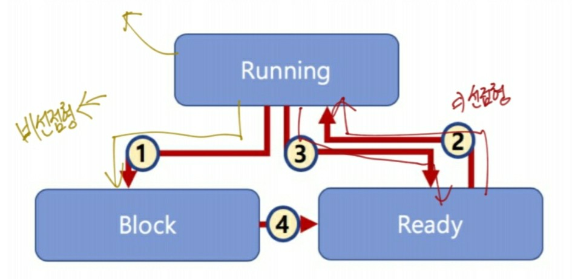

## 비선점형 스케줄러 작동 방식

준비상태에 큐에 1번이 가장 먼저 들어가서 1번이 가장 먼저 실행된다.

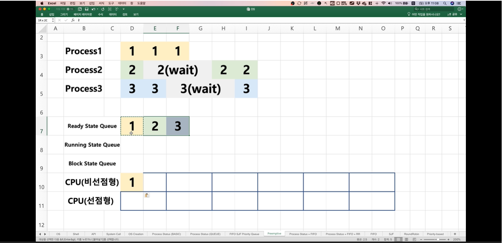

비선점형이기 때문에 wait이거나 실행이 끝나지 않으면 다른 프로세스로 교체되지 않는다. 따라서 프로세스1이 한번에 실행된다.

프로세스1이 실행이 다 되었으면 그 다음에 준비상태 큐에 프로세스2가 들어가기 때문에 프로세스2가 실행된다. 하지만 프로세스2는 한턴 실행되고 wait 상태로 빠지게 된다.

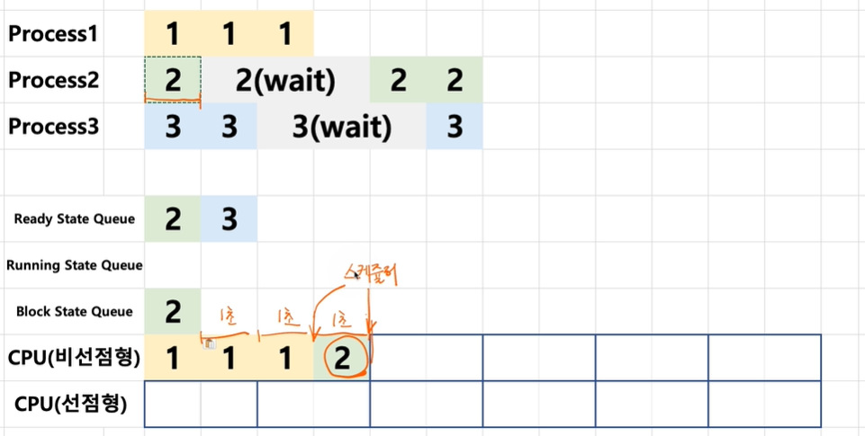

프로세스2가 wait 상태가 되었기 때문에 프로세스3번이 CPU에서 실행이 되고, 프로세스3은 2턴 실행되고 wait 상태로 빠지는데 이때 준비상태에 있는 프로세스가 없기 때문에 CPU에서는 한턴이 비게 된다.

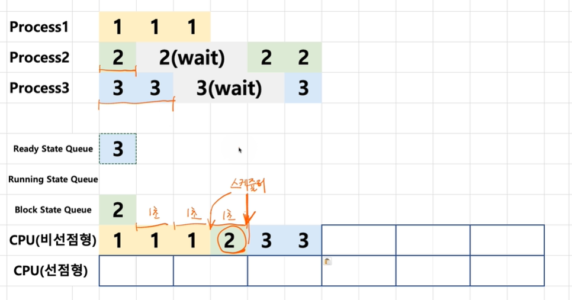

그 후에 3턴의 wait에서 돌아온 프로세스 2번이 실행되게 되고 프로세스2는 종료된다.

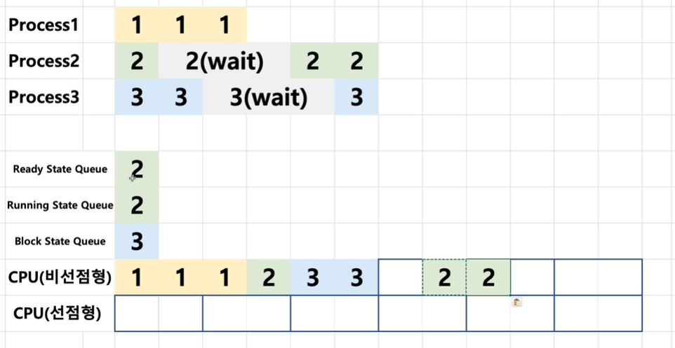

그리고 3턴의 wait을 마친 프로세스3이 CPU에서 실행되고 모든 프로세스가 종료된다.

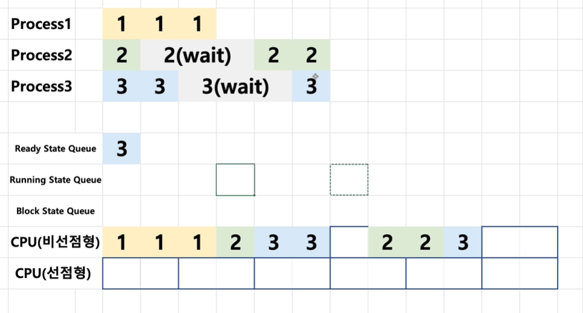

## 선점형 스케줄러 작동 방식

파란색 진한줄을 기준으로 프로세스를 진행되는 프로세스를 바꾼다고 생각을 해보자. 그럼 프로세스1은 2턴 실행되고 다른 프로세스로 넘어간다.

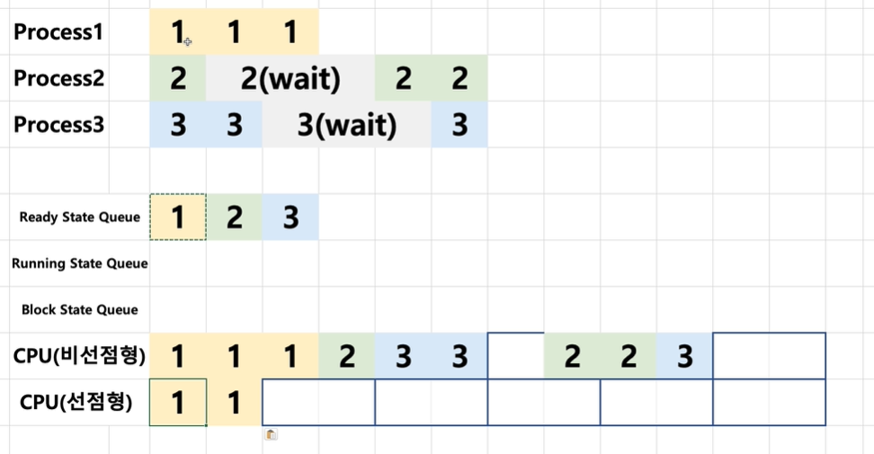

이 후에 프로세스2가 실행되는데 프로세스2는 1턴만 실행되고 wait상태로 들어가게 된다. 그래서 CPU에서는 1턴 시행되고 block 상태가 된다.

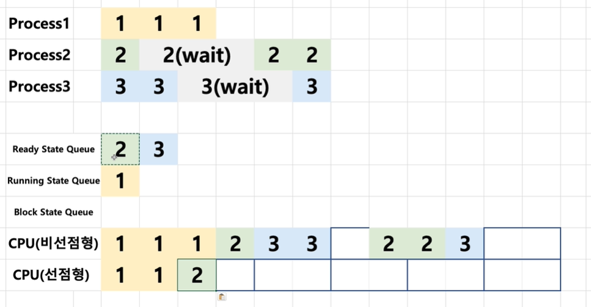

그 후에 준비상태에 있던 프로세스3번이 바로 실행되게 된다. 

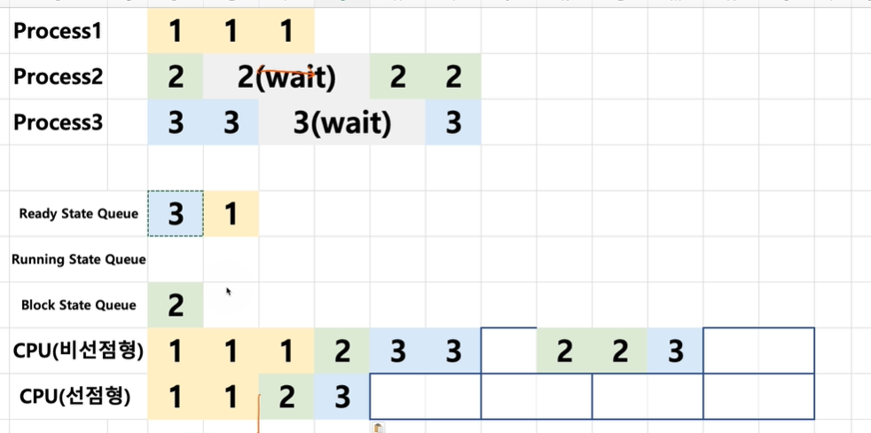

그 후 굵은 파란색 줄에 도달해서 1턴이 남아있던 프로세스1번이 바로 CPU에서 실행되게 된다.

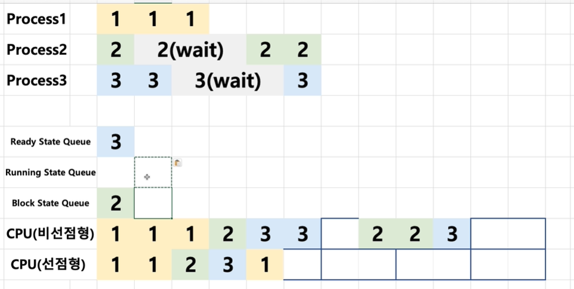

그 다음에 준비 상태에 있던 프로세스3이 실행되게 되고 wait 상태로 가게 된다.

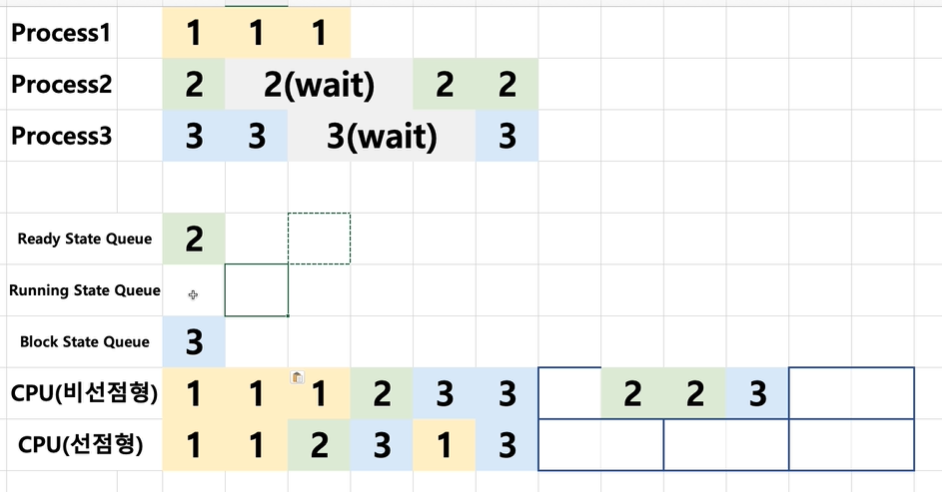

여기서는 wait 상태에 있던 프로세스2가 준비상태가 되면서 CPU에서 실행이 되게 되고 프로세스2가 종료된다.

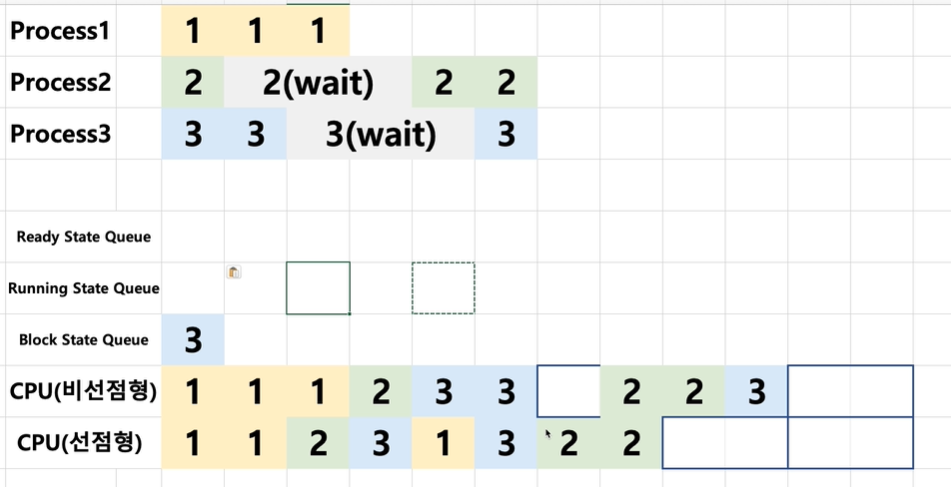

그 후에 프로세스3은 3턴의 wait를 거치게 때문에 한 턴의 idle 시간이 생기게 되고 wait에서 돌아온 프로세스3을 실행시키고 모든 프로세스가 종료된다.

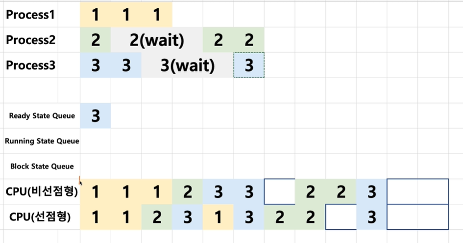

## 스케줄러 구분
- FIFO, SJF, Priority-based
-> 어떤 프로세스를 먼저 실행시킬지에 대한 알고리즘(비선점형 스케줄러)

- RoundRobin
-> 시분할 시스템을 위한 기본 알고리즘(선점형 스케줄러)