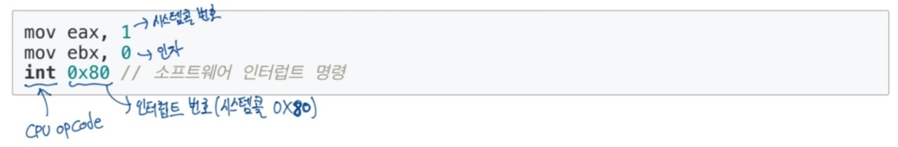
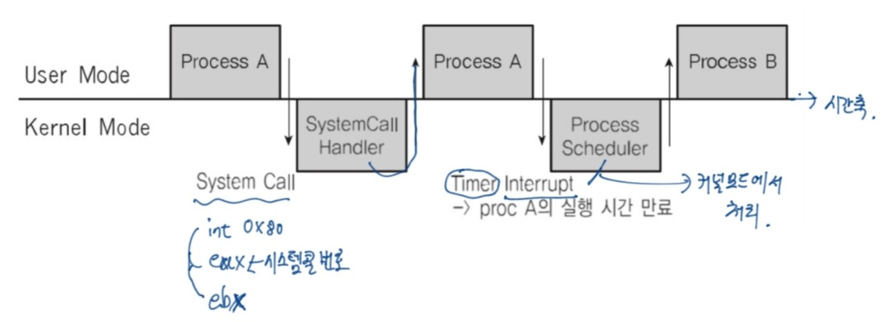
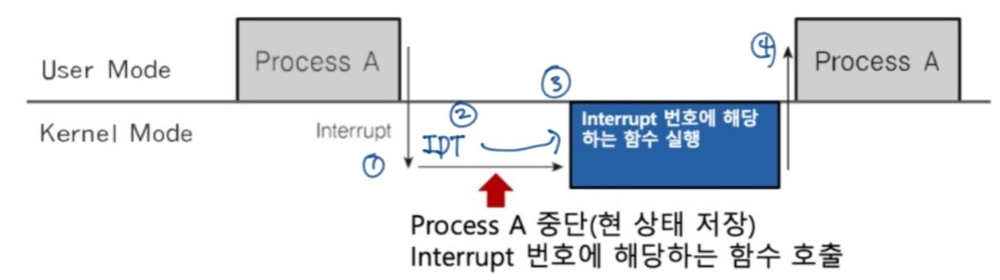

## 인터럽트

CPU가 프로그램을 실행하고 있을 때, 입출력 하드웨어 등의 장치나 또는 예외상황이 발생하여 처리가 필요할 경우에 CPU에 알려서 처리하는 기술

### 인터럽트가 필요한 이유

- **선점형 스케줄러 구현**
프로세스 실행 중에 스케줄러가 이를 중단시키고, 다른 프로세스로 교체하기 위해 현재 프로세스 실행을 중단시킨다. 
그렇게 하려면 스케줄러 코드가 실행되어서 현재의 프로세스 실행을 중단시켜야 한다.
 

- **IO Device와의 커뮤니케이션**
저장매체에서 데이터 처리 완료시, 처리가 끝났다는 것을 알려줘야 한다.(block state -> ready state)
 

- **예외 상황 핸들링** 
CPU가 프로그램을 실행하고 있을 때, 압출력 하드웨어 등의 장치나 또는 예외 상황이 발생할 경우에 CPU가 처리를 할 수 있도록 CPU에 알려줘야 한다.

### 인터럽트 처리 예
- CPU가 프로그램을 실행할 때, 
    - 입출력 하드웨어 등의 장치 이슈 발생
        - 파일 처리가 끝났다는 것을 운영체제에 알려주기 
        - 운영체제는 해당 프로세스를 block state에서 실행 대기 상태로 프로세스 상태 변경하기
 

    - 예외의 상황 발생
        - 0으로 나누는 계산이 발생하면, 예외 발생을 운영체제에 알려주기
        - 운영체제가 해당 프로세스 실행 중지/에러 표시

### 주요 인털럽트
1. 계산하는 코드에서 0으로 나누는 코드 실행시
 

2. 타이머 인터럽트
    - 선점형 스케줄려를 위해 필요하다.
    eg) 운영체제가 1/10초마다 프로세스 변경한다면 이 변경하는 것은 외부 이벤트여서 인터럽트가 실행된다.
 

3. 입출력 인터럽트
    - 입출력 장치들의 상태 변경 상황을 알려줘야 함
 

### 인터럽트 종류
- 내부 인터럽트(소프트웨어 인터럽트)
    - 주로 프로그램 내부에서 잘못된 명령 또는 잘못된 데이터 사용시 발생
        - 0으로 나눴을 때
        - 사용자 모드에서 허용되지 않은 명령 또는 공간 접근 시
        - 계산 결과가 Overflow/ Underflow날 때
        eg) int라는 변수 타입으로 표현할 수 있는 숫자를 넘어버림(Overflow)
- 외부 인터럽트(하드웨어 인터럽트)
    - 하드웨어에서 발생하는 이벤트
        - 전원이상
        - 기계 문제
        - 키보드 등 IO 관련 이벤트
        - Timer 이벤트

### 시스템 콜 인터럽트
- 시스템콜 실행을 위해서는 강제로 코드에 인터럽트 명령을 넣어, CPU에게 실행시켜야 한다.
- 시스템콜 실제 코드(C언어)
    - eax 레지스터에 시스템콜 번호를 넣고
    - ebx 레지스터에는 시스템 콜에 해당하는 인자값을 넣고
    - 소프트웨어 인터럽트 명을 호출하면서 0X80값을 넘겨줌

### 인터럽트와 시스템 콜

### 사용자/커널 모드와 프로세스, 인터럽트

프로세스가 실행될 때, 한번에 쭉 실행되는 것이 아니라 사용자모드와 커널모드를 왔다갔다 하면서 실행이 된다.

### 인터럽트와 IDT
- 인터럽트는 미리 정의되어 각각 번호와 실행 코드를 가리키는 주소가 기록되어 있다.

**컴퓨터 부팅시에 운영체제가 운영체제 내부 코드를 IDT(Interrupt Descriptor Table)에 기록한다.**

    * IDT 형태 -> 이벤트 번호: 실행코드의 주소(함수)

### 인터럽트와 프로세스
 

그림을 보면 프로세스A가 사용자 모드에서 인터럽트가 발생하게 되고 프로세스가 실행이 중단되는데 이 때 커널모드로 들어가게 된다. 그 후에 interrupt 번호에 해당하는 인터럽트 처리 함수를 실행하게 되고 다시 사용자모드로 돌아와서 재실행이 된다.

### 인터럽트와 스케줄러
- 수시로 타이머 인터럽트 발생
    - 운영체제가 타이머 인터럽트 발생 횟수를 기억해서 5번 타이머 인터럽트 발생하면, 현재 프로세스를 다른 프로세스로 바꿔준다.
