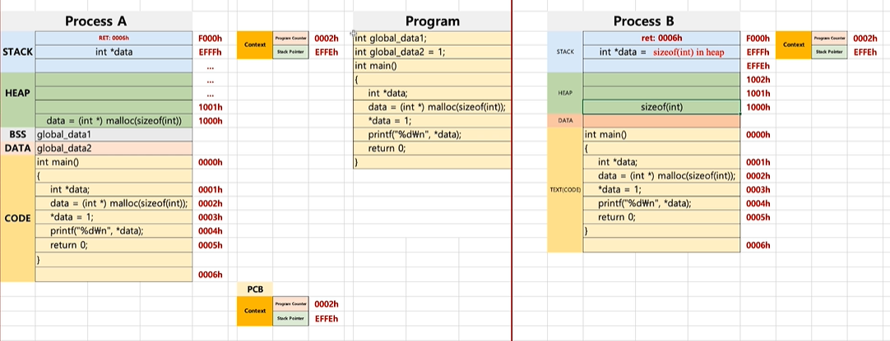

## 프로세스와 컨텍스트 스위칭
#### 프로세스 구조
- 프로세스의 구성 형태
    - text(code): 코드
    - data: 변수/초기화된 데이터
    - stack: 임시 데이터(함수 호출, 전역 변수 등)
    - heap: 코드에서 동적으로 만들어지는 데이터

이 그림을 통해 파이썬 코드가 실행될 때 프로세스는 어떻게 동작하는지를 알아볼 것이다. 우선 코드가 컴파일 되는데 이는 binary 형태인 기계어로 변환되는 것을 의미한다.
먼저 코드에는 컴파일된 소스 코드가 저장된다. 그 후, c=0...변수 선언의 경우에는 '데이터'라는 공간에 특정공간에 넣어준다.
함수가 실행되는 부분인 c = func(1,2)에서 함수가 실행된 후에 return Address값을 스택에 저장하고 그 인자도 스택에 저장한다. 그 후, 다 처리하면 두번째, 첫번쨰 인자 순으로 없애고 Retrun Address를 보고 print(c) 코드로 가서 실행하게 된다.
Heap이라는 공간은 c언어에서는 malloc()으로 처리하는데 이는 동적 메모리 공간을 생성한다. DATA, Code 공간은 정적 공간이고, Stack은 함수를 위한 공간이여서 추가하기 애매한 상황일 때 Heap이라는 동적 공간을 사용한다.

그림을 보면 별도의 선언된 변수가 없기 때문에 data에 아무것도 없다. 주소가 0003h인 부분에서 main이 실행되는데 return address는 0006h...즉, 메인 밖에 존재하는 부분이 stack에 쌓이게 된다. 그 후에 argc, argv 순으로 쌓이게 된다. 그리고 실질적으로 실행되는 return값의 리턴 주소인 0005h가 stack에 쌓이고 data=1, temp = 1 순으로 stack에 쌓인다.
실행이 끝나면 맨 끝부터 없애고 그러다가 return address를 만나면 PC의 값을 0005h로 바꾼 후에 스택에서 return address를 없앤다. 그렇게 메인 함수가 끝나고 argv부터 또 없앤다. 그러다가 return address:0006h가 나오면 PC 값을 0006h로 바꾼 후 스택에서 없애고 끝이 난다.

#### 프로세스와 컴퓨터 구조
- 프로세스
    - text
    - data
    - stack
    - heap
- 컴퓨터 구조
    - PC(Program Counter)
    : 코드를 한 줄 한 줄 가리키는 주소 레지스터
    - SP(Stack Pointer)
    : 함수가 실행될 때, 스택에 최상단 주소를 가리키는 레지스터

프로세스만 보는 것과 달리 PC, SP, EBP, EAX가 눈에 띈다는 것을 볼 수 있다. 프로세스를 실행할 때 문제가 생기는 경우, 어떤 함수를 어느 시점에서 실행하다가 문제가 생긴지 알기가 어렵다. 따라서 EBP 레지스터로 함수가 호출된 최상단 SP를 가져오기 떄문에 어느 부분에서 문제가 있었는지 확인이 가능하다. 이것이 EBP를 쓰는 이유이다.
프로그램 실행시, 코드가 프로세스 코드 영역에 올려진다. 코드가 실행되면 PC는 처음부분인 0000h를 가리키게 된다. SP는 스택에 아무것도 없어서 1000h를 가리킨다. c=0은 변수 선언 부분이기 때문에 데이터 영역으로 들어간다. PC에 0001h, 0002h를 넣어도 함수 선언 부분이기 때문에 아무런 반응을 하지 않는다.

PC가 0003h가 되면, EBP의 값이 stack에 올라가게 된다. 그 후, Return Address:0004h(함수가 끝났을 떄, 돌아갈 리턴 주소)가 stack에 들어간다. 그 밑으로는 함수 인자값 a와 b가 스택에 들어간다.

인자까지 들어가면 SP는 stack의 끝부분 주소인 0FFCh를 가리키게 된다. a+b를 하면 리턴값은 EAX에 저장이 된다.

stack의 값들이 다 사라지게 되면 PC는 0004h를 가리키게 된다. 

그래서 PC가 c=func() 코드를 실행하게 되고 결과로 Data=3이 된다. 이렇게 모든 실행이 끝나면 PC는 마지막 부분의 주소인 0005h를 가리키고 끝이 난다.

#### 프로세스구조와 힙

stack 영역에 return address: 0006h가 들어가게 된다. 그리고 첫부분인 int *data가 stakc에 들어가게 되고 다음부분인 malloc함수는 동적 메모리 공간이므로 Heap으로 들어가게 된다.

이때, heap으로 들어가는 것은 값이 아니라 공간이 들어가는 것이기 때문에 그림과 같이 값을 기준으로 봤을 때, heap에 0이 들어가고 stack에서는 data가 0이 들어간 heap 주소 1000h를 가리키게 된다. 그 후에 다음 줄에서 *data에 1이라는 값을 넣어줬기 때문에 heap에 0 대신에 1로 바뀌게 된다.

#### 프로세스구조와 데이터
- Data 영역은 BSS(초기화되지 않은 전역변수)와 Data(초기값이 있는 전역변수)로 분리

그림에서 코드를 보게 되면 int global_data1;은 초기값이 없어서 BSS로 들어가게 되고, int global_data2=1;은 초기값이 있기 때문에 Data에 들어가게 된다. 
메인 함수 안에 있는 int *data는 지역변수이기 때문에 stack에 들어가게 된다.

#### 프로세스와 컨텍스트 스위칭

- Context Switching(문맥 교환)
    - CPU에 실행할 프로세스를 교체하는 기술
1. 실행 중지할 프로세스 정보를 해당 프로세스의 PCB에 업데이트해서 메인 메모리에 저장한다.
2. 다음 실행할 프로세스 정보를 메인 메모리에 있는 해당 **PCB 정보를 CPU에 넣고 실행한다.**
    * 디스패치(dispatch): ready 상태의 프로세스를 running 상태로 바꾸는 것

- 조금이라도 컨텍스트 스위칭 시간을 짧게 하기 위해서는 어셈블리어로 컨텍스트 스위칭 코드를 작성하면 된다.
(하지만 어셈블리어는 다른 CPU 아키텍쳐가 등장할 때마다 매번 똑같은 프로그램을 작성해야 하는 일종의 프로그램의 이식성이 떨어진다는 단점이 있다.)

#### 컨텍스트 스위칭의 원리

프로세스A를 보면 int global_data1;은 초기화가 되지 않아서 BSS에 들어가고, int global_data2=1;는 초기화가 되어서 Data에 들어가게 된다.
본격적으로 프로그램이 시작되면 0000h 주소가 PC에 들어가서 실행이 된다. SP는 F000h를 가리키고 stack에는 return address를 0006h를 넣는다. 

그 다음 코드가 실행될 때는 PC에 0001h 주소가 들어가고 이 때, 지역변수인 int *data는 스택에 들어가게 된다.

PC가 0002h를 가리킬 때 스케줄러에서 프로세스A를 중단시키고 프로세스 B로 전환하게 되면 프로세스A에서는 PC, SP값을 PCB라는 별도 저장 메모리에 저장한다.
따라서 아래의 그림과 같이 된다.

프로세스 B가 실행되면 처음에는 PC가 0000h를 가리키고 0001h가 실행될 때 리턴 주소가 0006h가 스택에 들어가게 된다. 또한 int *data가 스택에 들어가게 되고 이후 stack은 최상단의 주소인 EEFEh를 가리키게 된다.

0002h 부분의 코드가 실행되면 PC가 0002h를 가리키게 되고 malloc이라는 명령어가 동적 메모리에 할당되므로 heap으로 들어가게 된다. 따라서 그림과 같이 sizeof(int)..즉, 공간이 들어온다.

0003h를 PC가 가리키면 heap에 원래 있던 공간에 1이라는 값이 들어가게 되고 stack에서의 int *data는 heap의 공간을 가리키게 된다.

0004h 부분에서 스케줄러가 프로세스 A로 전환하면서 컨텍스트 스위칭이 다시 이루어진다. 그러면 프로세스 B는 PCB 공간에 PC와 SP 정보를 저장한다.

그러면 A에서는 프로세스 A의 PCB를 확인하고 실제 CPU 레지스터에 PCB값을 덮어씌운다. 그 후에 바로 실행을 시킨다. 따라서 프로세스 A에서는 heap에 sizeof(int)라는 공간이 들어가고 그 공간을 스택의 int *data가 가리킨다.

그 다음으로 0003h로 가게 되면 heap에 있던 공간에 1이라는 값이 들어간다. stack에서는 주소는 같기 때문에 변하는 것이 없다.

0004h는 그냥 출력해주는 코드이다.
이후 0005h로 갔을 때, 스케줄러가 프로세스 B로 갔다고 해보자. 그럼 프로세스A에서는 CPU의 PC와 SP를 PCB에 업데이트 시키고, 프로세스 B의 PCB에서 CPU에 업데이트 시킨다. 그리고 0004h를 실행해서 1을 출력시키는 코드를 실행시키고 0005h에 와서는 프로그램을 끝내고 0006h에 접근하게 되면 stack에 있던 내용들이 사라진다.

대강의 프로세스는 이렇게 돌아간다는 것을 알 수 있다.

#### PCB
- 프로세스의 상태를 저장하는 데이터구조(운영체제에서 관리)
- PC, SP는 어디에 저장할까?
**Process Control Block(PCB)에 저장**
1. Process ID
2. Register 값(PC, SP 등)
3. Scheduling Info(Process State)
4. Memory Info(메모리 사이즈 limit)