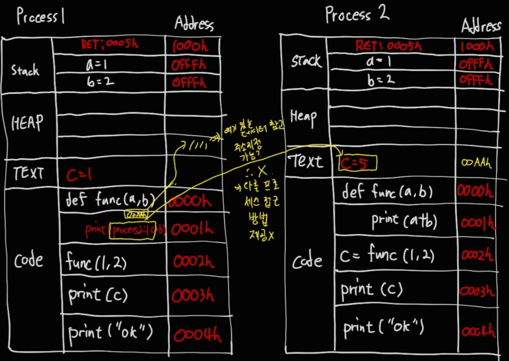
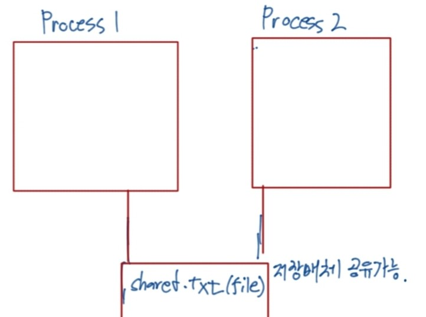

## 프로세스간 커뮤니케이션(InterProcess Communication)

#### 기본원리 
프로세스의 공간은 완전히 분리되어 있어서  다른 프로세스의 공간을 접근할 수가 없다. 사용자 모드에서는 커널 공간을 접근할 수가 없다. 
하지만 커널 공간은 실제 물리 메모리에 들어갈 떄, 동일한 공간을 공유할 수 있으므로 커널모드의 공간을 통해서 프로세스 간 커뮤니케이션을 할 수 있다.

#### 그렇다면 프로세스 간 커뮤니케이션을 해야 된다면 어떻게 할까?
- 프로세스간 통신 방법인 **IPC**를 제공한다.

#### 프로세스간 통신이 왜 필요한가?
- 성능을 높이기 위해 여러 프로세스를 만들어서 동시에 실행할 필요가 있다.
- 이 때, 프로세스간 상태 확인 및 데이터 송수신이 필요하다.

**fork()함수**를 통해서 동일한 데이터를 가진 프로세스를 생성할 수 있다. fork()를 가지고 있는 프로세스를 부모 프로세스라고 하고, 새롭게 만들어진 프로세스를 자식 프로세스라고 한다.
=> 각 프로세스를 각 코어에 동시에 실행하는 병렬 처리가 가능해진다.
 

**여러 프로세스 동시 실행하기 예시**

1~10000까지 더하기
=> 정상적으로 CPU core가 한개라고 하면 10초가 걸림

- fork()함수로 10개 프로세스를 만들어서, 각각 1~1000, 1001~2000, ... , 10000 더하기
- 각각 더한 값을 모두 합하면 1초만에 결과 생성할 수 있음
    **이때, 각 프로세스를 더한 값을 수집해야 되니까 프로세스간 통신이 필요!!**
 

**웹서버 예시**
- 사용자가 요청을 보내면 HTML 파일을 클라이언트 측에 제공해야 한다.
- 새로운 사용자의 요청이 올 때 프로세스 하나로 처리하기에는 응답시간이 너무 늦어질 수 있다.
- 따라서 fork()함수로 새로운 프로세스를 만들고, 각 사용자 요청에 즉시 대응

#### 프로세스간 커뮤니케이션을 해야 한다면 어떻게 해야 하는가??

여러가지 방법이 있는데 그중 하나가 **file 사용**

간단히 다른 프로세스에 전달할 내용을 파일에 쓰고, 다른 프로세스가 해당 파일을 읽는 구조이다.

하지만... file을 사용하면 
1. 실시간으로 직접 원하는 프로세스에 데이터 전달이 어렵다.
2. 저장 매체를 읽으려면 시간이 걸린다.

#### 다양한 IPC기법

1. file 사용 => 실시간 처리 불가능, 시간이 걸림
2. Message Queue
3. Shared Memory
4. Pipe
5. Signal
6. Semaphore
7. Socket
...

2번부터 7번까지는 모두 커널 공간을 이용한다. 
커널공간은 물리 메모리에 있고, 저장매체를 왔다갔다하는 것보다 시간이 적게 들고, 프로세스 공유 또한 할 수 있다는 장점이 있다.