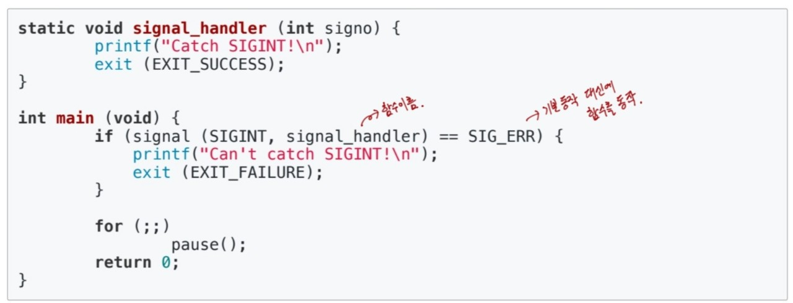

## 프로세스간 커뮤니케이션(InterProcess Communication)

#### 기본원리 
프로세스의 공간은 완전히 분리되어 있어서  다른 프로세스의 공간을 접근할 수가 없다. 사용자 모드에서는 커널 공간을 접근할 수가 없다. 
하지만 커널 공간은 실제 물리 메모리에 들어갈 떄, 동일한 공간을 공유할 수 있으므로 커널모드의 공간을 통해서 프로세스 간 커뮤니케이션을 할 수 있다.

#### 그렇다면 프로세스 간 커뮤니케이션을 해야 된다면 어떻게 할까?
- 프로세스간 통신 방법인 **IPC**를 제공한다.

#### 프로세스간 통신이 왜 필요한가?
- 성능을 높이기 위해 여러 프로세스를 만들어서 동시에 실행할 필요가 있다.
- 이 때, 프로세스간 상태 확인 및 데이터 송수신이 필요하다.

**fork()함수**를 통해서 동일한 데이터를 가진 프로세스를 생성할 수 있다. fork()를 가지고 있는 프로세스를 부모 프로세스라고 하고, 새롭게 만들어진 프로세스를 자식 프로세스라고 한다.
=> 각 프로세스를 각 코어에 동시에 실행하는 병렬 처리가 가능해진다.
 

**여러 프로세스 동시 실행하기 예시**

1~10000까지 더하기
=> 정상적으로 CPU core가 한개라고 하면 10초가 걸림

- fork()함수로 10개 프로세스를 만들어서, 각각 1~1000, 1001~2000, ... , 10000 더하기
- 각각 더한 값을 모두 합하면 1초만에 결과 생성할 수 있음
    **이때, 각 프로세스를 더한 값을 수집해야 되니까 프로세스간 통신이 필요!!**
 

**웹서버 예시**
- 사용자가 요청을 보내면 HTML 파일을 클라이언트 측에 제공해야 한다.
- 새로운 사용자의 요청이 올 때 프로세스 하나로 처리하기에는 응답시간이 너무 늦어질 수 있다.
- 따라서 fork()함수로 새로운 프로세스를 만들고, 각 사용자 요청에 즉시 대응

#### 프로세스간 커뮤니케이션을 해야 한다면 어떻게 해야 하는가??

여러가지 방법이 있는데 그중 하나가 **file 사용**

간단히 다른 프로세스에 전달할 내용을 파일에 쓰고, 다른 프로세스가 해당 파일을 읽는 구조이다.

하지만... file을 사용하면 
1. 실시간으로 직접 원하는 프로세스에 데이터 전달이 어렵다.
2. 저장 매체를 읽으려면 시간이 걸린다.

#### 다양한 IPC기법

1. file 사용 => 실시간 처리 불가능, 시간이 걸림
2. Message Queue
3. Shared Memory
4. Pipe
5. Signal
6. Semaphore
7. Socket
...

2번부터 7번까지는 모두 커널 공간을 이용한다. 
커널공간은 물리 메모리에 있고, 저장매체를 왔다갔다하는 것보다 시간이 적게 들고, 프로세스 공유 또한 할 수 있다는 장점이 있다.

#### 다양한 IPC 기법 개념
**파이프**
- 기본 파이프는 단방향 통신이다.
- fork()로 자식 프로세스를 만들었을 때, 부모와 자식 간의 통신을 한다.

이 때, 부모 프로세스는 1번 공간을 사용하고 데이터를 쓴다. 그리고 fork된 자식 프로세스에서는 0번 공간을 사용하고 데이터를 읽어온다. 부모 프로세스에서 읽는 것이 불가능하고 반대로 자식 프로세스에서 데이터를 쓰는 것이 불가능하다. 

코드로 보게 되면 부모 프로세스는 pid에 실제 프로세스 아이디가 들어가고 fd[1]의 공간에서 데이터를 쓰는 것을 볼 수 있다. 자식 프로세스에는 pid가 0이 들어가고 fd[0]으로 읽어들이는 것을 알 수 있다.
 
**메시지 큐(Message Queue)**
- 기본은 FIFO 정책으로 데이터를 전송한다.

메시지 큐에서는 프로세스A에서 프로세스B로 데이터를 전달할 때, key값을 명확히 알고 있으면 msgrcv로 이전의 데이터를 전달할 수 있다. 그리고 이 코드에는 나오지 않았지만 데이터를 전달받은 프로세스B에서 다시 msgsnd로 프로세스A에 데이터를 전달하게 되면 양방향 통신도 가능하게 된다.
 
**파이프와 메시지 큐**
- message queue는 부모/자식이 아니라, 어느 프로세스 간에라도 데이터 송수신이 가능하다.
- 먼저 넣은 데이터가 먼저 읽혀진다는 특징이 있다.
 

**IPC기법과 커널모드**

- pipe, message queue는 모두 kernel 공간의 메모리를 사용한다.

그림으로 보면 이런식으로 kernel 공간에 있다는 것을 알 수 있다.

 

**공유 메모리(Shared Memory)**

- 노골적으로 kernel 공간에 메모리 공간을 만들고, 해당 공간을 변수처럼 쓰는 방식이다.
- Message Queue처럼 FIFO 방식이 아니라, 해당 메모리 주소를 마치 변수처럼 접근한다.
- 공유메모리 key를 가지고, 여러 프로세스가 접근 가능하다.

**공유메모리 코드**

공유메모리 주소값을 가지고 여러 프로세스가 공유된 공간을 쓰거나 읽거나 할 수가 있다.
 

**시그널(signal)**
- 커널 또는 프로세스에서 다른 프로세스에 **어떤 이벤트가 발생**되었는지 알려주는 기법이다.
- 프로세스 관련 코드에 관련 시그널 핸들러를 등록해서, 해당 시그널 처리를 실행한다.
    - 시그널 무시
    - 시그널 블록
    - 등록된 시그널 핸들러로 특정 동작 수행
    - 등록된 시그널 핸들러가 없으면 커널에서 기본 동작 수행

**시그널 관련 코드 예제**
- 시그널 핸들러 등록 및 핸들러 구현

시그널 핸들러를 구현할 때, 기본 동작 대신에 함수를 실행시켜서 동작할 수 있다.

- 시그널 핸들러 무시

SIG_IGN은 기본 동작도 아니고 함수도 아니고 그냥 무시하라는 표현이다.

**시그널과 프로세스**
- PCB에 해당하는 프로세스가 블록 또는 처리해야 하는 시그널 관련 정보를 관리한다.

프로세스가 실행되면서 계속해서 사용자 모드와 커널 모드를 왔다갔다 하는데 전환이 될 때 시그널 처리가 계속해서 이루어진다.

 

**소켓(socket)**

- 소켓은 네트워크 통신을 위한 기술이다.
- 기본적으로 클라이언트와 서버 등과 같이 두 개의 다른 컴퓨터 간의 네트워크 기반 통신을 위한 기술이다.

**소켓과 IPC**
- 소켓을 하나의 컴퓨터 안에서, 두 개의 프로세스 간에 통신 기법으로 사용 가능하다.

그림을 보게 되면 커널 부분 끝에서 네트워크 기기로 다른 프로세스와 연결을 하면서 서로 통신이 된다는 것을 알 수 있다.

