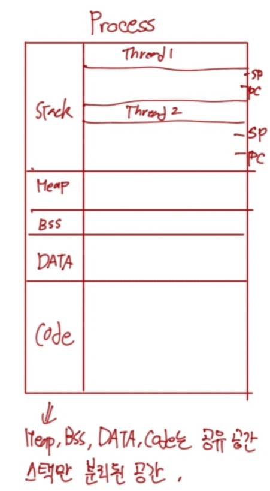
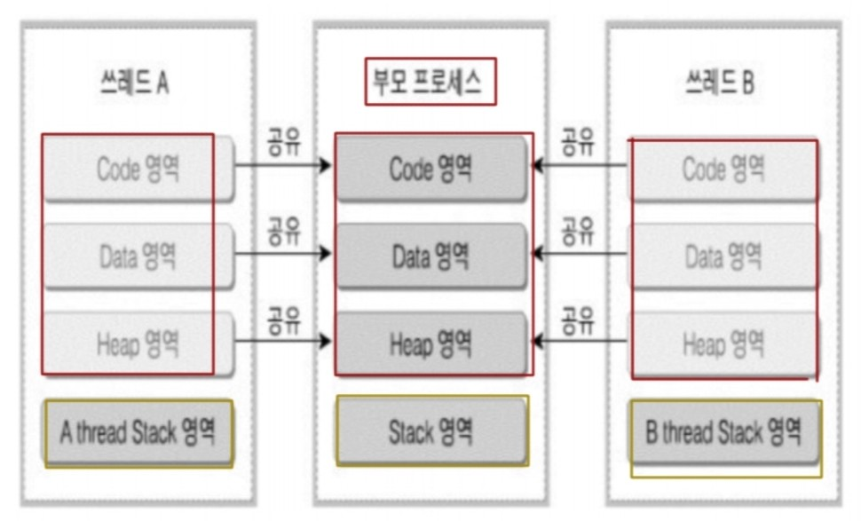
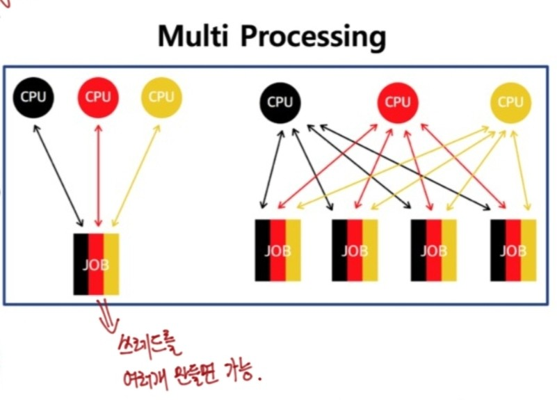
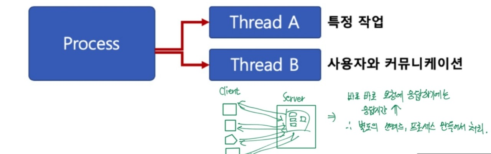
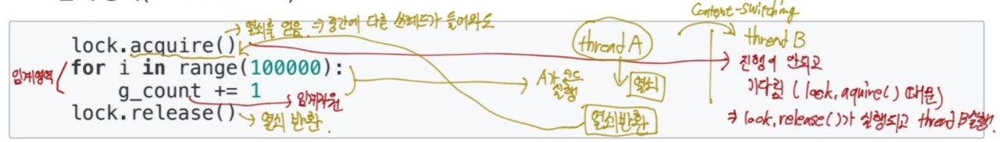
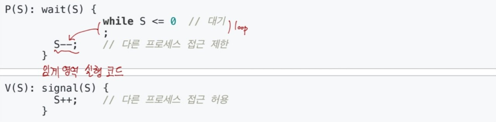
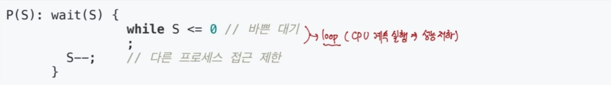
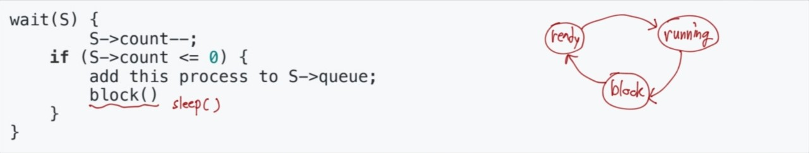
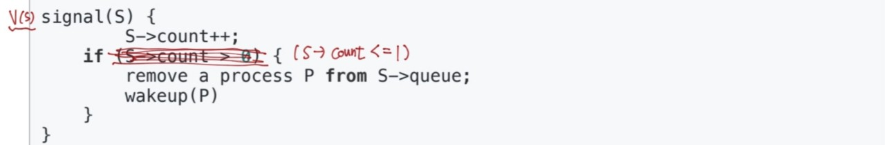

## Thread
- 하나의 프로세스에 여러 개의 스레드 생성이 가능하다.
- 스레드들은 동시에 실행도 가능하다.
- 프로세스 안에 있으니까 프로세스의 데이터를 모두 접근 가능하다.(IPC기법을 사용하지 않아도 된다.)

**프로세스 간에는 각 프로세스의 데이터 접근이 불가해서 IPC 통신기법을 사용했어야 했다...**

#### Thread의 구조
- Heap, BSS, Data, Code부분은 공유되는 공간이고, 스택영역에서 자리를 차지하고 있는 쓰레드는 분리된 공간을 가진다.

이때, 중요한 점은 하나의 프로세스 안에 생성된 쓰레드끼리만 공유가 가능하다는 점이다.

#### Multi Thread
- 소프트웨어 병행 작업 처리를 위해 Multi Thread를 사용한다.

그림은 보면 쓰레드 A와 B의  code, data, heap 영역은 부모 프로세스에서 공유가 된다. 하지만 부모 프로세스의 스택 영역에서 각각의 thread stack 영역을 따로 가진다.

#### 멀티 프로세싱과 Thread
- 최근 CPU는 멀티 코어를 가지므로, Thread를 여러 개 만들어서 멀티 코어의 활용도를 높인다.

하나의 프로세스에 여러 CPU를 병렬 실행 시키면 실행속도 올라간다. 또한 여러 프로세스를 나누어서 여러 CPU 를 실행시켜서 실행속도를 올릴 수 있다. 

이러한 기술이 사용될 떄 멀티 쓰레드가 활용된다.

#### Thread 장점

1. 사용자에 대한 응답성 향상

그림에서 보면 알겠지만 웹에서 서버와 클라이언트를 처리할 때, 응답성을 향상할 수 있다.

2. 자원 공유에 효율성

- IPC 기법과 같이 프로세스 간 자원 공유를 위해 번거로운 작업이 필요없다
- 프로세스 안에 있으므로, 프로세스의 데이터를 모두 접근 가능하다.

3. 작업이 분리되어 코드가 간결
- 사실 여러개의 프로세스를 만드는 것보다 간결해질 수는 있지만 작성하기 나름이다.

#### Thread 단점
- 쓰레드 중 한 쓰레드만 있어도, 전체 프로세스가 영향을 받는다

- 쓰레드를 많이 생성하면, Context Swiching이 많이 일어나 성능 저하가 일어난다.

eg) 리눅스 OS에서 Thread를 Process와 같이 다룸
- 쓰레드를 많이 생성하면, 모든 쓰레드를 스케줄링하면서 복잡도가 늘어나게 되고, Context Switching이 빈번할 수 밖에 없다.

#### Thread와 Process
- 프로세스는 독립적이고, 쓰레드는 종속적이다.
- 프로세스는 각각 독립적인 자원을 가지고, 쓰레드는 프로세스 자원을 공유한다.
- 프로세스는 자신만의 주소영역을 가지고, 쓰레드는 주소영역을 공유한다.
- 프로세스 간에는 IPC기법을 통해 통신해야 하고, 쓰레드는 필요하지 않다.

## Thread 동기화

#### 동기화 이슈
- 동기화: 작업들 사이의 실행 시기를 맞추는 것
- 여러 쓰레드가 동일한 자원(데이터) 접근 시 동기화 이슈 발생
(동일 자원을 여러 쓰레드가 동시 수정시, 각 쓰레드 결과에 영향을 준다.)

#### 동기화 이슈 해결 방안
- Mutual exclusion(상호 배제)
- 쓰레드는 프로세스 모드 데이터를 접근 할 수 있어서 여러 쓰레드가 변경하는 공유 변수에 대한 배타적인 연결이 필요하다.
- 어느 한 쓰레드가 공유 변수를 갱신하는 동안 다른 쓰레드가 동시 접근 하지 못하도록 막아야 한다.

#### 상호 배제

이 코드는 파이썬에서 가져온 Thread 코드이다. **lock.aquire()** 이 명령어는 임계영역에 들어갈 수 있는 권한을 얻는 일종의 열쇠의 기능을 한다. 이것으로 중간에 다른 쓰레드가 들어와도 임계영역에 들어갈 수가 없다. 
그 다음 **for문** 이 앞에서 얘기했던 임계영역이다. 이 곳에서는 한 쓰레드가 lock.aquire()를 통해 들어왔을 때, 실행되는 구간이다. 이 때, 임계영역에 있는 변수인 g_count를 임계자원이라고 한다. 
마지막 **lock.release()** 는 실행이 다 끝난 후 일종의 쓴 열쇠를 반환하는 코드이다.
중요한 점은 그림에서도 나왔듯이 Thread A가 임계영역에서 실행되는 도중에 Thread B가 실행되려고 하면 진행이 되지 않고 Thread A가 끝날 때까지 기다리게 된다.

## Thread 동기화와 세마포어

#### Mutex와 세마포어
- 임계영역에 대한 접근을 막기 위해 LOCKING하는 매커니즘이 필요하다. 이때, 방법은 Mutex와 세마포어이다.
    - Mutex(binary semaphore)
    임계영역에 하나의 쓰레드만 들어갈 수 있다.
    - Semaphore
        - 임계영역에 여러 쓰레드가 들어갈 수 있다.
        - Counter를 두어서 동시에 리소스에 접근할 수 있는 허용 가능한 쓰레드 수를 제어한다.

#### 세마포어(Semaphore)

- P: 검사(임계영역에 들어갈 때) -> lock.aquire() 역할
    - S값이 1이상이면, 임계영역 진입 후, S값 1차감(S값이 0이면 대기)

- V: 증가(임계영역에서 나올 때) -> lock.release() 역할
    - S값을 1더하고, 임계영역을 나옴
    
- S: 세마포어 값(초기 값만큼 여러 프로세스가 동시에 임계영역 접근 가능) 
eg) 2로 설정하면 2개의 쓰레드가 동시에 임계영역 접근...

    * 슈도 코드(pseudo code) => 언어와 상관 없이 로직으로만 이해할 수 있도록 만든 코드

#### 세마포어(Semaphore) - 바쁜 대기

- wait()은 S가 0이라면, 임계영역에 들어가기 위해, 반복문 수행한다.
    - 바쁜 대기, busy waiting

계속 loop를 하게 되면 CPU의 과부하를 유발한다.

#### 세마포어(Semaphore) - 대기큐

- 운영체제의 기술로 loop의 단점을 보완한다.
- S가 음수일 경우, 바쁜 대기말고 대기큐에 넣는다.

코드를 보게 되면 음수일 때, 조건문으로 대기큐를 넣고 sleep()으로 과부하를 방지한다.

그 후에 wakeup()함수를 통해 대기큐에 있는 프로세스 재실행한다.

