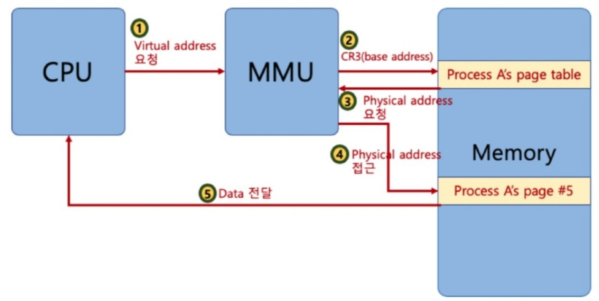
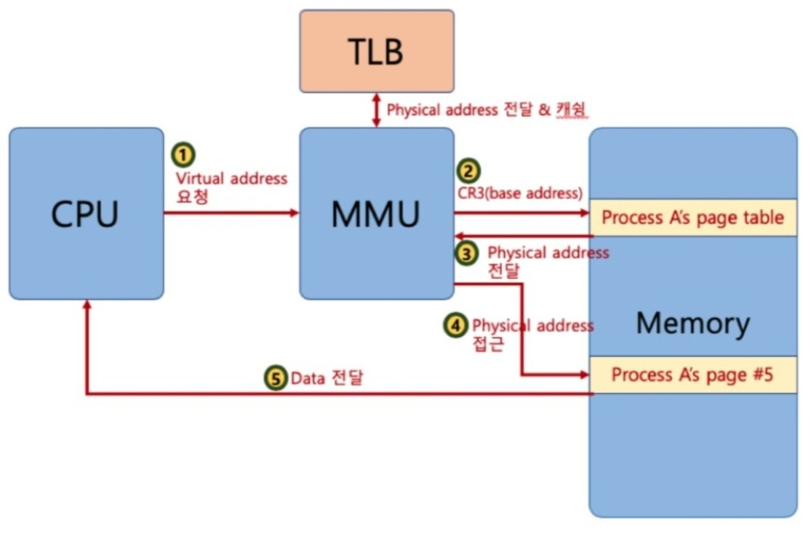
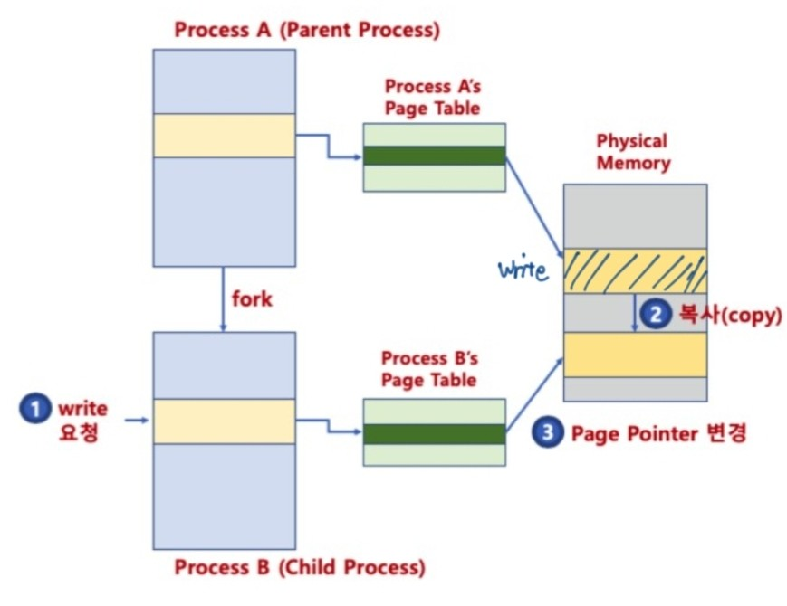
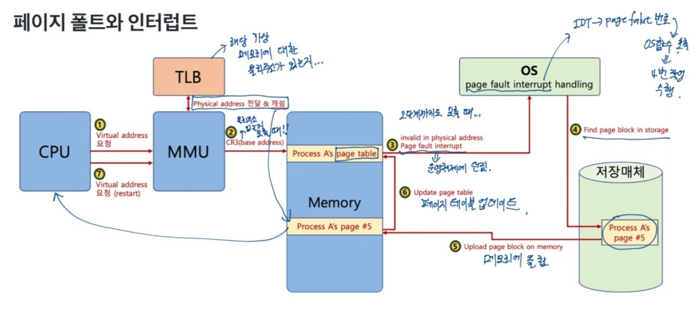
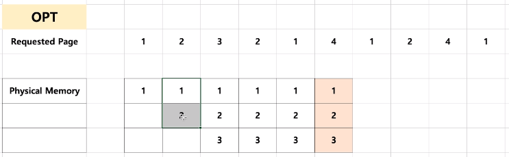

## 가상 메모리(Virtual Memory System)

> 실제 각 프로세스마다 충분한 메모리를 할당하기에는 메모리 크기의 한계가 있다.

> 폰노이만 구조 기반이므로, 코드는 메모리에 반드시 있어야 한다. 

- 리눅스의 경우 하나의 프로세스는 4GB

#### 가상 메모리가 필요한 이유
- 하나의 프로세스만 실행 가능한 시스템
1. 프로그램을 메모리로 로드(load)
2. 프로세스 실행
3. 프로세스 종료(메모리 해제)

- 여러 프로세스 동시 실행 시스템
1. 메모리 용량 부족 이슈
2. 프로세스 메모리 영역간에 침범 이슈

**가상 메모리**

- 메모리가 실제 메모리보다 많아 보이게 하는 기술
    - 실제 사용하는 메모리는 작다는 점에서 고안된 기술이다.
    - 프로세스 간 공간 분리로, 프로세스 이슈가 전체 시스템에 영향을 주지 않을 수 있다.
- 기본 아이디어
    - 프로세스는 가상 주소를 사용하고, 실제 해당 주소에서 데이터를 읽고 쓸 때만 물리 주소로 바꿔주면 된다.
- MMU(Memory Management Unit)
    - CPU에 코드 실행할 떄, 가상 주소 메모리 접근이 필요할 때, 해당 주소를 물리 주소값을 변환해주는 하드웨어 장치이다.

**가상 메모리와 MMU**

- CPU는 가상메모리를 다루고, 실제 해당 주소 접근시 MMU 하드웨어 장치를 통해 물리 메모리에 접근한다.
    - 하드웨어 장치를 이용해야 주소 변환이 빠르기 때문에 별도의 장치를 둔다.

## 페이징 시스템(paging system)

- 크기가 동일한 페이지로 가상 주소 공간과 이에 매칭하는 물리 주소 공간을 관리한다.
- 리눅스에서는 4KB로 paging한다.
- 페이지 번호를 기반으로 가상 주소/물리 주소 매핑 정보를 기록하고 사용한다.
- 하드웨어 지원이 필요하다.
 
- 프로세스(4GB)의 PCB에 Page Table 구조체를 가리키는 주소가 있다.
- Page Table에는 가상주소와 물리주소간 매핑 정보가 있다.

그림을 보면 Page Table에 가상주소와 물리주소의 매핑 정보가 있어서 가상 메모리와 물리 메모리를 연결하는 역할을 한다.

#### 페이징 시스템 구조
- Page 또는 page frame: 고정된 크기의 block(4KB)
- paging system
    - 가상 주소 v = (p,d)
        - p: 가상 메모리 페이지
        - d: p 안에서 참조하는 위치(변위)

페이지번호에는 물리주소를 기록한다. 
p + d => 실제 물리메모리의 해당 데이터 위치를 알 수 있다.

- 페이지 크기가 4KB의 예
    - 가상 주소의 0비트에서 11비트가 변위(d)를 나타낸다.
    - 12비트 이상이 페이지 번호가 될 수 있다.

#### 페이지 테이블(Page Table)
- page table
    - 물리 주소에 있는 페이지 번호와 해당 페이지의 첫 물리 주소 정보를 매핑한 표이다.
- Paging System 동작
    - 해당 프로세스에서 특정 가상 주소에 엑세스를 하려면...
        - 해당 프로세스의 page table에 해당 가상 주소가 포함된 page번호가 있는지 확인한다.
        - page번호가 있으면 이 page가 매핑된 첫 물리 주소를 알라내고(p') p' + d가 실제 물리 주소가 된다.

#### 페이징 시스템과 MMU
- CPU는 가상 주소 접근시 MMU 하드웨어 장치를 통해 물리 메모리에 접근한다.

- 프로세스를 생성할 때, 페이지 테이블 정보를 생성한다.
- PCB 등에서 해당 페이지 테이블 접근이 가능하고, 관련 정보는 물리 메모리에 적재된다.
- 프로세스 가동시, 해당 페이지 테이블 base 주소가 별도 레지스터에 저장된다.(CR3)
- CPU가 가상 주소 접근시, MMU가 페이지 테이블 base 주소를 접근해서 물리 주소를 가져온다.

#### 다중 단계 페이징 시스템
- 32bit 시스템에서 4KB 페이지를 위한 페이징 시스템은 하위 12bit는 오프셋, 상위 20bit가 페이징 번호이다. 따라서 2의 20승(1048576)개의 페이지 정보가 필요하다.
- 페이징 정보 단계를 나누어 생성하게 되면 필요없는 페이지는 생성하지 않아서 공간을 절약할 수 있다.
- 다중 단계 페이징 시스템은 페이지 번호를 나타내는 bit를 구분해서 단계를 나눈다.(리눅스는 3단계, 최근 4단계)

다시 듣고 설명해보기...

#### MMU와 TLB
- MMU가 물리 주소를 확인하기 위해서는 메모리를 갔다와야 한다.

그림은 보게 되면 CPU에서 물리주소를 요청하게 되면 MMU에서 메모리에 base 주소를 찾으러 가게 되고 물리 주소를 요청하게 된다. 그 후 물리 주소에 접근을 하게 되고 메모리에서 CPU로 데이터를 전달하는 구조가 된다. 
여기에는 큰 문제점이 있다. 레지스터 처리보다 메인 메모리에 왔다갔다하는게 시간이 더 많이 걸리는데 메모리를 2번이나 왔다갔다하다보니까 시간이 더 많이 걸린다. 

- TLB(Translation Lookaside Buffer): 페이지 정보 캐쉬

간단히 얘기하면 기존에 요청한 물리 주소를 다시 요청하면, MMU 단계에서 TLB를 확인한 후 있으면 바로 물리주소로 접근하여 기존의 단계를 줄일 수가 있다.

#### 페이징 시스템과 공유 메모리
- 프로세스간 동일한 물리 주소를 가리킬 수 있다.(공간 절약, 메모리 할당 시간 절약)

각각의 Process마다 운영체제를 다 가지기 때문에 이는 공간을 많이 차지하게 된다.
이때, 중요한 커널 공간의 Page table은 결과적으로 동일한 메모리 공간을 가리키게 하면 공간과 시간이 절약된다.

- 물리 주소 데이터 변경할 때, 물리 주소를 복사할 수 있다.(copy-on-write)

그림에서 보는 것과 같이 수정할 때만 물리 메모리에서 복사한다.

#### 요구 페이징(Demand Paging 또는 Demanded Paging)
- 프로세스 모든 데이터를 메모리로 적재하지 않고, 실행 중 필요한 시점에서만 메모리로 적재한다.
    - 선행 페이징(Prepaging):미리 프로세스 관련 모든 데이터를 메모리에 올려놓고 실행하는 개념의 반대 개념이다.
    - 더 이상 필요하지 않은 페이지 프레임은 다시 저장매체에 저장된다.(이때, 페이지 교체 알고리즘 필요)

#### 페이지 폴트(page fault) 
- 어떤 페이지가 실제 물리 메모리에 없을 때 일어나는 **인터럽트**
- 운영체제에 page fault가 일어나면, 해당 페이지를 물리 메모리에 올린다.

- 페이지 폴트가 자주 일어나게 되면,
실행되기 전에, 해당 페이지를 물리 메모리에 올려야 하기 때문에 시간이 오래 걸린다.
- 페이지 폴트가 안 일어나게 하려면,
향후 실행/참조될 코드/데이터를 미리 물리 메모리에 올리면 되지만... 예측하기는 쉽지 않다.

#### 페이지 교체정책(Page replacement Policy)
- 운영체제가 특정 페이지를 물리 메모리에 올리려고 하는데 물리 메모리가 다 차있다면 어떻게 해야 할까?
    - 기존 페이지 중 하나를 물리 메모리에서 저장 매체로 내리고 저장
    - 새로운 페이지를 해당 물리 메모리 공간에 올린다.

- 그렇다면 어떤 페이지를 물리 메모리에서 저장 매체로 내릴 것인가?
    - Page Replacement(Swaping) Algorithm

#### 페이지 교체 알고리즘
**FIFO 페이지 교체 알고리즘**
- 가장 먼저 들어온 페이지를 내리는 알고리즘

**최적 페이지 교체 알고리즘(OPTimal Replacement Algorithm)**
- 앞으로 가장 오랫동안 사용하지 않을 페이지를 내리는 알고리즘(일반 OS에서는 구현이 불가하다.)

해당 2개의 그림을 보게 되면 순서대로 메모리에 올려져 있다가 새로운 4번 페이지가 나오게 되면 4번 이후에 가장 사용하지 않을 페이지는 3번이 되고 그래서 제일 먼저 메모리에서 내려가는 것을 볼 수 있다.

**LRU(Least Recently Used) Page Replacement Algorithm**
- 가장 오래 전에 사용된 페이지를 교체하는 알고리즘
- OPT 교체 알고리즘을 구현하는 것이 불가능해서 과거의 기록을 기반으로 만든다.(OPT와 유사한 기능)

그림을 보게 되면 페이지 4번이 메모리에 들어올 때, 가장 고려되는 것이 제일 오래 전에 사용된 페이지이다. 바로 앞을 보게 되면 1번이 최근에 사용됐고 그 다음이 2번, 3번순이 되므로 3번이 가장 오래 전에 사용됐다는 것을 알 수 있다. 따라서 페이지 3이 페이지에서 먼저 내려간다.
이 알고리즘은 메모리 지역성을 기반으로 일종의 예측을 한다고 할 수 있다. 메모리 지역성은 반복문을 생각하면 쉽게 이해할 수 있는데 

이 그림에서 보는 것과 같이 특정한 지점에서 코드가 엄청 쓰인 것을 알 수 있다. 반복문의 경우에도 정해진 구역에서 계속 반복되다가 반복문이 끝나면 사용되지 않는 것처럼 특정한 지역을 벗어나면 그 다음에 실행되지 않을 가능성이 크다는 아이디어를 바탕으로 생성된 알고리즘이라고 할 수 있다.

**LFU(Least Frequently Used) Page Replacement Algorithm**
- 가장 적게 사용된 페이지를 내리는 알고리즘

여기에서는 페이지 4번이 메모리에 올라갈 때, 그 전에 적게 사용된 페이지를 내린다. 페이지1은 4번 사용되었고 페이지2는 3번 사용, 페이지3은 2번 사용되었기 때문에 페이지3이 가장 먼저 내려가는 것을 볼 수 있다.

**NUR(Not Used Recently) Page Replacement Algorithm**
- LRU와 마찬가지로 최근에 사용하지 않은 페이지부터 교체하는 알고리즘
- 각 페이지마다 참조비트(R), 수정비트(M)을 둔다.(R,M)
    - (0,0),(0,1),(1,0),(1,1)순으로 페이지를 교체한다.

페이지 1을 보게 되면 참조(read)도 되었고, 수정(write)도 되었다. 페이지 3도 참조도 되었고, 수정도 되었다. 하지만 페이지 2는 참조만 되었고 수정은 되지 않았다. 페이지 교체 순서를 보면 페이지 1과 페이지 3은 페이지 교체 가장 후순번이다. 그래서 페이지 2가 메모리에서 내려가고 페이지 4가 메모리에 올라간다.

#### Thrashing
- 반복적으로 페이지 폴트가 발생해서, 과도하게 페이지 교체 작업이 일어나, 실제로는 아무 일도 하지 못하는 상황을 말한다.

#### 세그멘테이션 기법
- 가상 메모리를 서로 크기가 다른 논리적 단위인 세그먼트(Segment)로 분할한다.
    - 페이징 기법에서는 가상 메모리를 같은 크기의 블록으로 분할한다.
    - CS(Code Segment), DS(Data Segment), SS(Stack Segment), ES(Extra Segment)로 세그멘트를 나누어, 메모리에 접근한다.

- 세그먼트 가상주소
    - v = (s,d): s는 세그먼트 번호, d는 블록 내 세그먼트의 변위이다.

- 세그먼테이션은 일괄적으로 잘게 쪼개서 물리 메모리에 넣는 페이징 기법과 다르게 크기가 다른 segment 단위로 물리 메모리에 로딩된다는 특징이 있다. 

#### 참고
- 내부 단편화
    - 페이지 블록만큼 데이터가 딱 맞게 채워져 있지 않을 때 공간 낭비가 발생한다.
- 외부 단편화
    - 물리 메모리가 원하는 연속된 크기의 메모리를 제공해주지 못하는 경우에 발생한다.
- 세그멘테이션/ 페이징 모두 하드웨어 지원 필요
    - 다양한 컴퓨터 시스템에 이식성을 중요시하는 리눅스는 페이징 기법을 기반으로 구현된다.