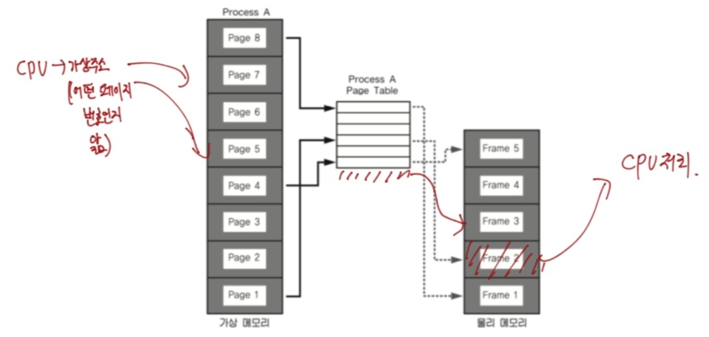
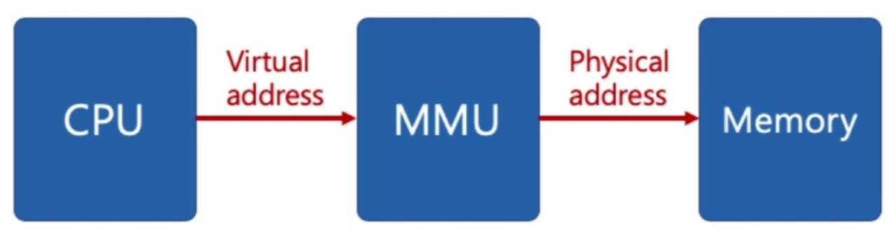
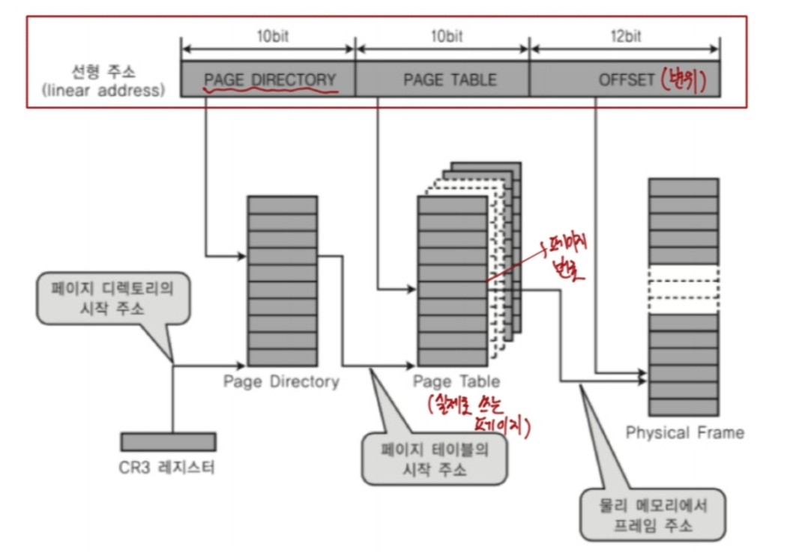
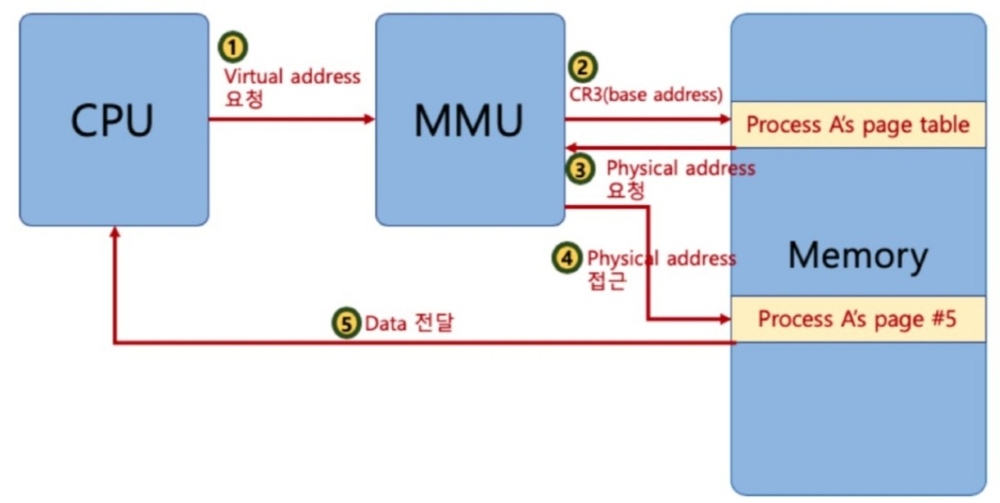
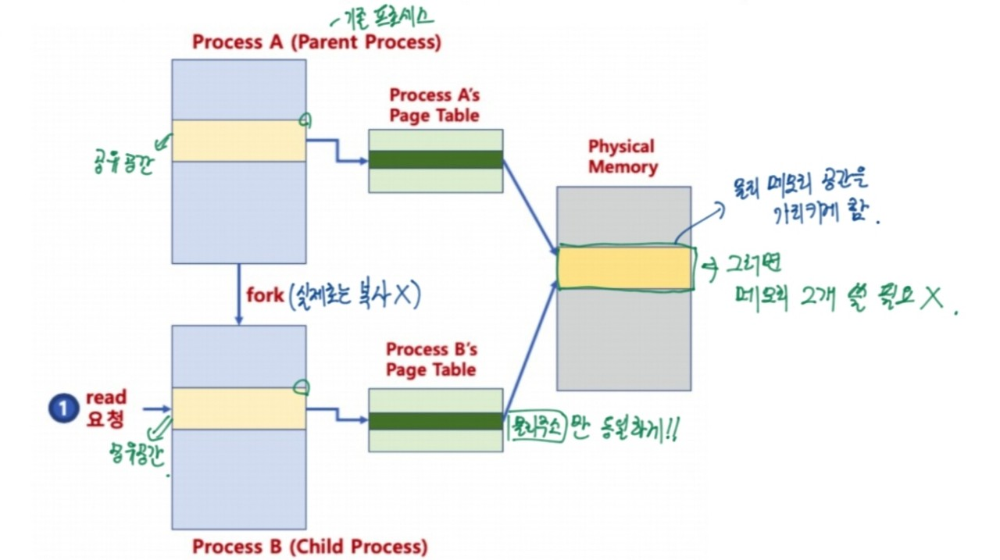
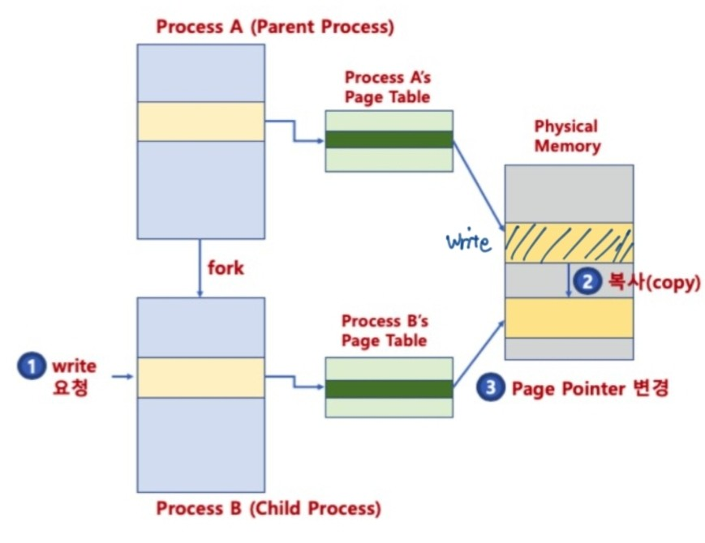
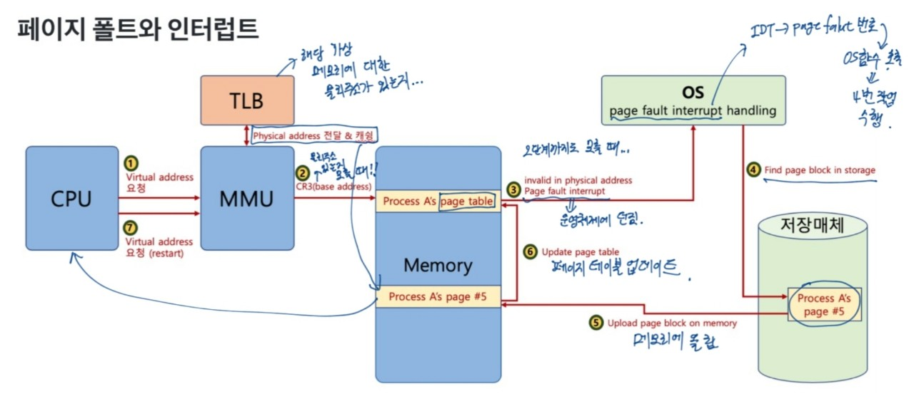

## 페이징 시스템(paging system)

- 크기가 동일한 페이지로 가상 주소 공간과 이에 매칭하는 물리 주소 공간을 관리한다.
- 리눅스에서는 4KB로 paging한다.
- 페이지 번호를 기반으로 가상 주소/물리 주소 매핑 정보를 기록하고 사용한다.
- 하드웨어 지원이 필요하다.
 
- 프로세스(4GB)의 PCB에 Page Table 구조체를 가리키는 주소가 있다.
- Page Table에는 가상주소와 물리주소간 매핑 정보가 있다.

그림을 보면 Page Table에 가상주소와 물리주소의 매핑 정보가 있어서 가상 메모리와 물리 메모리를 연결하는 역할을 한다.

#### 페이징 시스템 구조
- Page 또는 page frame: 고정된 크기의 block(4KB)
- paging system
    - 가상 주소 v = (p,d)
        - p: 가상 메모리 페이지
        - d: p 안에서 참조하는 위치(변위)

페이지번호에는 물리주소를 기록한다. 
p + d => 실제 물리메모리의 해당 데이터 위치를 알 수 있다.

- 페이지 크기가 4KB의 예
    - 가상 주소의 0비트에서 11비트가 변위(d)를 나타낸다.
    - 12비트 이상이 페이지 번호가 될 수 있다.

#### 페이지 테이블(Page Table)
- page table
    - 물리 주소에 있는 페이지 번호와 해당 페이지의 첫 물리 주소 정보를 매핑한 표이다.
- Paging System 동작
    - 해당 프로세스에서 특정 가상 주소에 엑세스를 하려면...
        - 해당 프로세스의 page table에 해당 가상 주소가 포함된 page번호가 있는지 확인한다.
        - page번호가 있으면 이 page가 매핑된 첫 물리 주소를 알라내고(p') p' + d가 실제 물리 주소가 된다.

#### 페이징 시스템과 MMU
- CPU는 가상 주소 접근시 MMU 하드웨어 장치를 통해 물리 메모리에 접근한다.

- 프로세스를 생성할 때, 페이지 테이블 정보를 생성한다.
- PCB 등에서 해당 페이지 테이블 접근이 가능하고, 관련 정보는 물리 메모리에 적재된다.
- 프로세스 가동시, 해당 페이지 테이블 base 주소가 별도 레지스터에 저장된다.(CR3)
- CPU가 가상 주소 접근시, MMU가 페이지 테이블 base 주소를 접근해서 물리 주소를 가져온다.

#### 다중 단계 페이징 시스템
- 32bit 시스템에서 4KB 페이지를 위한 페이징 시스템은 하위 12bit는 오프셋, 상위 20bit가 페이징 번호이다. 따라서 2의 20승(1048576)개의 페이지 정보가 필요하다.
- 페이징 정보 단계를 나누어 생성하게 되면 필요없는 페이지는 생성하지 않아서 공간을 절약할 수 있다.
- 다중 단계 페이징 시스템은 페이지 번호를 나타내는 bit를 구분해서 단계를 나눈다.(리눅스는 3단계, 최근 4단계)

다시 듣고 설명해보기...

#### MMU와 TLB
- MMU가 물리 주소를 확인하기 위해서는 메모리를 갔다와야 한다.

그림은 보게 되면 CPU에서 물리주소를 요청하게 되면 MMU에서 메모리에 base 주소를 찾으러 가게 되고 물리 주소를 요청하게 된다. 그 후 물리 주소에 접근을 하게 되고 메모리에서 CPU로 데이터를 전달하는 구조가 된다. 
여기에는 큰 문제점이 있다. 레지스터 처리보다 메인 메모리에 왔다갔다하는게 시간이 더 많이 걸리는데 메모리를 2번이나 왔다갔다하다보니까 시간이 더 많이 걸린다. 

- TLB(Translation Lookaside Buffer): 페이지 정보 캐쉬

간단히 얘기하면 기존에 요청한 물리 주소를 다시 요청하면, MMU 단계에서 TLB를 확인한 후 있으면 바로 물리주소로 접근하여 기존의 단계를 줄일 수가 있다.

#### 페이징 시스템과 공유 메모리
- 프로세스간 동일한 물리 주소를 가리킬 수 있다.(공간 절약, 메모리 할당 시간 절약)

각각의 Process마다 운영체제를 다 가지기 때문에 이는 공간을 많이 차지하게 된다.
이때, 중요한 커널 공간의 Page table은 결과적으로 동일한 메모리 공간을 가리키게 하면 공간과 시간이 절약된다.

- 물리 주소 데이터 변경할 때, 물리 주소를 복사할 수 있다.(copy-on-write)

그림에서 보는 것과 같이 수정할 때만 물리 메모리에서 복사한다.

#### 요구 페이징(Demand Paging 또는 Demanded Paging)
- 프로세스 모든 데이터를 메모리로 적재하지 않고, 실행 중 필요한 시점에서만 메모리로 적재한다.
    - 선행 페이징(Prepaging):미리 프로세스 관련 모든 데이터를 메모리에 올려놓고 실행하는 개념의 반대 개념이다.
    - 더 이상 필요하지 않은 페이지 프레임은 다시 저장매체에 저장된다.(이때, 페이지 교체 알고리즘 필요)

#### 페이지 폴트(page fault) 
- 어떤 페이지가 실제 물리 메모리에 없을 때 일어나는 **인터럽트**
- 운영체제에 page fault가 일어나면, 해당 페이지를 물리 메모리에 올린다.

- 페이지 폴트가 자주 일어나게 되면,
실행되기 전에, 해당 페이지를 물리 메모리에 올려야 하기 때문에 시간이 오래 걸린다.
- 페이지 폴트가 안 일어나게 하려면,
향후 실행/참조될 코드/데이터를 미리 물리 메모리에 올리면 되지만... 예측하기는 쉽지 않다.

