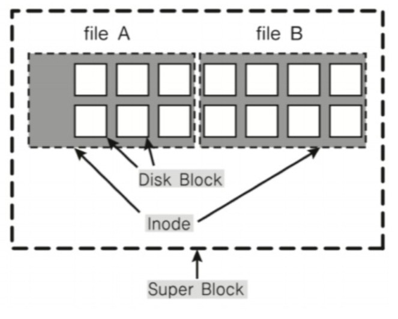

## 파일 시스템
- 운영체제가 저장매체에 파일을 쓰기 위한 자료구조 또는 알고리즘

**파일시스템이 만들어진 이유**
- 0과 1의 데이터를 저장매체에 어떻게 저장할까?
    - 비트로 관리하기에는 오버헤드가 너무 크다.
    - 블록 단위로 관리하기로 한다.
    - 블록마다 고유 번호를 부여하여 관리한다.
- 사용자가 각 블록 고유 번호를 관리하기 어렵다.
    - 추상적(논리적) 객체 필요: 파일
- 사용자는 파일 단위로 관리한다.
    - 각 파일은 블록 단위로 관리한다.
 

**저장매체에 효율적으로 파일을 저장하는 방법**
- 가능한 연속적인 공간에 파일을 저장하는 것이 좋다.
- 문제는 파일의 사이즈가 늘어나면 연속적인 저장이 불가능해진다.(외부 단편화)
- 외부 단편화, 파일 사이즈 변경 문제로 불연속 공간에 파일 저장 기능 지원이 필요하다.
    - 해결방법
        - 블록 체인: 블록을 링크드 리스트로 연결한다.
            - 문제점... 끝에 블록을 찾으려면, 맨 처음 블록부터 주소를 따라가야 한다.
        - 인덱스 블록 기법: 각 블록에 대한 위치 정보를 기록해서, 한번에 끝 블록을 찾아갈 수 있도록 한다.

**다양한 파일 시스템**
- Windows: FAT, FAT32, NTFS
    - 블록 위치를 FAT라는 자료 구조에 기록
- 리눅스(UNIX): ext2, ext3, ext4
    - 일종의 인덱스 블록 기법인 inode(핵심이 되는 파일 시스템 방식) 방식 사용

**파일 시스템과 시스템콜**
- 동일한 시스템콜을 사용해서 다양한 파일 시스템 지원 가능하도록 구현된다.
    - read/write 시스템콜 호출시, 각 기기 및 파일 시스템에 따라 실질적인 처리를 담당하는 함수를 구현한다.
        - eg)read_spec/write_spec
    - 파일을 실제 어떻게 저장할지는 다를 수 있다.
        - 리눅스의 경우 ext4 외 NTFS, FAT32 파일 시스템을 지원한다.

그림의 함수로 담당하는 함수를 구현한다.

#### inode 방식 파일 시스템
- 파일 시스템의 기본 구조
    - 수퍼 블록: 파일 시스템 정보
    - 아이노드 블록: 파일 상세 정보
    - 데이터 블록: 실제 데이터

- 수퍼 블록: 파일 시스템 정보 및 파티션 정보를 포함한다. 즉, 파일 시스템 전체를 대표하는 정보들이 있다.

df가 리눅스에서 시스템 전체를 포함하는 정보를 불러올 때 사용하는 명령어이다. 

#### inode와 파일
- 파일: inode 고유값과 자료구조에 의해 주요 정보를 관리한다.
    - '파일이름:inode'로 파일이름은 inode 번호와 매칭된다.
    - 파일 시스템에서는 inode를 기반으로 파일을 엑세스한다.
    - inode 기반 메타 데이터(상세정보)를 저장한다.

전체적인 구조는 그림에서 보는 것과 같이 수퍼블록이 큰 틀이고, 그 안에 inode로 파일을 엑세스할 수 있는 구조이다.

#### inode 구조
- inode 기반 메타 데이터(파일 권한, 소유자 정보, 파일 사이즈, 생성시간 등 시간 관련 정보, 데이터 저장 위치 등)

첫번쨰 그림은 전체적인 inode의 구조를 보여준다. 두 번째 그림은 리눅스에서 cat이라는 파일에 들어 있는 내용을 화면에 출력해주는 명령어를 통해 파일의 inode번호로 inode 구조에 가게 되고 이것은 또 Direct Block에 연결이 된다. 그리고 이 블록에서 실제 데이터 공간의 주소를 가리켜서 파일에 접근한다. 하지만 Direct Block은 12개의 공간으로 데이터가 1KB~4KB인데 그렇게 하면 최대 48KB를 가져올 수 있다. 

동영상 파일도 2GB가 넘는 이 시대에 너무 용량이 작다는 것을 알 수 있다. 그래서 파일 사이즈가 커지면 Direct Block 밑의 부분들로 처리할 수 있다. 보다 자세한 용량은 그림에 표기해두었다.

#### 디렉토리 엔트리
- 리눅스 파일 탐색: eg)/home/ubuntu/link.txt
    - 파일을 탐색할 떄 어떻게 탐색할까?
        - 각 디렉토리 엔트로(dentry)를 탐색
            - 각 엔트리는 해당 디렉토리 파일/디렉토리 정보를 가지고 있다
        - '/' dentry에서 'home'을 찾고, 'home'에서 'ubuntu'를 찾고, 'ubuntu'에서 link.txt 파일이름에 해당하는 inode를 얻는다.

#### 가상 파일 시스템(Virtual File System)
- Network 등 다양한 기기도 동일한 파일 시스템 인터페이스를 통해 관리가 가능하다.
- eg) read/write 시스템콜 사용, 각 기기별 read_spec/write_spec 코드 구현(운영체제 내부)

가상 파일 시스템을 이용하면 네트워크를 통해서 다른 디바이스에 확장할 수 있다. 유닉스의 경우, 가상 파일시스템을 이용해서 모든 디바이스를 파일처럼 다룬다.

#### 리눅스(유닉스) 운영체제와 가상 파일 시스템
- 모든 것은 파일이라는 철학을 따른다.
    - 모든 인터렉션은 파일을 읽고, 쓰는 것처럼 이루어져 있다.
    - 마우스, 키보드와 같은 모든 디바이스 관련된 기술도 파일과 같이 다루어진다.
    - 모든 자원에 대한 추상화 인터페이스로 파일 인터페이스를 활용한다.
    (내부를 몰라도 인터페이스만 사용할 수 있으면 내부 사용이 가능하다.)

#### 특수 파일
- 디바이스
    - 블록 디바이스
    HDD, CD/DVD와 같이 대용량 데이터여서 블록 또는 섹터 등 정해진 단위로 데이터를 전송한다. IO 송수신 속도가 높다.
    - 캐릭터 디바이스
    키보드, 마우스 등 byte 단위 데이터 전송, IO 송수신 속도가 낮다.