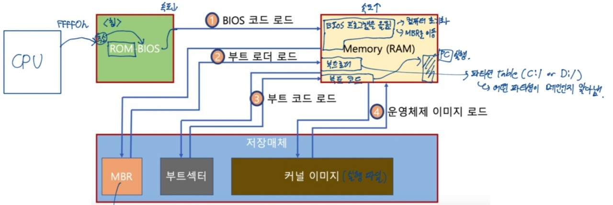

## Boot
- 컴퓨터를 켜서 동작시키는 절차
- Boot 프로그램
    - 운영체제 커널을 Storage에서 특정 주소의 물리 메모리로 복사하고 커널의 처음 실행 위치로 PC를 가져다 놓는 프로그램

### 부팅과정
- 컴퓨터를 키게되면...
    - Bios가 Storage를 읽어와 Bootstrap loader를 메모리에 올리고 실행한다.
    - Bootstrap loader 프로그램이 있는 곳을 찾아서 실행시킨다.

