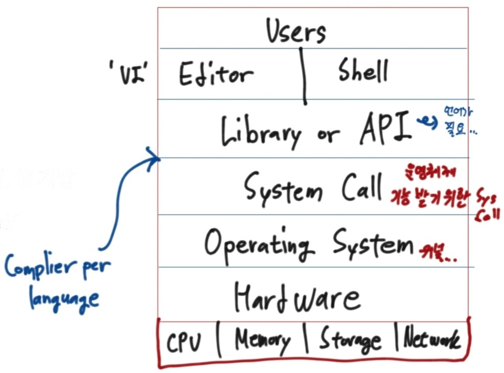

## 리눅스(LINUX)
- 서버에 많이 사용되는 운영체제이다.

- 프로그래밍을 할 때 컴파일러가 복잡하면 작업시간이 오래걸리는데 리눅스로 시간 단축을 할 수 있다.

- 최근 AWS와 같은 클라우드 컴퓨팅에서도 많이 사용된다.

- UNIX 계열의 운영체제이다.

- 표준에 맞춰서 프로그래밍할 수 있는 ANSI C - C언어 표준이다.

- 리눅스의 장점
    - 서버 + 클라우드 컴퓨팅
    - 프로그래밍에 유용
    - UNIX 계열의 운영체제이므로, 사용법을 익힐 수 있음

### 리눅스 역사와 운영체제 기술

**리눅스의 시작**
- 리누스 토발즈(Linus Torvalds)가 개발
    - 대학에 있는 UNIX 컴퓨터를 집에서 쓰고 싶어서 개발을 시작하였다.
    - 다중 사용자, 다중 작업(시분할 시스템, 멀티 태스킹)을 지원하는 유닉스와 유사한 운영체제이다.
 

**GNU 프로젝트**
- 유닉스 운영체제를 여러 회사에서 각자 개발, 소스를 공유하지 않는 문화에 반발하여 시작하였다.
- 리차드 스톨만: 초기 컴퓨터 개발 공동체의 상호협력적인 문화로 돌아갈 것을 주장하며, 1985년도에 GNU 선언문 발표하였다.
- GNU 프로젝트를 지원하기 위해 자유 소프트웨어 재단 설립, GNU 공개 라이선스(GPL)라는 규약을 제공하였다.

**GPL 라이선스**
- GPL 프로그램을 어떤 목적으로 어떤 형태로든 사용할 수 있지만, 사용하거나 변경된 프로그램을 다시 배포하는 경우 동일한 GPL 라이선스로 공개해야 한다.
- 소스 오픈을 장려하기 위해서 시작하였다.

**GNU 프로젝트와 GNU Hurd
- 운영체제 커널 개발 시도 - GNU Hurd
- 운영체제에 필요한 라이브러리, 컴파일러, 에디터, 쉘 개발

위에서 설명한 것과 같이 시스템콜, 라이브러리, 쉘, 에디터까지는 개발이 어느 정도 끝이 났지만 정작 중요한 OS에서 커널부분의 개발이 지연되는 상황이었다.
때마침 리누스 토발즈가 리눅스 커널 소스를 오픈하게 되면서 GNU 프로젝트 산출물과 리눅스 커널이 통합 개발되었다.

