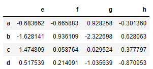

## 함수

### 머신, 딥러닝 코드를 다루다 보면 함수 정의 부분이 중요하다
1. 함수 정의 기본 문법
def 함수이름(매개변수):
수행할 문장1
수행할 문장2
<br>   
2. 함수를 만드는 방법 4가지
1) 위치매개변수
2) 기본매개변수
3) 키워드매개변수
4) 가변매개변수

**1. 위치매개변수**
- 가장 기본적인 인자값 전달방식, 함수에서 정의한 위치대로 인자값이 할당된다.

``` python
def calc(num1,num2):
    result = num1+num2
    return result

print(calc(3,5))
```

8

인자값으로 받은 num1, num2
2개의 값을 더해서 result 로컬변수에 할당
그 값을 리턴하는 기능을 구현
    
``` python
def add(a,b):
    print("%d와 %d의 합은 %d입니다." %(a,b,a+b))
add(3,4)
```

3와 4의 합은 7입니다.


return문 자체가 없으면 함수는 None 객체를 리턴한다.

**2. 기본매개변수**
- 변수값을 입력하지 않으면 기본값이 활성화된다.
- 기본매개변수는 반드시 일반매개변수 뒤에 나와야 한다.

``` python
def calc1(end, start = 0):
#def calc1(start = 0,end):
    total = 0
    for i in range(start,end):
        total += i
    return total
print(calc1(5,1))
print(calc1(5)) # 에러나지 않는다...기본값이 활성화 되어져서 돌아간다.
```

10
10

- 실제 기본 매개변수 사용 예

``` python
import pandas as pd
from pandas import DataFrame

pd.read_csv()
```

**3. 키워드 매개변수**
- 순서에 상관없이 직접 매개변수를 지정해서 전달한다.
- 주의할 점은 함수 호출시 매개변수명을 정확히 알고 있어야 한다.

``` python
def calc2(name,age):
    print("나의 이름은 ",name,"이고 나이는 ",age,"입니다.")
    
calc2("홍길동",19) #위치매개변수

calc2(30,"홍길동") # 에러는 안나고 단지 잘못된 값이 전달된다.

calc2(age = 30, name = "홍길동") # 키워드매개변수
```

나의 이름은  홍길동 이고 나이는  19 입니다.
나의 이름은  30 이고 나이는  홍길동 입니다.
나의 이름은  홍길동 이고 나이는  30 입니다.

- 키워드 매개변수 사용 예

``` python
import numpy as np
import pandas as pd
from pandas import DataFrame
#from 모듈명 import 서브모듈(또는 함수이름)

df1 = DataFrame(np.random.randn(4,4), index = list("abcd"), columns=list("efgh"))
df1
```



**4. 가변 매개변수**
- 인자값이 몇개인지 모르는 상황에서 사용되어지는 함수
- 파이썬에서 print() 함수가 대표적이다. 원하는 만큼의 인자값을 받을 수 있도록 작성
- 일반매개변수와 다르게 변수명 앞에 *을 붙임
- 역시 가변매개변수 뒤에 일반매개변수가 올 수 없다.
- 가변 매개변수는 하나만 사용해야 한다.

``` python
def calc3(*args):
    print(args)
calc3(3)
calc3(3,4,5,6) # 출력은 튜플 타입으로 된다.
```

(3,)
(3, 4, 5, 6)

- **이 2개일 경우에는 반드시 인자값 입력시 딕셔너리 타입이다.

``` python
def calc4(**args):
    print(args)
    
# calc4(1,2) 에러난다

calc4(name="James",age=44,address="NY")
```

{'name': 'James', 'age': 44, 'address': 'NY'}

- 일반 매개변수와 가변매개변수를 함께 사용하는 경우

``` python
def calc5(name, *args):
    print(name,":",args)
calc5("James",3,4,5)
```

James : (3, 4, 5)

#### 가변매개변수와 일반매개변수를 함께 사용
3
6
9
가 출력되도록

``` python
def value_time(times,*values):
    for value in values:
        print(times * value)
value_time(3,1,2,3,4,5,6,7,8,9,10)
```

3
6
9
12
15
18
21
24
27
30

``` python
def value_times(*values,times=2):
    for value in values:
        print(times * value)
value_times(1,2,3,4,5)
print("*"*10)
value_times(1,2,3,4,5,times=5)
```

2
4
6
8
10
**********
5
10
15
20
25