## SpringFramework

### 기존의 MVC 구조

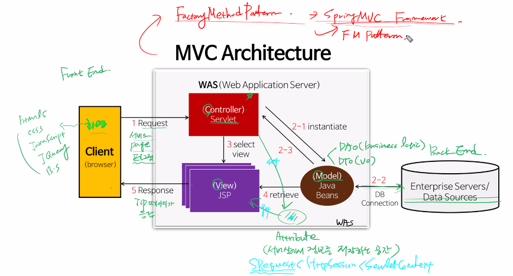

기존의 배웠던 웹 MVC 패턴은 클라이언트측에서 요청을 하면 동적인 파일은 WAS단에서 servlet을 거쳐서 DAO(business)와 DTO(vo)가 데이터베이스와 연결이 되어 데이터를 보낸다.
그리고 view를 담당하는 jsp파일은 정적인 파일이고 말 그대로 화면을 보여주는 역할을 한다. controller 역할인 servlet에서 어떤 페이지를 보여줄지 정하고 그 해당 페이지에 model의 데이터를 연결하여 jsp 페이지가 클라이언트 측으로 응답하게 된다.

이러한 패턴에서 컴포넌트 기반으로 Factory Method Pattern으로 마무리 했는데 이제는 SpringMVC 프레임워크로 넘어가려고 한다.

<br>
<br>

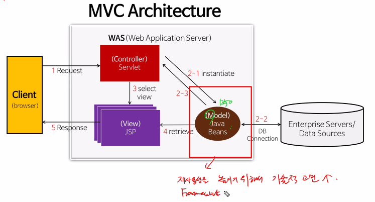

Framework는 코드의 재사용성을 높이기 위해 기술적인 고민 끝에 나온 구조이다.

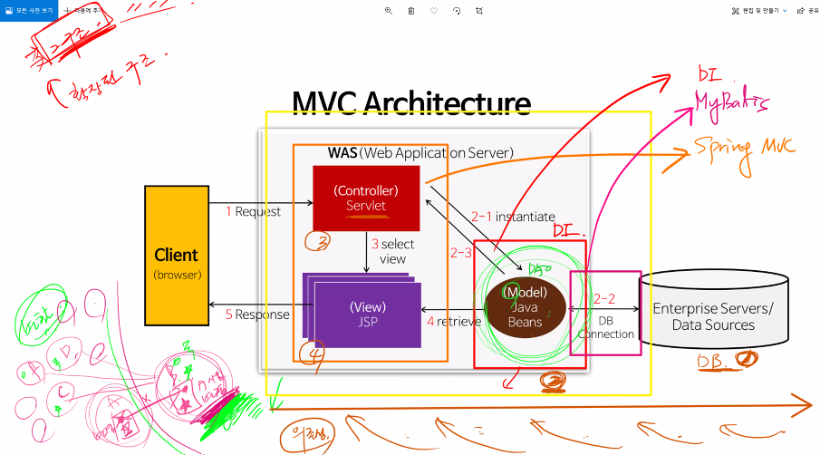

또한 기존의 MVC 구조로 가게 된다면 back에서부터 front까지 넘어올 때, 코드의 의존성이 강해져서 연관이 있는 코드를 고치게 되면 전부를 손봐야 되는 상황이 있기 때문에 좀더 확장된 구조가 필요하다. 
따라서 그림과 같이 DAO와 연결된 부분은 DI, model과 DB를 연결하는 부분은 MyBatis, controller와 view 부분은 SpringMVC로 프레임워크로 만들게 되었다.

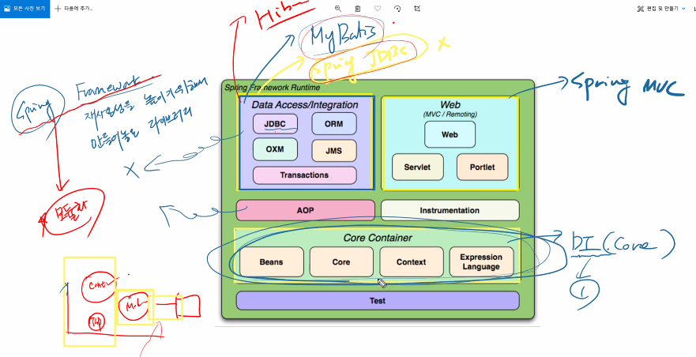

Spring Framework를 다시 정의하자면 재사용성을 높이기 위해 만들어 놓은 일종의 라이브러리이다. 앞서 얘기했던 것처럼 크게 3부분으로 나눈다. 이때, DB에 연결하는 부분은 MyBatis 외에도 Spring JDBC가 있지만 잘 쓰이지 않는다. 국내에서는 MyBatis와 JPA가 잘 쓰인다고 한다.

**<실습>**

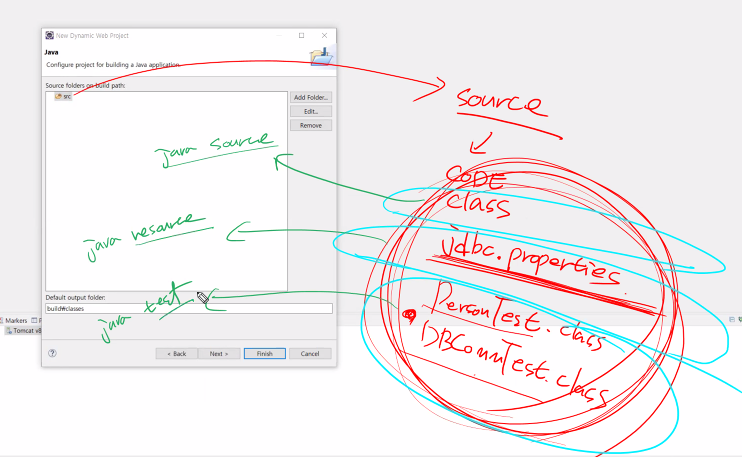

확장성을 위해 원래 source 경로를 remove 시키고 자바만을 취급하는 폴더, resource만을 취급하는 폴더, 자바테스트 파일만 취급하는 폴더 이렇게 3가지로 분류해놓는다.

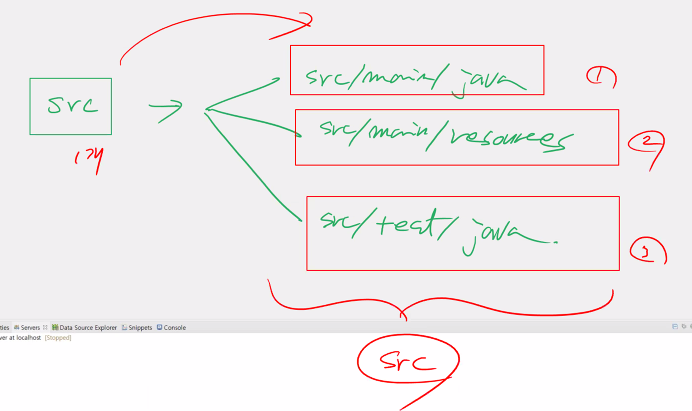

이 그림과 같이 폴더 이름을 3개로 만들어주면 된다.

우선, 위에 언급했던 각각 폴더에 배포하는 것이 가장 중요하고 패키지의 계층을 잘 구성하는 것도 중요한 부분이다.

.png)

Hello와 HelloTest는 서로 다른 클래스이지만 
HelloTest가 Hello를 사용(객체생성 등)하기 때문에 의존성을 띈다고 할 수 있다. 즉, HelloTest가 Hello를 의존한다고 볼 수 있다.

<그림10>

.png)

Hello와 HelloTest가 직접적으로 연관되지 않게 Hello 객체를 Test에서 생성하지 않아야 한다. 따라서 객체 생성의 권한을 그림과 같이 factory에게 준다. 
factory는 
1. meta Data(설정문서)를 읽는다.
2. 인스턴스를 생성한다.
3. 저장한다.

이렇게 저장된 것을 Bean이라고 하는데 HelloTest에서 Bean을 달라고 getBean()을 하면 Test에서 Hello 객체가 생성되어 메서드도 불러올 수 있다. 이렇게 하면 의존성이 줄어들고, 재사용성은 높아진다.

<그림12>

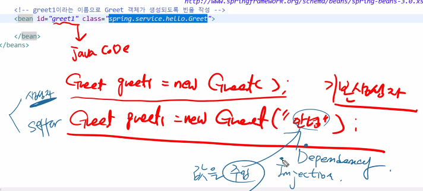

기존에 자바에서 객체에 값을 주입할 때 생성자로 주입하는 방법과 setter로 주입하는 방법 이렇게 2가지가 있었다. 이 그림에서는 생성자로 값을 주입한 경우인데 기존의 경우 그림과 같이 Greet greet1 = new Greet("안녕"); 은 Greet 객체 타입으로 인스턴스를 생성하므로 이것을 의존성 주입이라고 한다. 
하지만 우리는 의존성이 주입되지 않게 factory에서 주문서를 읽어들이는 방법을 사용하므로 설정문서를 건드리게 되는데 

``` xml
<bean id = "greet1" class="spring.service.hello.Greet">
</bean>
```

이렇게 표현한다. class는 경로이고, id는 Greet 객체의 이름을 정해주는 부분이다. 값의 주입이 없는 것을 보아 기본 생성자라고 볼 수 있다.

Setter로 주입할 때는 아래와 같이 한다.

``` xml
<bean id = "greet3" class = "spring.service.hello.Greet">
    <property name="message" value="Hello Spring!!"/>
</bean>
```

여기서 property는 값을 주입할 때 쓰는 부분이다.

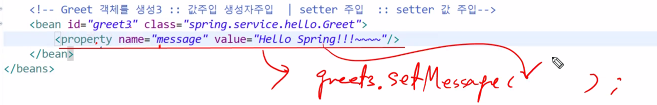

클래스를 생성할 때를 생각해보면 그림과 같이 해당 부분을 생각해볼 수 있다.

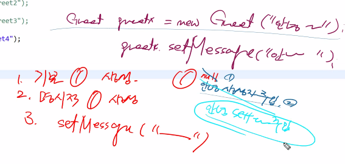

바로 위의 그림은 생성자와 setter를 둘다 생성할 떄의 그림이다. 생성 순서를 보면 기본 빈이 실행되고 명시적 빈(생성자)이 실행된다. 그 후에 setter가 실행이 된다. 생성자가 실행된 후  setter가 실행되면 덮어쓰기가 되기 때문에 실행결과는 setter의 결과가 표시된다. 

<br>
<br>


java 모델 쪽 framework에서 원래는 라이브러리 폴더에 .jar 파일을 넣어서 동작하도록 실행했었는데 그것이 아닌 classPath로 경로를 설정해줘서 굳이 넣어주지 않아도 실행할 수 있게 할 수 있다.

<br>
<br>

Dice

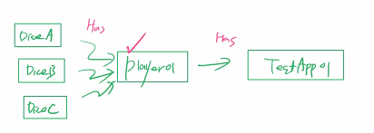

실습코드에 sp02_SpringDI를 보면 주사위 관련 코드가 있는데 위 그림과 같은 구조를 보인다.
이 그림의 구조는 의존 관계가 심하기 때문에 바꿔줄 필요가 있다.

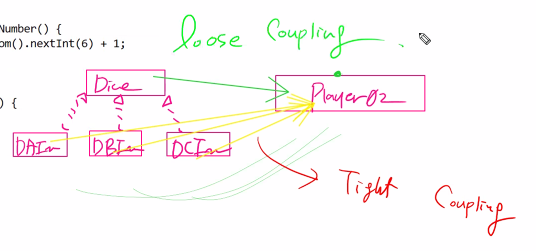

따라서 문제를 해결하기 위해 위에서 같이 tight coupling이 아닌 3개의 주사위 정보를 담고 있는 인터페이스와 player를 담고 있는 느슨한 결합을 해준다.

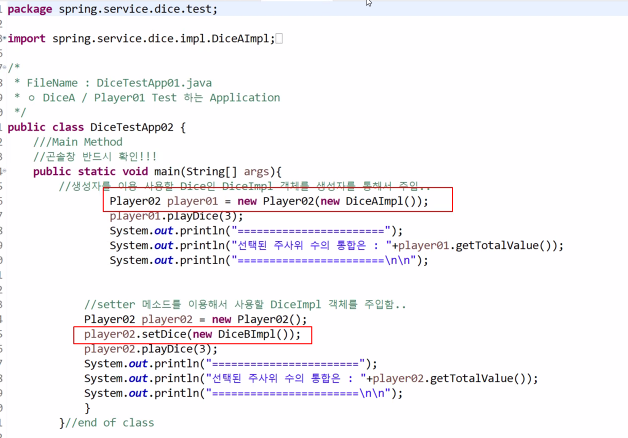

interface를 써도 new 키워드가 들어가면서 클래스의 정보가 들어간다는 점에서 이 문제를 해결해야 될 필요성이 있어 보인다.
이렇게 실체클래스가 code에 노출되면 재사용성이 떨어지게 된다. 따라서 이 문제를 해결하기 위해 객체 생성의 주체를 개발자가 아닌 앞서 봤던 factory가 하고 개발자는 xml파일과 같은 주문서 작성만 하게 만든다. 이렇게 만들 것이 SpringDI이다.

.png)

위의 테스트 클래스를 보게 되면 실체 클래스 이름이 노출되지 않게 코드를 작성하여 코드의 재사용성을 높였다.

